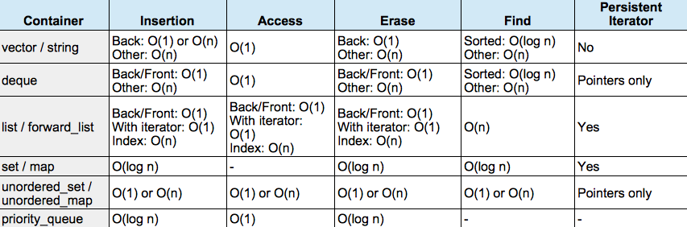
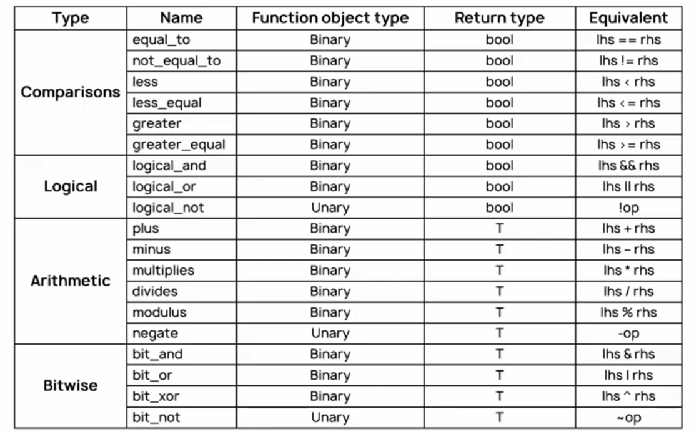
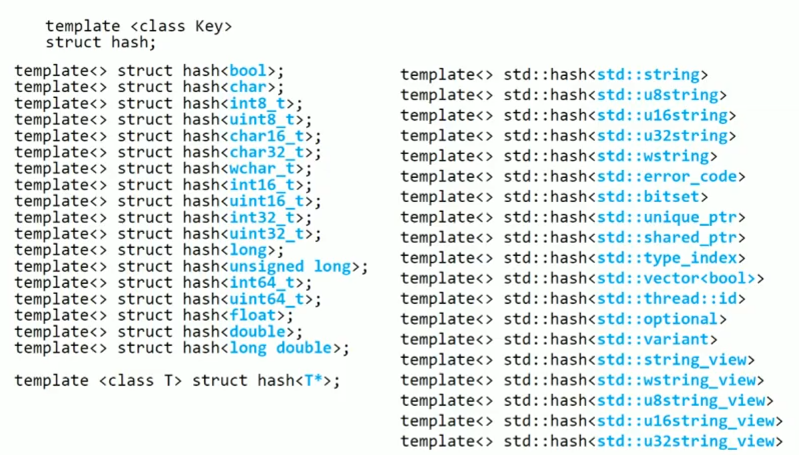
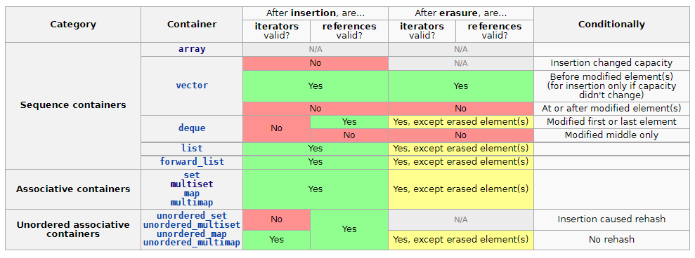
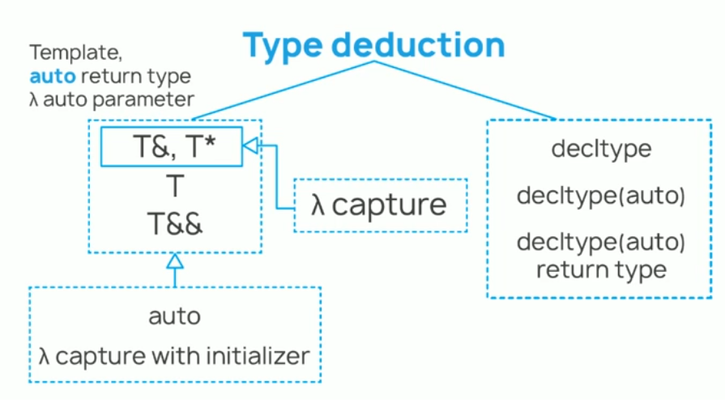
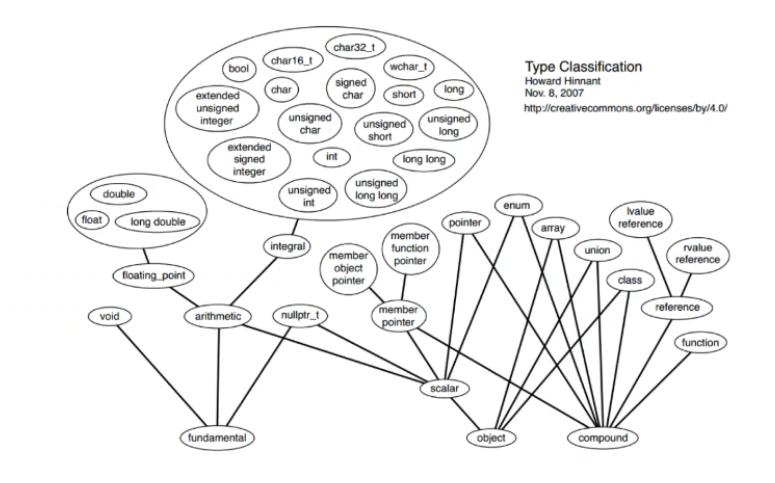

- [Lambda](#lambda)
	- [C++11](#c11)
	- [C++14](#c14)
	- [C++17](#c17)
- [auto/decltype](#autodecltype)
	- [C++11](#c11-1)
		- [**Альтернативный синтаксис шаблонных функций**](#альтернативный-синтаксис-шаблонных-функций)
	- [C++14](#c14-1)
- [Initialization](#initialization)
	- [C++11](#c11-2)
		- [**Универсальная инициализация**](#универсальная-инициализация)
		- [**std::initializer_list**](#stdinitializer_list)
	- [C++14](#c14-2)
		- [**Aggregate initialization with deafult member initializer**](#aggregate-initialization-with-deafult-member-initializer)
	- [C++17](#c17-1)
		- [**auto + std::initializer_list**](#auto--stdinitializer_list)
		- [**Агрегатная инциализация базового класса**](#агрегатная-инциализация-базового-класса)
- [C++11](#c11-3)
	- [**POD-type**](#pod-type)
	- [**Спецификаторы**](#спецификаторы)
		- [***'default' + 'deleted' specifiers***](#default--deleted-specifiers)
		- [***'override' + 'final' sepcifiers***](#override--final-sepcifiers)
	- [**Move semantics**](#move-semantics)
	- [**Perfect forwarding**](#perfect-forwarding)
	- [**noexcept**](#noexcept)
	- [**Range based for cycle**](#range-based-for-cycle)
	- [**Delegate constructors**](#delegate-constructors)
	- [**Default values for non-static class members**](#default-values-for-non-static-class-members)
	- [**nullptr**](#nullptr)
	- [**enum class**](#enum-class)
	- [**enum underlying type**](#enum-underlying-type)
	- [**Explicit cast operators**](#explicit-cast-operators)
		- [**Relaxed rules for unions**](#relaxed-rules-for-unions)
	- [**static_assert**](#static_assert)
	- [**allignof, alligingas**](#allignof-alligingas)
	- [**'using' for types**](#using-for-types)
	- [**inline namespaces**](#inline-namespaces)
- [C++14](#c14-3)
	- [**Memory allocation ellision/combining**](#memory-allocation-ellisioncombining)
- [C++17](#c17-2)
	- [**noexcept**](#noexcept-1)
	- [**Copy elision**](#copy-elision)
	- [**Structure bindings**](#structure-bindings)
	- [**Последовательность операций вызова**](#последовательность-операций-вызова)
	- [**'if' / 'switch' with initialization**](#if--switch-with-initialization)
	- [**inline variables**](#inline-variables)
	- [**__has_include(<io>)**](#__has_includeio)
	- [**allignas (32)**](#allignas-32)
	- [**static_assert(true)**](#static_asserttrue)
	- [**Nested namespaces**](#nested-namespaces)
- [Атрибуты](#атрибуты)
	- [C++11](#c11-4)
	- [C++14](#c14-4)
	- [C++17](#c17-3)
- [Литералы](#литералы)
	- [C++11](#c11-5)
		- [**Строковые литералы**](#строковые-литералы)
		- [**Пользовательские литералы**](#пользовательские-литералы)
	- [C++14](#c14-5)
		- [**Строковый литерал**](#строковый-литерал)
		- [**Бинарные литералы**](#бинарные-литералы)
		- [**Разделители числовых литералов**](#разделители-числовых-литералов)
		- [**STL литералы**](#stl-литералы)
- [constexpr](#constexpr)
	- [C++11](#c11-6)
	- [C++14](#c14-6)
	- [C++17](#c17-4)
- [Шаблоны](#шаблоны)
	- [C++11](#c11-7)
		- [**Вариативные шаблоны (Variadic template)**](#вариативные-шаблоны-variadic-template)
		- [**Extern templates**](#extern-templates)
	- [C++14](#c14-7)
		- [**Шаблон переменной (Variable template)**](#шаблон-переменной-variable-template)
	- [C++17](#c17-5)
		- [**Выведение типов шаблонных аргументов**](#выведение-типов-шаблонных-аргументов)
		- [**template auto**](#template-auto)
		- [**Fold expressions (свертка функций)**](#fold-expressions-свертка-функций)
		- [**constexpr if**](#constexpr-if)
- [STL](#stl)
	- [Нововведения](#нововведения)
		- [С++11](#с11)
			- [**Chrono**](#chrono)
			- [**Random**](#random)
			- [**Regex**](#regex)
			- [**Multithreading**](#multithreading)
			- [**Обновления вызванные новым стандартом**](#обновления-вызванные-новым-стандартом)
		- [**std::tuple**](#stdtuple)
			- [**Associative unordered containers**](#associative-unordered-containers)
			- [**Smart pointers**](#smart-pointers)
			- [**std::function**](#stdfunction)
			- [**std::reference_wrapper**](#stdreference_wrapper)
		- [C++14](#c14-8)
			- [**Гетрогенный поиск по ассоциативным контейнерам**](#гетрогенный-поиск-по-ассоциативным-контейнерам)
			- [**Адресация элементов кортежа через тип**](#адресация-элементов-кортежа-через-тип)
			- [**std::make_unique**](#stdmake_unique)
			- [**std::exchange**](#stdexchange)
			- [**rbegin, rend, cbegin, cend, rcbegin, rcend**](#rbegin-rend-cbegin-cend-rcbegin-rcend)
		- [C++17](#c17-6)
			- [**string_view**](#string_view)
			- [**std::to_chars/std::from_chars**](#stdto_charsstdfrom_chars)
			- [**std::optional**](#stdoptional)
			- [**std::variant**](#stdvariant)
			- [**std::any**](#stdany)
			- [**std::filesystem**](#stdfilesystem)
			- [**std::byte**](#stdbyte)
			- [**std::apply**](#stdapply)
			- [**std::invoke**](#stdinvoke)
			- [**std::as_const**](#stdas_const)
			- [**std::clamp**](#stdclamp)
			- [**Ассоциативыне контейнеры**](#ассоциативыне-контейнеры)
			- [**std::size, std::data, std::empty**](#stdsize-stddata-stdempty)
			- [**non const std::string::data**](#non-const-stdstringdata)
			- [**std::not_fn**](#stdnot_fn)
			- [**emplace_back**](#emplace_back)
			- [**std::scoped_lock**](#stdscoped_lock)
			- [**Математические функции**](#математические-функции)
			- [**Paralel algorithms**](#paralel-algorithms)
	- [Базовая структура STL](#базовая-структура-stl)
		- [**Контейнеры**](#контейнеры)
			- [**std::allocator**](#stdallocator)
			- [**Последовательные контейнеры**](#последовательные-контейнеры)
				- [**std::vector**](#stdvector)
				- [**std::array**](#stdarray)
				- [**std::forward_list**](#stdforward_list)
				- [**std::list**](#stdlist)
				- [**std::deque**](#stddeque)
			- [**Упорядоченные ассоциативные контейнеры**](#упорядоченные-ассоциативные-контейнеры)
				- [**std::set / std::multiset**](#stdset--stdmultiset)
				- [**std::map / std::multimap**](#stdmap--stdmultimap)
			- [**Неупорядоченные ассоциативные контейнеры**](#неупорядоченные-ассоциативные-контейнеры)
				- [**std::unordered_set**](#stdunordered_set)
				- [**std::unordered_map**](#stdunordered_map)
			- [**Сводная таблица временной сложности**](#сводная-таблица-временной-сложности)
			- [**Адаптеры**](#адаптеры)
				- [**std::stack**](#stdstack)
				- [**std::queue**](#stdqueue)
				- [**std::priority_queue**](#stdpriority_queue)
			- [Итераторы](#итераторы)
				- [**InputIterator**](#inputiterator)
				- [**ForwardIterator**](#forwarditerator)
				- [**BidirectionalIterator**](#bidirectionaliterator)
				- [**RandomAccessIterator**](#randomaccessiterator)
				- [**OutputIterator**](#outputiterator)
			- [**std::iterator_trait**](#stditerator_trait)
		- [**Алгоритмы и функциональные объекты**](#алгоритмы-и-функциональные-объекты)
			- [**Адаптеры итераторов**](#адаптеры-итераторов)
				- [**std::reverse_iterator**](#stdreverse_iterator)
				- [**std::back_insert_iterator**](#stdback_insert_iterator)
				- [**std::move_iterator**](#stdmove_iterator)
			- [**Функциональные объекты (Function objects)**](#функциональные-объекты-function-objects)
				- [**std::hash**](#stdhash)
				- [**Частичное применение функций**](#частичное-применение-функций)
			- [**Алгоритмы**](#алгоритмы)
				- [**Не модифицирующие последовательные алгоритмы**](#не-модифицирующие-последовательные-алгоритмы)
			- [**Модифицирующие последовательные алгоритмы**](#модифицирующие-последовательные-алгоритмы)
			- [**Разделяющие функции (Partitioning algorithms)**](#разделяющие-функции-partitioning-algorithms)
			- [**Алгоритмы с кучей (Heap algorithms)**](#алгоритмы-с-кучей-heap-algorithms)
			- [**Сортирующие алгоритмы**](#сортирующие-алгоритмы)
			- [**Бинарные алгоритмы поиска**](#бинарные-алгоритмы-поиска)
			- [**Алгоритмы для множеств**](#алгоритмы-для-множеств)
			- [**min\max алгоритмы**](#minmax-алгоритмы)
			- [**Алгоритмы сравнения**](#алгоритмы-сравнения)
			- [**Алгоритмы перестановок**](#алгоритмы-перестановок)
			- [**Numeric algorithms**](#numeric-algorithms)
			- [**Алгоритмы с неинциализованной памятью**](#алгоритмы-с-неинциализованной-памятью)
- [Undefined behavior](#undefined-behavior)
	- [**Неуточненное поведение**](#неуточненное-поведение)
	- [**Примеры undefined behavior**](#примеры-undefined-behavior)
	- [**Дополнительные примеры**](#дополнительные-примеры)
	- [**Инвалидация**](#инвалидация)
		- [**Ссылок**](#ссылок)
		- [**Итераторов**](#итераторов)
			- [**std::vector**](#stdvector-1)
			- [**std::deque**](#stddeque-1)
			- [**std::list**](#stdlist-1)
			- [**std::map \ multimap \ set \ multiset**](#stdmap--multimap--set--multiset)
			- [**Cводная таблица**](#cводная-таблица)
- [Выведение типов](#выведение-типов)
	- [**Правила вывода для шаблонов**](#правила-вывода-для-шаблонов)
		- [**Правила вывода типов по значению**](#правила-вывода-типов-по-значению)
			- [**(T param)**](#t-param)
			- [**(const T param)**](#const-t-param)
		- [**Правила вывода типов для указателей и ссылок**](#правила-вывода-типов-для-указателей-и-ссылок)
			- [**(T& param)**](#t-param-1)
			- [**(const T& param)**](#const-t-param-1)
			- [**(T* param)**](#t-param-2)
			- [**(const T* param)**](#const-t-param-2)
			- [**Массивы и функции**](#массивы-и-функции)
		- [**Правила вывода типов для forwarding reference**](#правила-вывода-типов-для-forwarding-reference)
			- [**(const T&& param)**](#const-t-param-3)
	- [**Правила вывода для auto**](#правила-вывода-для-auto)
		- [**auto& T**](#auto-t)
		- [**const\volatile auto& T**](#constvolatile-auto-t)
		- [**auto&& T**](#auto-t-1)
		- [**Пример с массивом и функцией**](#пример-с-массивом-и-функцией)
	- [**Правила вывода для lambda capture-list**](#правила-вывода-для-lambda-capture-list)
		- [**Типы списков захвата**](#типы-списков-захвата)
		- [**Захват по копии**](#захват-по-копии)
			- [**Влияние mutable спецификатора**](#влияние-mutable-спецификатора)
		- [**Захват по ссылке**](#захват-по-ссылке)
		- [**Список захвата с инициализацией**](#список-захвата-с-инициализацией)
	- [**Правила вывода для decltype**](#правила-вывода-для-decltype)
	- [**Правила вывода для возвращаемого типа**](#правила-вывода-для-возвращаемого-типа)
			- [**Опасности decltyp**](#опасности-decltyp)
	- [**Как найти\отладить выводимый тип**](#как-найтиотладить-выводимый-тип)
	- [**Вывод типов на runtime: RTTI**](#вывод-типов-на-runtime-rtti)
- [Метапрограммирование](#метапрограммирование)
	- [**Не типовые шаблонные параметры**](#не-типовые-шаблонные-параметры)
	- [**Типовые шаблонные параметры**](#типовые-шаблонные-параметры)
	- [**Ключевое слово typename**](#ключевое-слово-typename)
	- [**Explicit (full) specialization (явная\полная специализация)**](#explicit-full-specialization-явнаяполная-специализация)
	- [**Partial specialization (частичная специализация)**](#partial-specialization-частичная-специализация)
	- [**Variadic template (вариативные шаблоны)**](#variadic-template-вариативные-шаблоны)
	- [**Вычисления на этапе компиляции**](#вычисления-на-этапе-компиляции)
	- [**Compile-time type manipulation (Преобразование с типами)**](#compile-time-type-manipulation-преобразование-с-типами)
		- [**Primary type categories**](#primary-type-categories)
		- [**Composite type categories**](#composite-type-categories)
		- [**Type properties**](#type-properties)
		- [**Supported operations properties**](#supported-operations-properties)
		- [**Type relationships**](#type-relationships)
		- [**Property queries**](#property-queries)
		- [**Type transformations**](#type-transformations)
	- [**Curiously recurring template pattern : CRTP**](#curiously-recurring-template-pattern--crtp)
	- [**SFINAE (Subsituation Failure Is Not An Error)**](#sfinae-subsituation-failure-is-not-an-error)
		- [**Tag dispatch**](#tag-dispatch)
		- [**Практический пример основанный на SFINAE**](#практический-пример-основанный-на-sfinae)
	- [**Special metafunctions**](#special-metafunctions)
	- [**void_t**](#void_t)
	- [**Detectors**](#detectors)
- [Важные особенности языка](#важные-особенности-языка)
	- [**const**](#const)
		- [**Переменные**](#переменные)
		- [**Указатели**](#указатели)
		- [**Функции классов**](#функции-классов)
		- [**Многопоточность**](#многопоточность)
	- [**volatile**](#volatile)
	- [**memory: new \ delete**](#memory-new--delete)
		- [**new default initialization**](#new-default-initialization)
		- [**placement new**](#placement-new)
		- [**std::shared_ptr \ std::unique_ptr массивы**](#stdshared_ptr--stdunique_ptr-массивы)
	- [**Диапазоны значений стандартных типов**](#диапазоны-значений-стандартных-типов)
	- [**Исключения**](#исключения)
	- [**Преобразование типов**](#преобразование-типов)
		- [**const_cast**](#const_cast)
		- [**reinterpret_cast**](#reinterpret_cast)
		- [**static_cast**](#static_cast)
		- [**dynamic_cast**](#dynamic_cast)
		- [**std::chrono::duration_cast**](#stdchronoduration_cast)
- [Идеомы](#идеомы)
	- [**RAII**](#raii)
	- [**IILE**](#iile)
	- [**pImpl**](#pimpl)
	- [**Non-copyable**](#non-copyable)
	- [**Copy and Swap**](#copy-and-swap)
	- [**SBO, SOO, SSO**](#sbo-soo-sso)
	- [**Curiously recurring template pattern**](#curiously-recurring-template-pattern)
		- [**Barton–Nackman trick**](#bartonnackman-trick)
- [Стандартная библиотека](#стандартная-библиотека)
	- [**General**](#general)
	- [**Language support**](#language-support)


# Lambda

## C++11

***

Анонимные функции, вызываемого типа std::function, могут использоваться в STL.

Общий вид:
```cpp
auto lamda = [capture-list](arguments) mutable -> ret_type
{
    ...
}; //Создание

//Если не указывать mutable - по дефолту он не включен

lambda(arguments); //Вызов
```

Списки захвата:
```cpp
[] // ничего не захватывается
[=] // локальные переменные по значению
[&] // локальные переменные по ссылке
[this] // this по ссылке
[a, &b] // захват отдельных перменных, по значению и ссылке
```

Если необходимо хранить переменную или контейнер lambd:

```cpp
std::function<return_type(arguments_types)> lamda;

std::vector<std::function<int(int)>> lambas_vector;
```

## C++14

***

Дополнены правила списка захвата:

```cpp
[&r = x, x = x + 1]
//в lambda можно захватить ссылку, и назвать её как удобно, и можно использовать выражение для инициализации переменной

[x = factory(2)]
[p = std::move(p)]

//Пример генератора
auto generator = [x = 0]() mutable { return x++; }
int a = generator(); // == 0
int b = generator(); // == 1
```

Так же перестал быть необходим trailing return type, для возвращаемого типа auto.

Были введены генерализированные lambds, когда аргументы указаны типа auto.

Стало возможным удобно возвращать lambda из функции:

```cpp
auto create_lambda(int y) {
    return [&y](int x) { return x + y; };
}

auto lamda = CreateLambda(1);
std::cout << lamda(2); // Выведет 3
```

Появилась возможность использовать обобщенные лямбды с переменным числом аргументов:

```cpp
auto variadic_lambda = [](auto... args) { function(args...); }
// Perfect forwarding:
auto variadic_lambda_ = [](auto&&... args) { std::forward<decltype(args)>(args)...; }
```

## C++17

***

Добавлена возможность захвата текущего объекта по копии, а не по ссылке.

```cpp
[*this]
```

Необходим спецификатор mutable, для того чтобы иметь возможность вызывать неконстантные версии функций класса.

Стало возможно помечать лямбды constexpr.


# auto/decltype

auto - возможность замена типа на auto.

Примеры типов: переменной, возвращаемого значения функции, и шаблоных аргументов.

decltype() - позволяет выводить тип переменной или выражения.

## C++11

***

Особенности работы auto:

```cpp
int bar();

auto i = 0; //int
auto ui = 0u; //unsigned int
volatile auto ci = i; //volotile int
const volatile auto cvi = i; // const volatile int
auto j = cvi; //int

auto& ri = i; //int &
const auto& cri = i; //const int&

auto&& fri = i; // int &
auto&& fcri = cri; // const int &

auto &&frv = 0; // int &&
auto &&frvf = bar(); // int &&
```


### **Альтернативный синтаксис шаблонных функций**

Позволяет выводить возвращаемый тип шаблонной функции.

```cpp
template <typename T1, typename T2>
auto sum(const T1& lhs, const T2& rhs) -> decltype(lhs + rhs)
{
	return lhs + rhs;
}
```

## C++14

***

Не нужен trailing return type, достаточно auto, 
Можно реализовать функцию факториал с возвращаемым типом auto, но факториал от нуля должен быть определён до рекурсивного использования этой функции.


Так же было осущестлвенно послабление, теперь внутри decltype() можно указывать не выражение\переменную, а auto.

Примеры:

```cpp
double foo();
double&& bar();

double v1 = 0.0;  //double
const double& v2 = v1;  //const double &

decltype(auto) v3 = v1;  //double
decltype(auto) v4 = (v1);  //double& 
decltype(auto) v5 = v2;  //const double&

decltype(auto) v6 = foo(); //double
decltype(auto) v7 = bar(); //double && 
```


# Initialization

## C++11

***

### **Универсальная инициализация**

Везде можно использовать {}:

```cpp
// До С++11

int a;     		//(1) default init
int b(2);  		//(2) direct init
int c = 2; 		//(3) copy init
int d = int();  //(4) value init
int arr[] = {1, 2, 3}; //(5) aggregate init

struct Point { double x, y; } point (0.0, 0.0); //(5)
std::complex<double> cmpl(0.0, 0.0); //(2)
std::complex<double> c2 = std::complex<double>(0.0, 0.0); //(3)

// Начиная с C++11 можно везде {}

int a;
int b{2};
int c = {2};
int d{};
int arr[] = {1, 2, 3};

struct Point { double x, y; } point {0.0, 0.0}; //(5)
std::complex<double> cmpl{0.0, 0.0}; //(2)
std::complex<double> c2 = std::complex<double>{0.0, 0.0}; //(3)
```

### **std::initializer_list**

Возможность использовать список инициализации для создания конструкторов или операторов присвоения.

Значения задаются между {} и через запятую.

initializer_list содержит следующие функции:

```cpp
auto init_list = initializer_list<int> { 1, 2, 3};
init_list.size();
init_list.begin();
init_list.end();

init_list.r/c/begin/end(); // Начиная с C++14

init_list.empty(); // Начиная с C++17
init_list.data(); // Начиная с C++17
```

## C++14

***

### **Aggregate initialization with deafult member initializer**

```cpp
struct x 
{
	int a,b;
	char c = '0'; 
};

x v { 1, 2 }; // До C++14 нельзя было опустить третье поле "c"
```

## C++17

***

### **auto + std::initializer_list**

```cpp
//	До С++17

auto v1  { 1, 2, 3};  	// std::initializer_list<int>
auto v2 = { 1, 2, 3, }; // std::initializer_list<int>
auto v3 {42};  			// std::initializer_list<int>
auto v4 = { 42 };  		// std::initializer_list<int>

// Начиная с C++17

auto v1  { 1, 2, 3};  	// compile error
auto v2 = { 1, 2, 3, }; // std::initializer_list<int>
auto v3 {42};  			// int
auto v4 = { 42 };  		// std::initializer_list<int>

```

### **Агрегатная инциализация базового класса**

Возможность вложенной инициализации:

```cpp
struct Base 
{
	std::string name;
	std::string sur_name;
};

stuct Child : public Base
{
	int age;
}

Child ch1; //name, sur_name - empty, age undefined
Child ch2{}; //all fields empty

Child ch3 {{"name", "sur"}, 99};
Child ch4 {"name", "sur", 99};
```


# C++11

***

## **POD-type**

Plain old data - структура размещающаяся в памяти таким образом, как её описал программист, исключая оптимизации. Это может быть необходимо для передачи данных в другие языки программирования.

POD = Тривиальный класс + Класс со стандартным размещением


Тривиальный класс:
 
+ T() = default;
+ T(const T&) = default;
+ T& operator=(const T&) = default;
+ T(T&&) = default;
+ T& operator=(T&&) = default;
+ ~T() = default;
+ Нет виртуальных методов и виртуального наследования
+ Все нестатические поля тривиальны
+ Все базовые классы тривиальны(при наличии)


Класс со стандартным размещением:

+ Все нестатические поля имеют одинаковый доступ private\public\protected
+ Нет вирутальных методов и вирт. наследования
+ Нет нестатических полей-ссылок
+ Все нестатические поля и базовые классы со стандартным размещением
+ Все нестатические поля объявленны в одном классе в иерархии наследования
+ Нет базовых классов того же типа, что и первое нестатическое поле


## **Спецификаторы**

### ***'default' + 'deleted' specifiers***

***

Возможность либо пометить удалённой и недопустимой функцию (deleted).
Либо реализовать стандартное поведение для конструктров\операторов присваения итд.

+ 1) Дефотный конструктор
+ 2) Констуктор копирования
+ 3) Конструктор перемещения
+ 4) Оператор копирования
+ 5) Оператор перемещения
  
Если компилятор может - он постарается вывести noexcept версии функций


###  ***'override' + 'final' sepcifiers***

***

override - указывает на то, что функция переопределяет виртуальную функцию из наследуемого класса.

final - не даст переопределять функции дальше, т.е. означает что это финальная версия перезагруженной функции.

```cpp
virtual void foo(int) const override {}

virtual void foo(int) const final {}
```

Так же final может запретить дальнейшее наследование, если мы хотим создать класс\структуру, от которой нельзя наследоваться дальше.


## **Move semantics**

Добавлен новый тип r-value ссылка T&&, который представляет собой временное значение, например результат вычисления выражений или результат вызова функций.

Для того чтобы перенести такое значение без копирования введена специальная функция std::move().

Move семантика полезна когда объект тяжелый для копирования, но легкий для перемещения. Или же когда объект запрещено копировать, например unique_ptr.
Но если у объекта много данных на стеке - они будут копироваться и std::move может оказаться не так эффективен.

## **Perfect forwarding**

Позволяет создать функциональный шаблон, который принимает произвольные аргументы с фиксацией их типов и основных свойств (rvalue или lvalue). Сохранение этой информации предопределяет возможность передавать данные аргументы при вызове других функций и методов.

Используется в таких функциях как emplace_back.
Особенно полезно при использовании в variadic templates.

## **noexcept**

Метод пометить функцию, что она не должна вызывать исключения.

Необходимо для создания move-конструктора и оператора присвоения, если они не помечены как noexcept будут вызываны конструктор копирования и оператор копирования (например при содания векторов нашего произвольного класса).

## **Range based for cycle**

Вызов цикла в конструкции вида:

```cpp
for (const auto& element: containter)
{
	...
}
```

Где container это класс с функциями begin\end, возвращающих итератороподобный объект, который должен уметь инкрементироваться и разыменовываться как указатель.

Важно отметить: если требуется модифировать объект - его тип должен быть auto&.

## **Delegate constructors**

Возможность вызова одного из конструкторв из тела другого.

## **Default values for non-static class members**

Возможность проинициализировать переменную класса в месте её определения


## **nullptr**

Общий тип для обозначения пустых указателей.
Можно перегружать функции, используя std::nullptr_t как аргумент.

## **enum class**

Не позволяет сравнивать поля разных enum'ов.

## **enum underlying type**

Позволяет задать тип, в котором хранится перечисление, например:

```cpp
enum X : int 
{
	A,
	B
};
```

Тем самым можно задать размер переменной типа X.

## **Explicit cast operators**

Операторы явного каста:

```cpp
class P
{
	explicit operator bool() { return ...; }
};

P ptr;
int flag = ptr; // Преобразования не будет, 
//т.к. помечено explicit: ошибка компиляции
```

### **Relaxed rules for unions**

До 11 стандарта можно было использовать только POD внутри union.

Теперь почти любой, но важно для юнона так же объявить конструктор, если он есть у вложенной структуры. Но в 17 стандарте это стало не обязательным для реализации.


## **static_assert**

Возможность использования ассертов на этапе компиляции, условие + строка сообщения, например:

```cpp
static_assert(std::is_pod(variable), "ERROR: !!");
```

В 17 стандарте строка стала не обязательной.

## **allignof, alligingas**

Позволяет использовать нужное выравнивание или узнать его

## **'using' for types**

Более современная замена typedef, способная принимать шаблонные аргументы:

```cpp
typedef  std::vector<int>::iterator  vec_iter;

template <typename T>
typedef  std::vector<T>::iterator  vec_t_iter; 
//Ошибка при компиляции

Алтернативная запись:
using vec_iter = std::vector<int>::iterator;

template <typename T>
using vec_t_iter = std::vector<T>::iterator;

vec_t_iter<int> it; //ok!
```

## **inline namespaces**

Возможность включить данные из одного namespace в текущий:

```cpp
// file V1.h:
namespace V1 {
    void f(int);
}

// file V2.h:
inline namespace V2 {
    void f(int);    
    void f(double);
}

//Code:
namespace Default {
	#include "V1.h"
	#include "V2.h"
}

using namespace Default;
V1::f(1); 
V2::f(1);  
f(1); // Тоже самое, что и V2::f(1);  
```


# C++14

***

## **Memory allocation ellision/combining**

Вызовы new\delete могут оптимизироваться.

# C++17

***

## **noexcept**

Cпецификатор того, что функция не выбрасывает исключения - теперь часть системы типов функции.

```cpp
typdef void (*nef)() noexcept;
typedef void (*уа)();

void foo() noexcept;
void bar();

ef pf1 = foo;  // +
nef pf2 = foo;  // +
ef = bar;  // +
nef = bar; //Compile error
```

## **Copy elision**

Создание объекта не при выходе из фукнкции, а в месте его последующего применения, там где эта функция вызывалась.

## **Structure bindings**

Возможность раскрутить группу значений в серию переменных. Можно раскрытить:

+ array
+ tuple
+ pair/structure

```cpp
const auto& [field1, field2, field2] = structure/tupple/..
```

Можно реализовать для произвольного класса:

```cpp
template <size_t N>
decltype(auto) get(const Person&);

template <>
delctype(auto) get<0>(const Person& p)
{
	return p.GetName();
}

template <>
decltype(auto) get<1>(const Person& p)
{
	return p.GetSurname();
}

// Далее нужно определить tuple_size в std::

namespace std
{
	template <>
	struct tuple_size<Person> : std::integral_constant<size_t, 2> 
	{};

	template <>
	struct tuple_element<0, Person> 
	{
		using type = const std::string &;
	};

	template <>
	struct tuple_element<1, Person> 
	{
		using type = const std::string &;
	};
}
```

## **Последовательность операций вызова**

```cpp
a.b
a->b
a->*b
a(b1, b2, b3) 
// b1, b2, b3 не последовательны
// их порядок не определен
b @= a
a[b]
a << b << c
a >> b >> c
```


## **'if' / 'switch' with initialization**

Возможность задать значение в теле условия:

```cpp
if (int a = f(5); a > 2)
{
	//a существует здесь
} 
//a не существует здесь
```

Можно использовать structure bindings на этапе if initialization. Тем самым подготовить сразу несколько переменных для условий и вычислений.


## **inline variables**

Необходимы чтобы быть разделяемыми между файлами, будучи определенными в хэдере.
Или для функций - чтобы писать определение прямо в хэдере.


## **__has_include(<io>)**

Директива препроцессора, проверяет наличие хэдеров


## **allignas (32)**

Теперь выравнивани структуры по границе заданной, при динамическом размещении

## **static_assert(true)**
Теперь можно использовать без строки, просто 1 условие


## **Nested namespaces**

```cpp
namespace A::B::C {
	int i;
}

//Эквивалентно:
namespace n1 {
	namespace n2 {
		int n;
	};
};

//Вызов
n1::n2::n;
```


# Атрибуты

## C++11

***

[[noreturn]]

Функция помеченная так не должна возвращать поток управленения.

[[carries_dependencies]]

Атрибут связан с моделями памяти.

## C++14 

***

[[depracated]]

Атрибудт позволяет разметить устаревший код, вызывая warning'и при его использовании.

```cpp
struct [[depracated]] Name;
[[depracated]] typedef S* pS;
using PS [[depracated]] = S*;
[[depracated]] int x;
uninon U { [[depracated]] int n; }
[[depracated]] void f();
namespace [[depracated]] {NS { int x; }
enum [[depracated]] E {};
enum E { a [[depracated]], b [[depracated]] = 1 };
template < > struct [[depracated]] X<int> {};
```

## C++17

***

[[fallthrough]] 

Используется для switch блоков, сообщая что оператор break не был пропущен по ошибке.

```cpp
switch (x)
{
	case 1:
	    [[fallthrough]] //No warning
	case 2:
	    break;
    case 3: //Warning
    case 4:
        break; 
}
```


[[nodiscard]] 

Атрибут требует чтобы результат функции не был проигнорирован.

```cpp
[[nodiscard]] bool isEmpty() { ... }

bool status = isEmpty(); //No warning

isEmpty(); //Warning - результат возвращаемый функцией проигнорирован
```

[[maybe_unused]] 


Атрибут убирает warning от неиспользуемых аргументов\переменных\функций итд.

```cpp
struct [[maybe_unused]]  S;
[[maybe_unused]]  typedef S* PS;
using PS [[maybe_unused]]  = S*;
[[maybe_unused]]  int x;
union U { [[maybe_unused]]  int n; };
[[maybe_unused]]  void f();
enum [[maybe_unused]]  E {};
enum { A [[maybe_unused]], B [[maybe_unused]] }; 
```


# Литералы

## C++11

***

### **Строковые литералы**

```cpp
//Было до С++11

"Text" //char 
L"Text" //wchar_t

//Появилось в C++11 - utf

u8"Text" //char - utf8
u"Text" //char16_t
U"Text"//char32_t

//Сырые строки обрамляются в () в "" и могут иметь произвольны delemiter
R"delimiter( raw string )delimeter" 
LR"delimiter( raw string )delimeter"
u8R"delimiter( raw string )delimeter"
uR"delimiter( raw string )delimeter"
UR"delimiter( raw string )delimeter"
```


### **Пользовательские литералы**

Пример пользовательского литерала преобразования радиан в градусы.

```cpp
long double operator""_degrees(long double value)
{
	return value * M_PI / 180.0;
}

double degrees = 0.38__degrees
```

Список возможных аргументов, при определении пользовательского литерала:

```cpp
( const char * )
( unsigned long long int )	
( long double )	
( char )
( wchar_t )	
( char16_t )	
( char32_t )
( const char * , std::size_t )	
( const wchar_t * , std::size_t )	
( const char16_t * , std::size_t )	
( const char32_t * , std::size_t )
```


## C++14

***

### **Строковый литерал**

```cpp

std::string from_literal = "some string"s;

```

### **Бинарные литералы**

```cpp
int a = 0b111; // == 7
int b = 0B11; // == 3
```

### **Разделители числовых литералов**

```cpp
int a = 1'000'000;
int b = 3.14'15'92'65;
```

### **STL литералы**

```cpp
	auto half_minute = 30s; // std::chrono::duration
	auto day = 24h; // std::chrono::duration

	auto complex = 1 + 1i; //std::complex
```


# constexpr

## C++11

***

Функции помеченные constexpr могут вычислять на этапе компиляции.
Изначально такие функции имели большое количество ограничений, например должны были состоять из только 1 блока return.

## C++14

***

Ограничения были существенно ослабленны. Запрещенным остались:

```cpp
__asm__
goto
метки, корме case\default в switch,
блок try,
переменные нелитерального типа, 
static \ thread_local переменные,
переменные без инициализации
```

Так же они удобны для применения в шаблонной магии, например в вариативных шаблонах, о них ниже.

## C++17

***

Лямбда может быть помечена как constexpr:

```cpp
constexpr auto add = [](int a, int b) { return a + b; }
```

Если она может быть вызванна на этапе компиляции - это будет осуществленно, иначе она будет работать в run-time.


# Шаблоны 

## C++11

***

### **Вариативные шаблоны (Variadic template)**

Используются для создания функций с переменным числом аргументов:

```cpp
template <typename... Args>
void printf(const char* const format, const Args&... args);

//При вызове
printf("test", 1, 0.1);

// Произойдёт инстанцирование
printf<int, double>("test", 1, 0.1);
```

Помимо этого, используются в кортежах (tuple).

### **Extern templates**

Используются с целью осуществить единичное истанцирование при компиляции, для её ускорения.

```cpp
extern template void foo<int>(int);
extern template class SomeClass<int>;
```

## C++14

***

### **Шаблон переменной (Variable template)**

```cpp
template <class T>
structure is_reference
{
	static constexpr bool value = false;
};

template <class T>
structure is_reference<T&>
{
	static constexpr bool value = true;
};

template <class T>
structure is_reference<T&&>
{
	static constexpr bool value = true;
};


template <typename T>
constexpr bool is_reference_v = is_reference<T>::value;

static_assert(!is_reference_v<SomeType>, " SomeType is reference");
```

## C++17

***

### **Выведение типов шаблонных аргументов**

Возможность не использовать указание типа шаблонного параметра в <>:

```cpp
std::piar m {0, 0}; //Вместо std::pair<int, int> { 0, 0};
std::vector v { 0.0 }; // Вместо std::vector<double> { 0.0; }
std::lock_guard lock(mutex); // Вместо std::lock_guard<std::mutex>
```

Так же deduction guide может быть определен вручную. Пример для std::array:

```cpp
namespace std
{
template <class T, size_t N>
struct array
{
	T arr[N];
};

template <class T, class... U>
array(T, U...) -> array<T, sizeof...(U) + 1>

};

//Тогда возможно использование 
std::array arr {0, 1, 2, 3}; //Вместо std::array<int, 4>;
```

### **template auto**

Полезно для template not-type параметров.

```cpp
template <auto Val> // Эквивалент template <decltype(auto) Val> 
struct integral_const 
{
	using value_type = decltype(Val);
	static constexpr value_type value = Val;
};
using true_type = integral_const<true>; //Не требуется задавать тип вручную
using false_type = integral_const<false>; //integral_const<bool, false>

//Схожий пример:
template <auto.. seq>
struct my_sequence 
{
	...
};

auto seq = std::integer_sequence<int, 0, 1, 2>(); //int задан явно
auto seq2 = my_sequence<1, 2, 3>(); //int будет выведен из значений
```

### **Fold expressions (свертка функций)**

Позволяет записывать операции для вариативного числа шаблонных аргументов:

```cpp
template <typename T, typename ..Types>
constexpr auto sum(T t1, Types ..tN)
{
	return (t1 + ... + tN);
}

constexpr size_t res = sum(0, 1, 2, 3);
```

Четыре вида свёрток функций:

```cpp
(pack op ...) = (E_1 op (... op (E_N-1 op E_N)))
(... op pack) = (((E_1 op E_2) op ...) op E_N)
(pack op ... op init) = (E_1 op (... op (E_N-1 op (E_N op I))))
(init op ... op pack) = ((((I op E1) op E2) op ...) op E_N)
```

Операции:
```cpp
op:
+,  -,  *,  /,  %,  ^,  &,  |,  =,  <,  >,  <<,  >>,  
+=,  -=,  *=,  /=,  %=,  ^=, &= |=, 
<<=, >>=, ==, !=, <=, >=, &&, ||, .*, ->*
и оператор ,
```

Начиная с C++17 возможна запись:

```cpp
template <typename ...Types>
void print(const Types& ...tN) 
{
	std::cout << ... << tN;
}
```

### **constexpr if**

Метод разметить ветки для шаблонов:

```cpp
template <size_t N>
decltype(auto) get(const Person& )
{
	if constexpr (N == 0)
	{
		return p.Name();
	}
	else if constexpr (N == 1)
	{
		return p.GetSurname();
	}
}
```


----------------------------------------

# STL 

## Нововведения

### С++11

***

#### **Chrono**

Используется для измерения времени:

```cpp
#include <chrono>

template <class Clock, class Duration = typename Clock::duration>
std::chrono::time_point; //Тип для хранения момента времени

std::chrono::system_clock; //Возможные типы отсчётов
std::chrono::high_resolution_clock;
std::chrono::steady_clock; //Наиболее приоритетный

auto start = std::chrono::steady_clock::now();
auto end = std::chrono::steady_clock::now();

std::chrono::duration<double> elapsed_seconds = end - start;
auto durMs = duration_cast<std::chrono::miliseconds>(end - start);

//Другие варианты для std::chrono::duration_cast:
std::chrono::nanosecods;
std::chrono::microseconds;
std::chrono::miliseconds;
std::chrono::seconds;
std::chrono::minutes;
std::chrono::hours;
```

#### **Random**

Используется для генерации случайных чисел.

```cpp
Random number engines 
{
	linear_congruential_engine, 
	mersenne_twister_engine,
	subtract_with_carry_engine
};

Random number engine adaptors
{
	discard_block_engine,
	independent_bits_engine,
	shuffle_order_engine	
};

Predefined generators
{
	minstd_rand0,
	minstd_rand,
	mt19937,
	mt19937_64,
	ranlux24_base,
	ranlux48_base,
	ranlux24,
	ranlux48,
	knuth_b,
	default_random_engine
};

Non-deterministic random numbers : random_device;

//Внутри каждого из них есть несколько вариаций
Distributions  
{
	Uniform distributions,
	Bernoulli distributions,
	Poisson distributions,
	Normal distributions,
	Sampling distributions
};
```

Пример:
```cpp
#include <random>

std::mt19937_64 engine { std::random_device{}() };
std::uniform_int_distribution<> distr { 0, 100 }; 
std::cout <<  distr(engine);
auto generator = std::bind(distr, engine);
std::cout << generator();
```

#### **Regex**

Регулярные выражения:

```cpp
#include <regex>

std::regex pattern { R"((\d{2}).(\d{2}).(\d{2,4}))"};
std::string str{"I was born 01.02.1993"};

for (auto it = std::sregex_iterator {str.begin(), str.end(), pattern},
		  end = std::sregex_iterator {}; it != end; ++it)
{
	auto&& match = *it;
	std::string day = match[1]; //01
	std::string day = match[2]; //02
	std::string day = match[3]; //1993
	std::string day = match[4]; // ""
}

//Другой вариант использования - замена:

auto replaced = std::regex_replace(str, pattern, "xx.xx.xxxx");
```

#### **Multithreading**

Используется для реализации многопоточных или асинхронных приложений.

```cpp
#include <thread>

	// Потоки и синхронизация:
	std::thread
	std::mutex
	std::recursive_mutex
	std::timed_mutex
	std::recursive_timed_mutex
	std:: conditional_variable

	// Модели и барьеры памяти:
	std::memory_order
	std::atomic_thread_fence

	// Атомарные переменные:
	std::atomic

	// Асинхронные вычисления:
	std::future
	std::packaged_task
	std::promise
```


#### **Обновления вызванные новым стандартом**


```cpp
// конструирование на месте, на подобии как make_pair: только 1 вызов move конструктора
std::container<T>::emplace();
std::container<T> ::cbeing, ::cend(), std::begin, std::end;

// если unordered контейнер, когда есть ясность куда вставить значение - это может улучшить скорость
std::associative_container<T>::emplace_hint();

// обрезать по границе использования
std::seq_container<T>::shrink_to_fit();
std::vector<T>::data();
std::list<T>; // complexity constraints
```

### **std::tuple**

Можно использовать функцию make_tuple().

Доставать значения можно std::get<type>(v);

Функция tie - которая может сформировать tupple от левых ссылок,
std::tie(name, surname) =  get_person(1);

В С++17 он перестаёт быть нужен, но можно им сравнивать группы значений:

std::tie(year, month, day) > std::tie(year2, month2, day2);

#### **Associative unordered containers**

unordered_
_set, _multiset,
_map, _multimap,

Поиск за O(1), как и вставка\удаление. Но зависит от количества элементов на bucket'е.

#### **Smart pointers**

```cpp
//Можно настроить делитер - который закроет файл
std::unique_ptr<FILE, decltype(deleter)>;

std::unique_ptr<T>
std::shared_ptr<T>
std::week_ptr<T> //решение для перекрестных ссылок
```

#### **std::function**

Обертка для callable объекта, которым может выступать лямбда.

Или результат std::bind.

#### **std::reference_wrapper**

Модулирование поведения ссылки.
Нужны для thread'ов - чтобы протолкнуть объект по ссылке

std::ref + std::cref - функции помогающие сгенерировать объект типа reference_wrapper.


### C++14

***

#### **Гетрогенный поиск по ассоциативным контейнерам**

```cpp
//Гетрогенный компоратор less
std::set<std::string, std::less<>> elements { ... };
//При вызове не будет формироваться новые std::string для сравнения:
elements.find("const char*"); 
```

#### **Адресация элементов кортежа через тип**

Стала доступна адресация по типу ::get<double>().

Если будет указан несуществующий тип - ошибка будет на этапе компиляции.
Но элементов с одинаковым типом не должно быть, для корректной работы функции.

#### **std::make_unique**

Подобие make_shared, make_pair, make_tuple.

#### **std::exchange**

std::excange( объект, следующее его значение ).
Результат вызова это изначальный объект.

Можно использовать чтобы пробежать по массиву и обнулить его:


```cpp
for (const auto x: std::exchange(vec, {})
	std::cout << x <<  std::endl;
```

Другая область использоваия это реализация своего move конструктора, или move оператора присваивания.

#### **rbegin, rend, cbegin, cend, rcbegin, rcend**

Константные и реверсивные интераторы для контейнеров.

### C++17

***

#### **string_view**

Обобщенный и легковесный вариант для хранения строчек std::string\c_string
std::string_view // std::wstring_view

#### **std::to_chars/std::from_chars**

Функции приобразования цифр.
Может содержать ошибку парсинга.


#### **std::optional**

Хранит либо значение, либо nullopt

```cpp
#incluede <optional>

std::optional<int> opt = 3;

opt.has_value(); // == if (optional)
opt.value(); // == *optional

//Возвращает значение, если оно есть, или переданный объект:
opt.value_or({}); 

//Операции сравнения в условиях с нижлежащим классом 
if (optional > 2) {}
```

#### **std::variant**

Метод хранения множества разнотипных значений вместе:

```cpp
#include <variant>

std::get<0>();
std::get<std::string>();

//Возвращает const type* ptr, или nullptr если не удалось преобразовать к типу
std::get_if<type>(variant);

//возможность установки базового состояния variant
//на случай если другие объекты не имеют конструктора по умолчанию
std::monostate; 

//Можно всё обработать единственной лямбдой с auto аргументом
std::visit( [](auto arg) { std::cout << arg << ' '; }, v);

```

#### **std::any**

Принимает произволный тип, но почти всегда происходит динамическая локация.
Если возможно, лучше использовать variant.

Пример:

```cpp
std::any x{5};
x.has_value(); // == true
std::any_castt<int>(x); // == 5
```

#### **std::filesystem**

Позвояет использовать функции доступа к файловой системе:

```cpp
if (std::filesystem::exists(my_path))
{
	const auto fileSize { std::filesystem::file_size(my_path)};
	std::filesystem::path tmpPath { "/tmp"};
	if (std::filesystem::space(tmpPath).available > fileSize )
	{
		std::filesystem::create_directory(tmpPath.append("example"))
		std::filesystem::copy_file(my_path, tmpPath.append("newFile"))
	}
}
```

#### **std::byte**

```cpp
//Новый тип для хранения "сырых" байтов, перегружен
std::byte a { 0 };
int x = std::to_integer<int>(a);
```

#### **std::apply**

Применение функции к tuple\pair:

```cpp
auto add = [](int x, int y)
{
	return x + y;
};
std::apply(add, std::make_tuple(2, 3)); // == 5
std::apply(add, std::make_pair(1, 2)); // == 3
```

#### **std::invoke**

Обобщенный вызов функтора.

```cpp
std::invoke(functor, arguments_list);
```

#### **std::as_const**

Обертка для получение const-ref.

#### **std::clamp**

Клипует значение по 2м границам - верхней и нижней.

#### **Ассоциативыне контейнеры**

Добавлены функции: try_emplace, insert_or_assign.

Добавлены функции: extract, insert, merge.

```cpp
// merge:
std::set<int> src { 1, 3, 5};
std::set<int> dst { 2, 4, 5};
dst.merge(src);
// dst == {1, 2, 3, 4, 5}
// src == {5} !!!

// extract\insert - позволяют move'нуть объект из одного контейнера, в другой
// Или изменить ключ у поля
std::map m; 
auto e = m.extract(2); // key == 2
e.key() = 4;
m.insert(std::move(e));
```

#### **std::size, std::data, std::empty** 

Свободные обобщенные функции для всех контейнеров.

#### **non const std::string::data** 

Доступ к сырой памяти строки.

#### **std::not_fn** 

Wrapper возвращающий отрицательное\обратное значение функции.

#### **emplace_back** 

Функции теперь возвращают ссылку на объект.

#### **std::scoped_lock** 

Возможность использовать несколько мьютексов в одном локе.


#### **Математические функции** 

TODO дополнить + (std::gcd, std::lcm).

#### **Paralel algorithms**

Возможность использовать параллельные вычисления в стандартных алгоритмах.

Для этого в первый аргумент алгоритма требуется передать значение std::execution::seq \ std::execution::par \ std::execution::par_unseq.


***


## Базовая структура STL

***

+ Контейнеры
+ Итераторы
+ Алгоритмы
+ Адаптеры
+ Функциональные объекты

***

### **Контейнеры**

+ Последовательные
+ Упорядоченные ассоциативные
+ Неупорядоченные ассоциативные
+ Адаптеры


#### **std::allocator**

Изначально алокаторы появились для того чтобы проще было работать со старой моделью памяти, в которой существовали ближние и дальние указатели.
Но на текущий момент у них другие задачи. Рассмотрим пример реализации:

```cpp
template <class T>
struct allocator { ... };

template <class Alloc>
struct allocator_traits
{
	using allocator_type = Alloc;
	using value_type = Alloc::value_type;
	using pointer = Alloc::pointer;
	using const_pointer = Alloc::const_pointer;
	using difference_type = Alloc::difference_type;
	using size_type = Alloc::size_type;

	[[nodiscard]] static pointer allocate(Alloc& a, size_type n);

	static void deallocate(Alloc& a, pointer p, size_type n);

	template <class T, class... Args>
	static void construct(Alloc& a, T* p, Args&&... args);

	template<class T>
	static void destroy(Alloc& a, T* p);
}
```

Allocator умеет:

+ Аллоцировать кусок памяти через функцию allocate
+ Очищаять аллоцированную память через deallocate
+ Через функцию construct формируется объект (placement new)
+ Разрушать объект, через функцию destroy

Начиная с C++11 эти функции были перенесены в allocator_traits, а так же были добавленны using'и для шаблонной магии.

Пример использования:

```cpp
#include <memory>

std::allocator<int> a1; //Стандартный алокатор для int
int* p = a1.allocate(1); //алокация памяти для 1 элемента
a1.construct(p, 7); //Конструирование и инициализация

std::cout << *p; // 7

using prev_alloc = decltype(a1);
std::allocator<std::allocator_traits<prev_alloc>::value_type> a2;

a2.deallocate(p, 1); //Этот код корректен, алокаторы не хранят состояния
```

Контейнеры используют алокаторы как второй шаблонный параметер.

#### **Последовательные контейнеры**

##### **std::vector**

Вектор хранит объекты типа T в динамически выделенной памяти.
 
```cpp
template <class T, class Alloc = std::allocator<T>>
class vector
{
	using value_type = T;
	using allocator_type = Alloc;
	using size_type = std::size_t;
	using difference_type = std::ptrdiff_t;
	using reference = value_type&;
	using const_reference = const value_type&;
	using pointer = std::allocator_traits<Alloc>::pointer;
	using const_pointer = std::allocator_traits<Alloc>::const_pointer;

	//+ итераторы (о них позже)
};
```

Функции класса вектор можно разбить на 4 типа.

Доступ к элементам:

+ at, operator[] - асимптотическая сложность O(1)
+ data - асимптотическая сложность O(1)
+ front, back - асимптотическая сложность O(1)

Функция at может бросить исключение, если вышли за границы, operator[] - нет.

Размеры (capacity):

+ empty - асимптотическая сложность O(1)
+ size, max_size, capacity - асимптотическая сложность O(1)
+ resize, reserve, shrink_to_fit - асимптотическая сложность O(n)

При инициализации вектора при помощи std::initializer_list или {} - capacity равно его размеру.

При resize происходит изменение размера вектора, новые элементы (выше прошлого size()) заполняются дефолтным значением.

При reserve происходит увеличение capacity, но не size.

Функция shrink_to_fit делает capasity = size, т.е. обрезает лишнюю память.

Модицикаторы (modifiers):

+ clear, erase - асимптотическая сложность O(n)
+ insert, emplace, push_back - асимптотическая сложность O(1) или O(n)
+ emplace_back, pop_back - асимптотическая сложность O(1)
+ swap - асимптотическая сложность O(1)

Разница в асимптотической сложности push_back итд связанна с тем нужна ли реалокация, или нет.
Если требуется сделать вставку не в конец, insert\emplace тоже работают за O(n), иначе O(1).

Emplace и emplace_back формируют объект при помощи preferct forwarding.

Аллокатор:

+ get_allocator - асимптотическая сложность O(1)


##### **std::array**

Отличается от вектора там, что хранит элементы на стеке, а не в динамически выделенной памяти.

```cpp
template <class T, size_t N>
struct array
{
	using value_type = T;
	using size_type = std::size_t;
	using difference_type = std::ptrdiff_t;
	using reference = value_type&;
	using const_reference = const value_type&;
	using pointer = T*;
	using const_pointer = const T*;

	//+ итераторы (о них позже)
};
```

В отличии от сырых массивов его можно передавать как по значению, так и по ссылки, и в первом случае он будет копироваться.

std::array содержит 3 группы функций.

Доступ к элементам:

+ at, operator[] - асимптотическая сложность O(1)
+ data - асимптотическая сложность O(1)
+ front, back - асимптотическая сложность O(1)

Размер (capacity):

+ empty - асимптотическая сложность O(1)
+ size, max_size - асимптотическая сложность O(1)

Модификаторы:

+ swap - асимптотическая сложность O(n)


##### **std::forward_list**

Представляет однонаправленный список. Так же использует аллокатор как вектор и содержит все те же using'и, для метапрограммирования.

У него есть 5 групп функций.

Доступ к элементам:

+ front - асимптотическая сложность O(1)

Размер:

+ empty - асимптотическая сложность O(1)
+ max_size - асимптотическая сложность O(1)
+ resize - асимптотическая сложность O(n)

Модификаторы:

+ clear - асимптотическая сложность O(n)
+ erase_after - асимптотическая сложность O(1)-O(n)
+ insert_after - асимптотическая сложность O(1)-O(n)
+ push_front, emplace_after, emplace_front - асимптотическая сложность O(1)
+ pop_front - асимптотическая сложность O(1)
+ swap - асимптотическая сложность O(1)
+ merge - асимптотическая сложность O(n)

Merge перености все элементы из листа переданного в качестве аргумента функции, второй лист становится пустым.

Встроенные алгоритмы:

+ splice_after - асимптотическая сложность O(1)-O(n)
+ remove, remove_if - асимптотическая сложность O(n)
+ reverse - асимптотическая сложность O(n)
+ sort -  - асимптотическая сложность O(n log n)
+ unique - асимптотическая сложность O(n)

Функция splice_after работает схоже с merge, но можно задать позицию для вставки.

Функции remove\remove_if - удаление диапазона.

Функция unique - оставляет только уникальные значения, однако перед тем как её вызвать нужно обязательно отсортировать элементы, функцией sort.

Аллокатор:

+ get_allocator - асимптотическая сложность O(1)


##### **std::list**

Похож на std::forward_list - но умеет двигаться в обоих направлениях. Это приводит к тому что он занимает больше места в памяти, но у него появляются новые функции.

У него тоже есть 5 групп функций.

Доступ к элементам:

+ front, back - асимптотическая сложность O(1)

Размер:

+ empty - асимптотическая сложность O(1)
+ max_size - асимптотическая сложность O(1)
+ resize - асимптотическая сложность O(n)

Модификаторы:

+ clear - асимптотическая сложность O(n)
+ erase - асимптотическая сложность O(n)
+ insert - асимптотическая сложность O(1)-O(n)
+ push_front, push_back, emplace, emplace_front, emplace_back - асимптотическая сложность O(1)
+ pop_front, pop_back - асимптотическая сложность O(1)
+ swap - асимптотическая сложность O(1)
+ merge - асимптотическая сложность O(n)

Встроенные алгоритмы:

+ splice_after - асимптотическая сложность O(1)-O(n)
+ remove, remove_if - асимптотическая сложность O(n)
+ reverse - асимптотическая сложность O(n)
+ sort -  - асимптотическая сложность O(n log n)
+ unique - асимптотическая сложность O(n)

Аллокатор:

+ get_allocator - асимптотическая сложность O(1)


##### **std::deque**

Дек - двусторонняя очередь (стек + очередь). Саму структуру возможно реализовать через std::list, однако последний не дружелюбен к кэшированию, т.к. элементы не хранятся блоком памяти.

Другой возможный способ - это реализация через массив указателей на chunk'и.

Содержит 4 группы функций:

Доступ:

+ at, operator[] - асимптотическая сложность O(1)
+ front, back - асимптотическая сложность O(1)

Размер:

+ empty - асимптотическая сложность O(1)
+ size, max_size - асимптотическая сложность O(1)
+ resize, shrink_to_fit - асимптотическая сложность O(n)

Модификаторы:

+ clear, erase - асимптотическая сложность O(n)
+ insert, emplace, push_front, push_back, O(1), O(n)
+ emplace_front, emplace_back, pop_front, pop_back - асимптотическая сложность O(n)
+ swap - асимптотическая сложность O(1)

Аллокатор:

+ get_allocator


#### **Упорядоченные ассоциативные контейнеры**

Поиск в последовательных контейнерах достаточно тяжелая операция, более эффективная структура для поиска элементов - дерево.


##### **std::set / std::multiset**

```cpp
template <class Key, class Compare = std::less<Key>,
		  class Alloc = std::allocator<T>>

class set 
{
	using key_type = Key;
	using value_type = Key;
	using key_compare = Compare;
	using value_compare = Compare;
	//И все остальыне using'и, которые были в std::vector
}
```

Реализация сета это красно-черное дерево даёт сбалансированное бинарное дерево поиска, благодаря этом средняя скорость поиска имеет логарифмическую сложность. 

Содержит 5 групп функций:

Размер:

+ empty - асимптотическая сложность O(1)
+ size, max_size - асимптотическая сложность O(1)

Модификаторы:

+ clear - асимптотическая сложность O(n)
+ erase - асимптотическая сложность O(1), O(log n), O(n)
+ insert, emplace - асимптотическая сложность O(log n)
+ emplace_hint - асимптотическая сложность O(1), O(log n)
+ swap - асимптотическая сложность O(1)
+ merge - асимптотическая сложность O(n log n)
+ extract - асимптотическая сложность O(1), O(log n)

Удаление при помощи erase по итератору работает за константное время, если удаление по ключу - то логарифмическое, и если последний случай с multiset тогда за линейное время.

Так же определяется асимптотическая сложность extract.

Функция emplace_hint может быть использована, чтобы "подсказать" куда вставить элемент - если позиция будет верная - тогда вставка будет за константное время, иначе - логарифмическое.

Важное замечание: extract\insert можно использовать только между контейнерами с одинаковыми алокаторами, иначе это undefined behavior.

Поиск \ нахождение элементов по условиям (Lookup):

+ count, find, contains, equal_range - асимптотическая сложность O(log n)
+ lower_bound, upper_bound - асимптотическая сложность O(log n)

Contains появилась в C++20 и возвращает bool, в остальном работая как count.

Функция lower_bound для ключа возвращает итератор на элемент, который не меньше по компаратору с переданным.

Функция upper_bound для ключа возвращает итератор на элемент, который больше чем заданный.


Наблюдатели (Observers):

+ key_comp, value_comp - асимптотическая сложность O(1)

Аллокатор:

+ get_allocator - асимптотическая сложность O(1)


std::multiset может хранить повторяющиеся значения, но они так же будут отсортированны.


##### **std::map / std::multimap**

```cpp
template <class Key, class T, class Compare = std::less<Key>,
		  class Alloc = std::allocator<std::pait<const Key, T>>>

class map 
{
	using key_type = Key;
	using mapped_type = T;
	using value_type = std::pair<const Key, T>;
	using key_compare = Compare;
	using value_compare = Compare;
	//И все остальыне using'и, которые были в std::vector
}
```

Есть 6 групп функций std::map.

Доступ к элементам:

+ at, operator[] - асимптотическая сложность O(log n)

operator[] может использоваться для добавления нового элемента, не только для получения существующего.

Размер\длина:

+ empty - асимптотическая сложность O(1)
+ size, max_size - асимптотическая сложность O(1)

Модификаторы:

+ clear - асимптотическая сложность O(n)
+ erase  - асимптотическая сложность O(1), O(log n), O(n)
+ insert, insert_or_assign, emplace, try_emplace - O(log n)
+ emplace_hint  - асимптотическая сложность O(1), O(log n)
+ swap - асимптотическая сложность O(1)
+ merge - асимптотическая сложность O(n log n)
+ extract  - асимптотическая сложность O(1), O(log n)

Почти всё действует как в std::set.

Функция insert_or_assing работает как оператор [], отличие в том что возвращается пару - итератор на вставленный элемент и bool определяющий был ли вставлен элемент.

Функция try_emplace - пытается создать объект на месте, но если он уже создан - не будет делать ничего


Поиск:

+ count, find, contains, equal_range - асимптотическая сложность O(log n)
+ lower_bound, upper_bound - асимптотическая сложность O(log n)

Наблюдатели (observers):

+ key_comp, value_comp - асимптотическая сложность O(1)

Аллокатор:

+ get_allocator - асимптотическая сложность O(1)


std::multimap может хранить повторяющиеся значения, но они так же будут отсортированны.


#### **Неупорядоченные ассоциативные контейнеры**


Особенность неупорядоченных ассоциативных контейнеров заключается в том, что они используют хэш-функцию, для хранения ключей. Это позволяет добиться более быстрого доступа к элементам, в средем за константное время.

##### **std::unordered_set**

```cpp
template <class Key, class Hash = std::hash<Key>, 
		  class KeyEqual = std::equal_to<Key>,
		  class Allocator = std::allocator<Key>>
class unordered_set
{
	//Те же самые using что и в std::set  
}
```


Содержит те же 5 групп функций, что и std::set:

Размер:

+ empty - асимптотическая сложность O(1)
+ size, max_size - асимптотическая сложность O(1)

Модификаторы:

+ clear - асимптотическая сложность O(1)
+ erase - асимптотическая сложность O(1), O(log n), O(n)
+ insert, emplace - асимптотическая сложность O(1)
+ emplace_hint - асимптотическая сложность O(1), O(log n)
+ swap - асимптотическая сложность O(1)
+ merge - асимптотическая сложность O(n)
+ extract - асимптотическая сложность O(1), O(n)

Поиск \ нахождение элементов по условиям (Lookup):

+ count, find, contains, equal_range - асимптотическая сложность O(log n)
+ lower_bound, upper_bound - асимптотическая сложность O(log n)

Наблюдатели (Observers):

+ key_eq, hash_function - асимптотическая сложность O(1)

Аллокатор:

+ get_allocator - асимптотическая сложность O(1)


##### **std::unordered_map**

```cpp
template <class Key, class Hash = std::hash<Key>, 
		  class KeyEqual = std::equal_to<Key>,
		  class Allocator = std::allocator<Key>>
class unordered_map
{
	//Те же самые using что и в std::map

	using hasher = Hash;
	using key_equal = KeyEqual;  
}
```


Присутствуют те же 6 групп функций как и в std::map.

Доступ к элементам:

+ at, operator[] - асимптотическая сложность O(1), O(n)

Размер\длина:

+ empty - асимптотическая сложность O(1)
+ size, max_size - асимптотическая сложность O(1)
+ reserve - асимптотическая сложность O(n), O(n^2)

Модификаторы:

+ clear - асимптотическая сложность O(n)
+ erase  - асимптотическая сложность O(1), O(n)
+ insert, insert_or_assign, emplace, try_emplace - O(log n)
+ emplace_hint  - асимптотическая сложность O(1), O(log n)
+ swap - асимптотическая сложность O(1)
+ merge - асимптотическая сложность O(n)
+ extract  - асимптотическая сложность O(1), O(log n)

Поиск:

+ count, find, contains, equal_range - асимптотическая сложность O(log n)
+ lower_bound, upper_bound - асимптотическая сложность O(log n)

Наблюдатели (observers):

+ key_eq, hash_function - асимптотическая сложность O(1)

Аллокатор:

+ get_allocator - асимптотическая сложность O(1)


Функции load factor, max load factor позволяют регулировать количество элементов на bucket'е. 
По умолчанию это 1.0. Значение больше - создаст больше колизий, но потребует меньше памяти, значение меньше - наоборот.

#### **Сводная таблица временной сложности**



Более подробная таблица доступна по ссылке:
https://alyssaq.github.io/stl-complexities/


#### **Адаптеры**

Это разновидность контейнеров, которые могут использовать для своей реализации другой класс контейнера.

##### **std::stack**

```cpp
template <class T,
		  class Container = std::deque<T>>

class stack
{
	using container type = Containter;
	//value_type, size_type, reference, const_reference

	Container c;
}
```

Функции:

+ top - O(1)

Элемент на вершине стека.

+ empty - O(1)
+ size - O(1)
+ swap - как в контейнере ниже
+ push, emplace - как в контейнере ниже push_back, emplace_back
+ pop - как в контейнере pop_back

Условиям функций соответствуют помимо std::deque, std::vector и std::list.

##### **std::queue**

Функции:

+ front, back - O(1)
+ empty - O(1)
+ size - O(1)
+ swap - как в контейнере ниже
+ push, emplace - сложность как в контейнере ниже у функций push_back, emplace_back  
+ pop - сложность как в контейнере ниже у pop_front

Типы доступных контейнеров: deque, list.
std::vector нельзя, у него нет pop_front.

##### **std::priority_queue**

Очередь с приоритетом. По умолчанию нижележайший контейнер это std::vector.

```cpp
templace <....
		  class Compare = std::less<typename Container::value_type>>
class priority_queue
{ 
}; // Остальные using схожие
```

Функции:

+ top - O(1)
+ empty - O(1)
+ size - O(1)
+ swap - как в контейнере ниже
+ push, emplace - как в контейнере ниже push_back, emplace_back
+ pop - как в контейнере pop_back

Помимо std::vector могут быть использованы std::list, std::deque.
Очередь с приоритетом реализуется через кучу, она похожа на дерево.
На вершине находится максимальный элемент, слева максимальный наследник, справа минимальный наследник.

#### Итераторы

Итераторы это обобщенные указатели, которые используются для унифицированного доступа к контейнерам (и не только).

InputIterator:

+ std::istream

ForwardIterator:

+ std::forward_list
+ std::unordered_set
+ std::unordered_map
+ std::unordered_multiset
+ std::unordered_multimap

BidirectionalIterator:

+ std::list
+ std::set
+ std::multiset
+ std::map
+ std::multimap

RandomAccess \ ContinuesIterator (C++17):

+ std::array
+ std::vector
+ std::string
+ std::string_view
+ std::valarray

OutputIterator:

+ std::ostream

Последовательность первых 5 итераторов иерархична, и каждая следующая группа имеет больше возможностей, чем предшествующая.

##### **InputIterator**

```cpp
//std::istream& is;

std::istreambuf_iterator it {is};
std::istreambuf_iterator<char> end;

//size_t count = std::distance(it, end); //O(n)
//Если строчку выше раскоментить, то buf окажется пустой, т.к. it смещён!

std::string buf {it, end};
```

```cpp
std::vector<int> v { std::istreambuf_iterator<int> { is }, 
					 std::istreambuf_iterator<int> {}};
```

##### **ForwardIterator**

У него есть перегруженная функция ++, но отсутствует --.

Оператор += не перегружен, но его эффекта можно достичь при помощи std::next \ std::advance.

Любой контейнер можно сконструировать используя итераторы, таким образом можно из std::forward_list или std::unordered_map создать вектор, с соответствующей нижележащей структурой.


##### **BidirectionalIterator**

В дополнение имеет перегрузку --. Для смещения на несколько элементов можно использовать std::prev // std::advance.

Контейнеры имеют реверсированыне итераторы rbegin \ rend.


##### **RandomAccessIterator**

В дополнение перегружены операторы +=, -=. Но prev\next\advance - работают так же.

##### **OutputIterator**

```cpp
std::string buf { "text" };

std::ostream& os;

std::copy(buf.begin(), buf.end(), os); //Копирует строку в поток
```


#### **std::iterator_trait**

Структуры для метапрограммирования, позволяющие узнать тип итератора.

```cpp
template <class Iter>
struct iterator_traits
{
	using difference_type = typename Iter::difference_type;
	using value_type = typename Iter::value_type;
	using pointer = typename Iter::pointer;
	using reference = typename Iter::reference;
	using iterator_category = typename Iter::iterator_category;
};

template <class T>
struct iterator_traits<T*>
{
	using difference_type = ptrdiff_t;
	using value_type = T;
	using pointer = T*;
	using reference = T&;
	using iterator_category = random_access_iterator_tag;
}
```

Существует 6 типов итератор тэгов:

+ input_interator_tag
+ forward_iterator_tag - наследуюет предшествующий
+ bidirectional_iterator_tag - наследуюет предшествующий
+ random_access_iterator_tag - наследуюет предшествующий
+ continues_iterator_tag - наследуюет предшествующий

+ output_iterator_tag

```cpp
template <typename It>
using it_cat = typename std::iterator_trait<It>::iterator_category;

template <typename It>
using it_diff = typename std::iterator_trait<It>::difference_type;

template <class It>
auto distance(It first, It last, std::input_iterator_tag)
{
	it_diff<It> dist = 0;
	for (; frist != last; ++first, ++dist);

	return dist;
}

template <class It>
auto distance(It first, It last, std::random_access_iterator_tag)
{
	return first < last ? (last - first) : -(first - last);
}

template <class It>
auto distance(It first, It last)
{
	return distance(first, last, it_cat<It>{});
}
```


### **Алгоритмы и функциональные объекты**

#### **Адаптеры итераторов**

##### **std::reverse_iterator**

```cpp
std::string str {"text"};

std::reverse_iterator<std::string::iterator> rit {str.end()}; // C++11
auto rit = std::make_reverse_iterator(str.end()); // C++14
std::reverse_iterator rit{str.end()}; // C++17
auto rit = str.rbegin();

std::reverse_iterator<std::string::iterator> rend {str.begin()}; // C++11
auto rend = std::make_reverse_iterator(str.begin()); // C++14
std::reverse_iterator rend{str.begin()}; // C++17
auto rend = str.rend();

std::string reversed {rit, rend}; // == "txet"
``` 

##### **std::back_insert_iterator**

Данный адаптер при резименовании приводит к вставке элемента в конец, в данном случае вызовется std::vector::push_back:

```cpp
std::vector<uint64_t> generate_vector(size_t n, std::functional<uint64_t()> g)
{
	std::vector<uint64_t> res;
	res.reserve(n);
	//Функция заполнен n элементов, функтором g
	std::generate_n(std::back_insert_iterator<std::vector<uint64_t>> {res}, n, g); //C++11
	std::generate_n(std::back_inserter(res), n, g); //альтернатива
	std::generate_n(std::back_insert_iterator{res}, n, g); //C++17
}
```

##### **std::move_iterator**

При разименовывании адаптера std::move_iterator нижележащий тип кастится к r-value&, т.е. будут извлекаться ресурсы.

```cpp
std::vector<std::string> v1 { "Hello", "my", "beautiful", "world" };
std::vector<std::string> v2;
v2.reserve(v1.size());

using iter_t = decltype(v1)::iterator;
std::copy(std::move_iterator<iter_t> {v.begin() }, //<iter_t> не нужно для C++17
		  std::move_iterator<iter_t> {v1.end()}, //<iter_t> не нужно для C++17
		  std::back_inserter(v2));

//v1 {"", "", "", ""}
//v2 { "Hello", "my", "beautiful", "world" }
```

Так же можно использовать std::make_move_iterator:

```cpp
std::vector<std::string> v1(vec.begin(), vec.end()); // copy

std::vector<std::string> v2(std::make_move_iterator(vec.begin()),
							std::make_move_iterator(vec.end())); // move
```

#### **Функциональные объекты (Function objects)**

std::function могут быть:

+ Функции
+ Функторы - структуры с перегруженным operator()
+ Lambda



##### **std::hash**

Функтор вычисляющий значения хэш функции для встроенных типов, включая std::string и многие другие. 
Используется в неупорядоченных ассоциативных контейнерах, а так же может быть удобна при создании хэш функции из структур, содержащих несколько типов, которые умеет обрабатывать std::hash.



```cpp
struct Person
{
	std::string name, surname;
	uint8_t age;
}

template <typename T, typename... Rest>
size_t hash_combine(const T& obj1, const Rest&... objN) 
{
	size_t res = 0; //Шаблонный сатанизм из boost:
	res ^= std::hash<T>{}(obj1) + 0x9e3779b9 + (res << 6) + (res >> 2);
	(..., (res ^= std::hash<Rest>{}(objN) + 0x9e3779b9 + (res << 6) + (res >> 2)) );

	return res;
}

namespace std 
{
	template <>
	struct hash<Person>
	{
		size_t operator()(const SomeClass& obj) const noexcept
		{
			return hash_combine(obj.name, obj.surname, obj.age);
		}
	};
}

Person p { "A", "B", 7};
const auto hash_value = std::hash<decltype(obj)>{}(obj);
```

Для комбинации нескольких хешей, часто используют их как коэффициенты при вычислении некоторого многочлена.

```cpp
struct MyHasher {
	size_t operator() (const MyType& p) const
	{
		size_t r1 = double_hash(p.double_value);
		size_t r2 = str_hash(p.str_value);
		size_t r3 = int_hash(p.int_value)
		size_t x = 37; 
		return (r1*x*x + r2*x + r3); //// ax^2 + bx + c
	}

	std::hash<double> double_hash;
	std::hash<std::string> str_hash;
	std::hash<int> int_hash;
}
```

##### **Частичное применение функций**

Если у нас есть функция с большим количеством аргументов, и мы хотим сделать вторую, которая будет вызывать изначальную, но принимать только част её аргументов, а остальные проталкивать в соответствии с требуемыми условими.

Для этого используется std::bind.

Она принимает функциональный объект и список аргументов.

```cpp
void f(int a1, int a2, int a3, int a4, double a5)
{...}

using namespace std::placeholders;

int n = 7;
auto f2 = std::bind(f, _1, 42, _2, std::cref(n), 24); 
//без cref мы передадим 7 и она всегда будет такой (копия)

f(1, 2, 3); //1 связано _1, 2 связано _2, 3 не используется
//вызовется f1(1, 42, 2, n, 24);
```

Это может быть полезно, например, для функции возвращающей вектор случайных чисел.

```cpp
std::vector<int64_t> foo(int64_t a, int64_t b, size_t n)
{
	std::mt19937_64 engine { std::random_device{}() };
	std::uniform_int_distribution<int64_t> {a, b};

	std::vector<int64_t> res;
	res.reserve(n);

	std::generate_n(std::back_inserter(res), n, 
					[dirst, engine]() mutable { return distr(engine); })
	//Если сделать захват по ссылкам &disrt, &engine и тогда не mutable

	//Вариант с bind:
	std::generate_n(std::back_inserter(res), n, 
					std::bind(std::ref(distr), std::ref(engine)));

	return res;
}
```

#### **Алгоритмы**

Причины использования алгоритмов:

+ Делает код чище и читабельней
+ Нет ошибок связанных с границами
+ Высокий уровень оптимизации
+ Исчерпывающая документация

##### **Не модифицирующие последовательные алгоритмы**

+ std::all_of
+ std::any_of
+ std::none_of

Принимают 2 итератора и применяют к каждому элементу предикат.

std::all_of вернёт true, если все элементы удовлетворяют предикату. std::any_of - если хотя бы один удовлетворяет предикату. std::none_of - если нет ни одного элемента, удовлетворяющего предикату.


+ std::for_each
+ std::for_each_n

Проходит по каждому элементу и выполняет функтор, если он модифицирует элемент - он будет изменен.


+ std::count
+ std::count_if

Подсчёт количества значений на диапазоне итераторов. std::count_if вместо значения принимает функциональный объект возвращающий true, если подсчёт необходим.


+ std::find
+ std::find_if
+ std::find_if_not

Поиск элемента по значению, или по фунциональному объекту возвращающему bool.

+ std::find_first_of

Ищет группу элементов, заданных диапазоном итераторов, и возвращает итератор на первое вхождение одного из этих элементов.

+ std::find_end

Ищет целую цепочку элементов, возвращается итератор на последнее вхождение этой цепочки.

+ std::mismatch

Ищет точку в двух последовательностях, когда элементы не совпадают. Возвращает пару итераторов.

+ std::adjacent_find

Ищет первую пару одинаковых элементов. Возвращает итератор на первый из этих двух элементов. Можно передать std::greater<int>() в аргументы функции, для того чтобы искать с конца.

+ std::search

Находит первое вхождение группы элементов. Т.е. почти как std::find_end.

В C++17 подвезли версию алгоритма с searcher. Например для строки появились searcher'ы, которые работают с алгоритмами Бойера-Мура-Хорспула и Бойера-Мура.

Для их применения используются: std::boyer_moore_searcher, std::boyer_moore_horspool_searcher, std::default_searcher.

+ std::search_n

Алгоритм ищет n вхождений одного элемента, т.е. когда подряд идет n одинаковых элементов.

#### **Модифицирующие последовательные алгоритмы**

+ std::copy
+ std::copy_if
+ std::copy_n

Копируют элементы из диапазона. Есть вариации когда используется предикат для проверки требуется ли копирование, и функция когда элемент копируется n раз.

+ std::copy_backward

Копирует элементы начиная с последнего копируемого. Может оказаться полезной, при копировании внутри одного контейнера.

+ std::move

Принимает диапазон итераторов, и переносит их по указанному итератору.

+ std::move_backward

Как и прошлый алгоритм, но перемещение начинается с конца диапазона.

+ std::fill
+ std::fill_n

Заполнения нашей последовательности определенным значением. fill_n вставит только n элементов в последовательность.

+ std::generate
+ std::generate_n

Выполняет функциональный объект (без аргументов) для диапазона или n элементов.

+ std::transform

Преобразует каждый элемент из последовательности при помощи унарного функционального объекта, и вставляет их по указанному адресу.
Вторая версия алгоритма принимает 2 контейнера и осуществляет преоразование с использованием бинарного функционального объекта.

+ std::remove
+ std::remove_if

Принимает последовательность со значением для удаление, либо же функтор вместо значения.

Важно!Функция не удаляет сами элементы, а только смещает их так, словно произошло удаление, после этого необходимо вызвать функцию erase, в которую передать итератор возвращенный функцией std::remove.

+ std::remove_copy
+ std::remove_copy_if
 
Тоже осуществляет удаление, но записывает новую последовательность в другой контейнер. Т.е. изначальная последовательность остаётся без изменений.

+ std::replace
+ std::replace_if

Ищет элемент и меняет его на выбранное значение. Либо же выполняется предикат и меняется на выбранное значение.

+ std::replace_copy
+ std::replace_copy_if

Как и выше, но записывает в другую последовательность (контейнер).

+ std::unique

Удаляет повторы элементов. Действует схоже как и std::remove - после требуется вызов erase.

Важно! Последовательность должна быть отсортирована.

+ std::unique_copy 

Как и функция выше, однако копирует в новую последовательность, т.е. не нужен вызов erase - старая последовательность неизменна.

+ std::swap_ranges

Меняет местами объекты в двух последовательностях.

+ std::reverse
+ std::reverse_copy

Разворачивает последовательность задом наперёд, _copy версия копирует развернутую последовательность внутрь другой последовательности.

+ std::rotate
+ std::rotate_copy

Задается последовательность и точка в ней, точка становится первым элементов, остальное вращается по кругу 1,2,3,4 -> 3,4,1,2.

+ std::sample

Принимает на вход совокупность элементов, и случайным образом генерируется n элементов.

+ std::shuffle

Перемешивает диапазон, в соответствии с движком случайных чисел.

+ std::shift_left
+ std::shift_right

Смещает область контейнера вправо или влево.


#### **Разделяющие функции (Partitioning algorithms)**

Данная группа алгоритмов осуществляет разделения на части.

+ std::partition
+ std::stable_partition
+ std::is_partitioned
+ std::partition_point

По предикату, позволяет разграничить последовательности на левую и правую. Например {x1, y1, x2, y2, x3} -> {x1, x2, x3, y1, y2}.

std::partition не гарантирует исходную последовательность перемещённых объектов, stable_partition гарантирует изначальный порядок исходной последовательности.

std::partition_point находит точку где последовательности разделяются на две под группы.
std::is_partitioned проверяет что элементы разеделены на 2 последовательности.

+ std::partition_copy

Работает схожим образом, но не изменяет исходную последовательность, а создаёт две новых.


#### **Алгоритмы с кучей (Heap algorithms)**

Куча это сортирующее дерево, у которого корневой элемент максимальный (если куча отсортирована по максимуму), правый дочерний элемент больше левого дочернего элемента.

+ std::make_heap

{2, 3, 4, 5, 6, 7, 8, 9} -> {9, 4, 8, 2, 3, 6, 5, 2}

Возможно передать компоратор, так чтобы сделать минимальную кучу, вместо максимальной.

Чтобы для ноды n найти наследников нужно n * 2 + 1 или + 2.

+ std::is_heap
+ std::is_heap_untill

Проверяют ялвяется ли последовательность кучей, или есть ли подмножество кучи в последовательности.
std::is_heap_untill возвращают указатель на первый элемент нарушающий структуру кучи.

Так же есть версии с компораторами.

+ std::push_heap

Алгоритм вставки в кучу, есть версия с компаратором.

+ std::pop_heap

Сортирует кучу, так словно из неё удалён первый элемент.

Если каждый раз применять к последовательности на 1 элемент короче (убирая элемент с начала) - это будет алгоритм пирамидальной сортировки.

+ std::heap_sort

Как и в других случаях с кучей, есть версия принимающая компаратор.


#### **Сортирующие алгоритмы**

+ std::sort
+ std::stable_sort

Сортирует последовательность, есть возможность передать компаратор.

Если требуется чтобы элементы, которые одинаковые по значению - не переставлялись, есть вариант std::stable_sort, но он медленней.

+ std::is_sorted
+ std::is_sorted_untill

Проверят упорядоченна ли последовательность. std::is_sorted_untill возвращает итератор на первый элемент, который выбивается из отсортированной последовательности. 
Есть версии с компораторами.

+ std::partial_sort

Сортирует только часть последовательности, но другая хранит элементы строго больше или меньше (в зависимости от компоратора) чем отсортированная последовательность.

Алгоритм нужен например когда надо найти 10 лучших значений, но дальше сортировать 1000 элементов массива не нужно.

+ std::partial_sort_copy

Как и алгоритм выше, но копирует всё в отдельную последовательность.

+ std::nth_element

Сортирует только 1 элемент, при этом правая и левые части последовательности от него соблюдают условия что каждый их элемент меньше или больше (или равны) отсортированному элементу.

Может быть полезно чтобы найти кто находится на 11 месте, без того чтобы сортировать ни весь массив, ни 11 элементов.

+ std::merge
+ std::inplace_merge

Соединение отсортированных последовательностей - слияние двух массивов. Результат записывается в отдельную последовательность.

std::inplace_merge - отличается тем, что части находятся в одной последовательности, и результат остаётся в ней же.

#### **Бинарные алгоритмы поиска**

Когда у нас отсортированна последовательность - появляется возможность осуществлять ускоренные методы поиска.

+ std::lower_bound

Возвращает первый элемент, который не меньше, чем переданный нами как аргумент.

Т.е. {0, 1, 2, 3, 4, 5, 6}; и элемент 3, дадут указатель на 3, т.к. 3 >= 3.

+ std::upper_bound

Возвращает первый элемент, который больше, в примере выше это будет 4.

+ std::binary_search

Алгоритм поиска работающий с использованием upper\lower_bound. Работает за логарифмическое время.

+ std::equal_range

Работает как комбинация std::lower_bound и std::upper_bound, возвращая пару итереторов.

#### **Алгоритмы для множеств**

+ std::includes
  
Проверка является ли одно множество подмножеством другого.

+ std::sef_difference

Разница множеств, из А вычитается B.

+ std::set_intersection

Пересечение множеств.

+ std::set_symmetric_difference

Подсчёт симметричной разницы (всё кроме пересечения).

+ std::set_union

Совокупность двух множеств.

#### **min\max алгоритмы**

+ std::min_element

Поиск минимального в последовательности.

+ std::max_element

Поиск максимального в последовательности.

+ std::minmax_element

Сочитание двух предшествующих функций.


#### **Алгоритмы сравнения**

+ std::equal

Проверяет равны ли две наших последовательности.
Но чаще используют std::vector::operator==.

+ std::lexicographical_compare

Лексикографическое сравнение двух последовательностей.
Используется в следующем алгоритме.

#### **Алгоритмы перестановок**

Функции комбинаторики:

+ std::next_permutation

Ищет следующую комбинацию, например {1, 1, 2} -> { 1, 2, 1 }.

Возвращает true если ещё возможны перестановки, или false - если они все уже осуществленны.

+ std::prev_permutation

Обратный алгоритм.

+ std::is_permutation

Проверка являются ли 2 последовательности перестановками.

#### **Numeric algorithms**

+ std::iota

Заполняет последовательность значениями, начиная с переданного значения, и инкрементируя его каждый шаг.

+ std::accumulate

Считает сумму по последовательности, которая может начинаться с инициализированного значения.

+ std::reduce 

Работает схоже, но последок не определен. Необходимо для возможности использовать параллельный алгоритм.

+ std::inner_product

Скалярное произведение двух векторов.

+ std::partial_sum

Суммирует элементы и в каждую ячекую записывает текущую сумму. Например {1, 2, 3, 4} -> {1, 3, 6, 10};

+ std::inclusive_scan

Схоже как выше, учитывает i элемент в i-ой сумме. Может быть паралеллен.

+ std::exclusive_scan

Схоже как выше, но не учитывает i элемент в i-ой сумме. Может быть паралеллен.

+ std::transform_reduce
+ std::transform_inclusive_scan
+ std::transform_exclusive_scan

Как выше, но до суммирования ещё применяется функциональный объект.


#### **Алгоритмы с неинциализованной памятью**

+ std::unitialized_copy
+ std::unitialized_copy_n

Вызывается конструктор от элемента на последовательности. (???)

+ std::unitialized_fill
+ std::unitialized_fill_n

Действует схоже, но конструирует объекты по передаваемому значению в функцию.

+ std::unitialized_move
+ std::unitialized_move_n

Как и выше, но перемещение.

+ std::unitialized_default_construct
+ std::unitialized_default_construct_n

Вызывает дефолтные конструкторы на последовательности.

+ std::unitialized_value_construct
+ std::unitialized_value_construct_n

Делает value initialization (???).

+ std::destroy
+ std::destroy_n

Разрушает объекты (вызывает деструктор) на последовательности.

***
***

# Undefined behavior

Стандарт языка допускает **неопределенное поведение**, в некоторых ситуациях.
Это сделанно с целью сделать код наиболее эффективным и быстрым, и не платить за дорогие проверки.


## **Неуточненное поведение**

**Неуточненное поведение** или **поведение определяемое реализацией** - поведение, которое может различаться на разных платформах и компиляторах, т.к. спецификация языка предлагает несколько доступных вариантов реализации конструкции.

В отличии от **неопределённого поведения**, программа с неуточненным поведением с точки зрения соответствия спецификации языка не считается ошибочной. Но писать такой код - плохая идея.

```cpp
int a = 0;
// Неуточненное поведение:
foo(a = 2, a); 
// Последовательность вычисления аргументов не гарантирована стандартом
```

```cpp
// -1 знаковое целое, вычисление b будет неуточненным поведением:
int b = (-1) >> 5;
```

## **Примеры undefined behavior**

+ Переполнение знакового числа
+ Выход за границы массива (как в +, так и в -)
+ Неинцилизированное скалярное значение
+ Неправильный тип скалярного значения
+ Разименовывание nullptr
+ Доступ к высвобожденному указателю
+ Бесконечный цикл без побочных эффектов
+ Отсутствие return в функции с возвращаемым типом
+ Модификация строкового литерала
+ Целочисленное деление на 0
+ Перепутанные new\delete[] и delete[]\new
+ Переполнение числа с плавующей точкой
+ Вызов чисто-виртуальных функций из конструктора или деструктора
+ Удаление (delete) указателя базового класса
+ Висячие ссылки (например ссылка на объект\скаляр из тела функции)
+ Вызов функции через не соответствующий спецификации функции указатель
+ Модификация константного объекта
+ Смещения на отрицательное число бит или превосходящее размер переменной, например на 32 для 32 битной переменной
+ Выход return (в т.ч. пустой конец функции) из [[noreturn]] функции
+ Разрушение уже разрушенного объекта
+ 


```cpp
void foo()
{
	int a[10];
	//Выход за границу массива:
	a[22] = 10; 
}
```

```cpp
struct Base 
{
	//virtual ~Base() = default;
	virtual void f();
}

struct Derived : Base {};

void foo() 
{
	Base* b = new Derived();
	delete b; // UB т.к. нет виртуального деструктора в Base
}
```

```cpp
auto p1 = new int[10];
delete p1; //Должно быть delete[]

auto p2 = new int;
delete[] p2; //Должно быть delete

auto p3 = new int[10];
free(p3); //Должно быть delete[]

auto p4 = new int;
free(p4); //Должно быть delete
```

## **Дополнительные примеры**


```cpp
int try_init(struct usb_line6_podhd* podhd)
{
	//Отсутствует проверка что podhd != nullptr
	struct usb_line* line6 = &podhd->line6;

	//Тут у нас уже возможно UB:
	if (podhd == nullptr) //Проверять надо раньше
		return -ENODEV; 
	//Компилятор может опитимизировать условие!
}
```

Пример из JPEG:

```cpp
//Схожая ситуация, как с >>
((-1) << 2) + 1;
//Правильный unsigned вариант
((~0u) << 2) | 1;
```

Целочисленное переполнение:

```cpp
size_t count = (size_t)(5) * 1024 * 1024 * 1024; // 5 Gb
//... выделим array размера count

// count не поместится в int, если он 32
for (int i = 0; i != count; ++i)
	//Произойдёт переполнение i
	array[i] = (char)(i) | 1;

//Если вдруг count == 0, тут тоже UB
if (array[count - 1] == 0)
	std::cout << "Issue";
```

```cpp
int foo(const unsigined char* s)
{
	int r = 0; //Fix: unsigned
	while (*s)
	{
//Возможно переполнение r
//Но это не рассматривается, т.к. запрещено переполнять знаковые числа
		r += ((r * 20891 + *s * 200) | *s ^ 4 | *s ^ 3) ^ (r >> 1);
		s++;
	}
//Компилятор может оптимизировать и убрать операцию ниже
//Т.к. суммация положительного числа с положительным
	return r & 0x7fffffff
// Станет: return r;
// И мы вернём отрицательное число, после оптимизации
}
```

## **Инвалидация**


### **Ссылок**

При реаллокации в std::vector - старые ссылки, ссылающиеся на его элементы инвалидируются.

```cpp
std::vector a = {0};
int& ref = a[0];

a.push_back(1);
a.push_back(2);
a.push_back(3);

std::cout << ref; // UB
```

Подобную инвалидацию возможно избежать при использовании std::deque или если хранить индекс, вместо ссылки.

Так же std::vector может привести к UB в ситуации когда в range based for loop будет происходить модификация вектора - вставка или удаление.

Подобную инвалидацию возможно решить при помощи счётчика индексов size_t, т.е. классического цикла for.


### **Итераторов**


#### **std::vector**

Инвалидация может происходить при:

+ вставке нового элемента (если ставка не в конец или начало) - все инвалидируются
+ при удалении элемента (если удаление происходит не с конца) - инвалидируются элементы после вставленного
+ при выделения памяти resize или при реалокации - как и при вставке\удалении

#### **std::deque**

Инвалидация может происходить при:

+ вставке нового элемента (если ставка не в конец) - инвалидируются все после вставленного элемента
+ при удалении элемента (если удаление происходит не с конца\начала) - инвалидируются все элементы
+ при выделения памяти resize или при реалокации - как и при вставке\удалении


#### **std::list**

Инвалидируются только значения\ссылки по удаленным итереаторам.

#### **std::map \ multimap \ set \ multiset**

Инвалидация происходит только при удалении.

#### **Cводная таблица**




# Выведение типов

До С++11 вывод типов применялся только в шаблонах.

Потом приехали новые конструкты языка.

С++11: r-value/forwarding reference, auto, decltype, lambda capture, return type deduction for lambda.

C++14: function return type deduction, lambda caption with initialization.




Изначально было 2 типа правил, для вывода шаблонных типов:
+ для указателей и ссылок
+ для обычных типов

В C++11 появились r-value ссылки, которые в шаблонах работают не совсем как r-value, а как forwarding reference и в зависимости от того чем инициализируется становится либо r-value либо l-value ссылкой.

Появилось ключевое слово auto, которое наследует правила вывода всех шаблонных аргументов.

Далее появилось ключевое слово decltype.

Появились списки захвата lambda, которые наследуют правила вывода типов для ссылок и указателей.

Появился вывод типов lambda, который как auto наследует правила вывода шаблонных аргументов.

## **Правила вывода для шаблонов**

***

### **Правила вывода типов по значению**

#### **(T param)**

Отбрасываются ссылки, const, volatile:

```cpp
template <typename T>
void foo(T param); //param типа T

int i = 0; 				// int
int &ri = i;			// int&
const int &rci = i; 	// const int&
volatile int &rvi = i;  // volatile int&
const volatile int &rcvi = i; // const volatile int&

foo(ri);   //T = int, param тип = int
foo(rci);  //T = int, param тип = int
foo(rvi);  //T = int, param тип = int
foo(rcvi); //T = int, param тип = int
```

#### **(const T param)**

```cpp
//Если заменить на const T:
template <typename T>
void foo(const T param); //param типа T

//Тогда:
foo(ri);   //T = int, param тип = const int
foo(rci);  //T = int, param тип = const int
foo(rvi);  //T = int, param тип = const int
foo(rcvi); //T = int, param тип = const int

//Тоже самое для void foo(volatile T param);
//T = int, param тип = volatile int
```

Отбрасывается модификатор для указателя (const\volatile):

```cpp
template <typename T>
void foo(T param); //param типа T

int i = 0; 				//int
const int* pci = &i;	//const int*
volatile int* pvi = &i; //volatile int*

//const int * const
const int* const cpci = &i;
//volatile int * volatile
volatile int* volatile vpvi = &i;

//cv int * cv
const volatile int* const volatile cvpcvi = &i;

foo(pci);    //T = const int*, param тип = const int*
foo(pvi);  	 //T = volatile int*, param тип = volatile int*
foo(cpci);   //T = const int*, param тип = const int*
foo(vpvi); 	 //T = volatile int*, param тип = volatile int*
foo(cvpcvi); //T = cv int*, param тип = cv int*
```

```cpp
template <typename T>
void foo(T param);

void bar();
int arr[10]; //int[10]

foo(arr); //T = int*, param тип = int*
foo(bar); //T = void(*)(), param тип = void(*)()

foo({1, 2, 3}); //ERROR: fails to deduce type
```

### **Правила вывода типов для указателей и ссылок**

#### **(T& param)**

Если передаётся значение, у которого есть референс - он отбрасывается, остальные модификаторы сохраняются:

```cpp
template <typename T>
void foo(T& param);

int i = 0; 
const int ci = i;
volatile int vi = i;
const colotile int cvi = i;

foo(i); // T = int, param тип = int&
foo(i); // T = const int, param тип = const int&
foo(i); // T = volotile int, param тип = volotile int&
foo(i); // T = cv int, param тип = cv int&

//Если добавить ссылки перед ci, vi, cvi
//То результат не изменится
```

#### **(const T& param)**

Если наш параметр должен быть ссылкой на константный объект:

```cpp
template <typename T>
void foo(const T& param);

int i = 0; 				// int
int &ri = i;			// int&
const int &rci = i; 	// const int&
volatile int &rvi = i;  // volatile int&
const volatile int &rcvi = i; // const volatile int&

foo(ri);   //T = int, param тип = const int&
foo(rci);  //T = int, param тип = const int&
foo(rvi);  //T = volatile int, param тип = cv int&
foo(rcvi); //T = volatile int, param тип = int cv int&
```

#### **(T* param)**

Для указателей действуют схожие правила:

```cpp
template <typename T>
void foo(T* param);

int i = 0;
int* pi = &i;
const int* pci = &i;
volatile int* pvi = &i;
const volatile int* pcvi = &i;

foo(pi); // T = int, param тип = int*
foo(pci); // T = const int, param тип = const int*
foo(pvi); // T = volatile int, param тип = volatile int*
foo(pcvi); // T = const volatile, param тип = const volatile int*
```

#### **(const T* param)**

При добавлении константности для указателей:


```cpp
template <typename T>
void foo(const T* param);

int i = 0;
int* pi = &i;
const int* pci = &i;
volatile int* pvi = &i;
const volatile int* pcvi = &i;

foo(pi); // T = int, param тип = const int*
foo(pci); // T = int, param тип = const int*
foo(pvi); // T = volatile int, param тип = volatile int*
foo(pcvi); // T = volatile int, param тип = const volatile int*
```

#### **Массивы и функции**

```cpp
template <typename T>
void foo(T& param);

void bar();
int arr[10]; //int[10]

foo(arr); //T = int [10], param тип = int(&)[10]
foo(bar); //T = void(), param тип = void(&)()

foo({1, 2, 3}); //ERROR: fails to deduce type
```

### **Правила вывода типов для forwarding reference**

#### **(const T&& param)**

Если передается ссылка на объект l-value, т.е. объект у которого есть имя и адрес, тогда аргумент ссылка на l-value.

Если передаётся временный объект, то расскручивается аргумент на r-value ссылка.


```cpp
template <typename T>
void foo(const T&& param);

int i = 0; 				// int
int &ri = i;			// int&
const int &rci = i; 	// const int&
volatile int &rvi = i;  // volatile int&
const volatile int &rcvi = i; // const volatile int&

foo(ri);   //T = int&, param тип = int&
foo(rci);  //T = const int&, param тип = const int&
foo(rvi);  //T = volatile int&, param тип = volatile int&
foo(rcvi); //T = cv int&, param тип = int cv int&
foo(42);   //T = int, param тип = int&&
```

Подобное поведение было необходимо для реализации emplace_back.

```cpp
//Плохо: копирование
template <class... Args>
void emplace_back(Args... args); 

//Лучше - ссылки
template <class... Args>
void emplace_back(Args&... args);

//Идеально
template <class... Args>
void emplace_back(Args&... args) 
{
	T* ptr = ....; //Memory region from allocator
	new (ptr) T { std::forward<Args>(args)...}; 
}
```


## **Правила вывода для auto**

***

```cpp
int i = 0; 				// int
int &ri = i;			// int&
const int &rci = i; 	// const int&
volatile int &rvi = i;  // volatile int&
const volatile int &rcvi = i; // const volatile int&

//Все auto = int, все типы переменных = int:
auto a_i = i; 
auto a_ri = ri;
auto a_rci = rci;
auto a_rvi = rvi;
auto a_rcvi = rcvi;
```

```cpp
//Для задания переменной со спецификатором:
const auto ca_i = i;
volatile auto va_i = ri;
volatile auto va_i = rvi;
const volatile auto cva_i = rcvi;
//Полынй тип переменной = specificators + int
```

### **auto& T**

При указании ссылки, работают правила вывода ссылки в шаблонах:

```cpp
auto& a_i = i;       //auto == int, var type = int&
auto& a_ri = ri;     //auto == int, var type = int&
auto& a_rci = rci;   //auto == const int, var type = const int&
auto& a_rvi = rvi;   //auto == volatile int, var type = volatile int&
auto& a_rcvi = rcvi; //auto == cv int, var type = cv int&
```

### **const\volatile auto& T**

При добавлении спецификаторов немного меняется поведение:

```cpp
int i = 0; 				// int
int &ri = i;			// int&
const int &rci = i; 	// const int&
volatile int &rvi = i;  // volatile int&
const volatile int &rcvi = i; // const volatile int&

auto& a_i = i; //auto = int, var type = int&
const auto& ca_rci = rci; //auto = int, var type = const int&
volatile auto& va_rvi = rvi; //auto = int, var type = volatilee int&
const volatile auto& cva_rcvi = rcvi; //auto = int, var type = cv int&
```

### **auto&& T**

При применении двойного амперсанда:

```cpp
int foo();
int&& bar();

int i = 0; 		// int
int &ri = i;	// int&
int &rri = 42;  // int&&

auto&& a_i = i; //auto = int, var type = int&
auto&& a_ri = ri; //auto = int, var type = int&

auto&& a_foo = foo(); //auto = int, var type = int&&
auto&& a_bar = bar(); //auto = int, var type = int&&
```

### **Пример с массивом и функцией**

```cpp
void bar();
int arr[10];

auto& rarr = arr; // auto = int[10], var type = int(&)[10]
auto& abar = bar; // auto = void(), var type = void(&)()

auto parr = arr; // auto = int*, var type = int*
auto pbar = bar; // auto = void(*)(), var type = void(*)()

auto init_list1 {1, 2, 3}; // auto = std::initalizer_list<int>
auto init_list2 = {1, 2, 3}; // auto = std::initalizer_list<int>

auto err_list = {1, 0.2}; // не удастся вывести тип
```

## **Правила вывода для lambda capture-list**
***

### **Типы списков захвата**


```cpp
[=]
[&]
[this]
[*this] // C++17
[identifier]
[&identifier]
[identifier initializer] // C++14
[&identifier initializer] // C++14
```

### **Захват по копии**

Захват по копии:

```cpp
const int cx = 42;
auto lambda = [cx] { ... };

// При раскручивании в компиляторе:
class LambdaCompilerRepresentation
{
	// Сохраняется const\volatile:
	const int cx;
public:
	auto operator()() const { ... }
}
```

#### **Влияние mutable спецификатора**

Влияние mutable спецификатора:

```cpp
int x = 42;
// Compile error:
auto lambda = [x] { x = 0; }; // Нехватает mutable

class LambdaCompilerRepresentation
{
	int x;
public:
	// const модификатор причина проблемы выше
	auto operator()() const { ... }
	// требуется модификатор mutable в lambda
}
```

```cpp
const int x = 42;
// Compile error:
auto lambda = [x] mutable { x = 0; }; 

class LambdaCompilerRepresentation
{
	// const модификатор причина проблемы выше:
	const int x;
public:
	auto operator()() { x = 0; }
}
```

### **Захват по ссылке**

```cpp
int x = 42;
auto lambda = [&x] { x = 0; }; // ok

class LambdaCompilerRepresentation
{
	int& x;
public:
	auto operator()() const { x = 0; }
}
```

```cpp
const int x = 42;
auto lambda = [&x] { x = 0; }; // compile error

class LambdaCompilerRepresentation
{
	const int& x;
public:
	auto operator()() const { x = 0; }
}
```

### **Список захвата с инициализацией**


```cpp
auto p = std::make_unique<SomeClass>();

auto lambda = [p = std::move(p)] { ... }; // ok

class LambdaCompilerRepresentation
{
//Если захват не по ссылке const\volatile отбросятся
	std::make_unique<SomeClass> p; 
public:
	auto operator()() const { ... }
}
```

```cpp
int x = 42;
auto lambda = [&rx = x] { rx = 0; }; // ok

class LambdaCompilerRepresentation
{
//Если захват по ссылке const\volatile сохранятся
	int& rx;
public:
	auto operator()() const { rx = 0; }
}
```

## **Правила вывода для decltype**
***

```cpp
int foo();
int&& bar();

int arr[10];

int v1 = 0.0;  //int
const int& v2 = v1;  //const int &
int&& v3 = 0; //int&&

decltype(auto) v4 = v1;   //int
decltype(auto) v5 = (v1); //int& 
decltype(auto) v6 = v2;   //const int&

decltype(auto) v7 = foo(); //int
decltype(auto) v8 = bar(); //int && 

decltype(auto) v9 = arr[0]; //int &

//Если не использовать (auto) - compile errors:
decltype(foo) v10 = foo(); //int ()()
decltype(bar) v11 = bar(); //int && ()()
//Исправляется через decltype(foo()), decltype(bar())
```

## **Правила вывода для возвращаемого типа**
***

```cpp
// Будет используется шаблонный вывод типов:
[capture-list](params) -> T 
{
	return ...;
}

//В C++ не обязательно использовать ->
//Тогда будут применены правила вывода auto

// Будет используется шаблонный вывод типов:
auto foo() -> T
{
	return ...;
}

//Не обязательно использовать ->, как выше

// Будет использовать decltype вывод типов:
decltype(auto) bar()
{
	return ...;
}
```

Применение механизмов выше, создание обобщенного оператора суммации:

```cpp
template <typename T1, typename T2>
auto operator+(T1&& lhs, T2&& rhs)
{
	return std::forward<T1>(lhs) + std::forward<T2>(rhs);
}
```

```cpp
template <typename Callable, typename ...Args>
auto operator+(Callable&& op, Args&& args) // auto не может вернуть ссылку
{
	return std::forward<Callable>(op)(std::forward<Args>(args)...);
}

template <typename Callable, typename ...Args>
auto&& operator+(Callable&& op, Args&& args) // Могут быть проблемы!
{
	return std::forward<Callable>(op)(std::forward<Args>(args)...);
}
// Если Callable возвращает просто тип T, тогда вернется ссылка
// на локальный объект, который погибнет сразу же: undefined behavior

template <typename Callable, typename ...Args>
decltype(auto) operator+(Callable&& op, Args&& args) // Perfect returning
{
	return std::forward<Callable>(op)(std::forward<Args>(args)...);
}
```

#### **Опасности decltyp**

Но с decltype нужно быть аккуратным:

```cpp
template <typename T>
decltype(auto) lookup(T value)
{
	static const std::vector<SomeClass> values = {...};
	size_t idx = ...; // Найти индекс по value

	auto ret = values[idx];
	return ret; // Возвращаемый тип SomeClass
}

// НО:

template <typename T>
decltype(auto) lookup(T value)
{
	static const std::vector<SomeClass> values = {...};
	size_t idx = ...; // Найти индекс по value

	auto ret = values[idx];
	return (ret); // Возвращаемый тип SomeClass&
}
// Из-за лишних скобок вернётся ссылка на локальный объект
// А это выстрел в ногу
```

## **Как найти\отладить выводимый тип**
***

Следующий код выведет ошибку компиляции, из которой можно понять выводимый тип:

```cpp
template <typename T, typename ...Types>
class TypePrinter;

template<typename T>
void foo(const T& t)
{
	TypePrinter<T, decltype(t)> _;
}

class SomeClass { ... };

SomeClass obj;
foo(obj);
```

## **Вывод типов на runtime: RTTI**
***

```cpp
template <typename T>
void print_type(const T& arg)
{
	std::cout << "T = " << typeid(T).name() << "\n";
	std::cout << "arg = " << typeid(arg).name() << "\n";
}

SomeClass { ... };

void foo()
{
	std::vector<SomeClass> vec { ... };
	print_type(vec.data());
}

//Ожидание:
//T = SomeClass *
//arg = SomeClass * const&

//Реальность:
//T = P9SomeClass, demangle - SomeClass*
//arg = P9SomeClass, demangle - SomeClass*
```

Если необходимо - можно решить задачу через boost::typeindex.

***

# Метапрограммирование

Вид программирования, связанный с созданием программ, которые порождают другие программы, как результат своей работы.

В C++ реализуется при помощи шаблонов: инстанцируемые функции и классы.

## **Не типовые шаблонные параметры**
***

Существует 4 вариации:

```cpp
template <size_t> // или <size_t N>
struct int_array { ... };

template <size_t = 42> // или <size_t N = 42>
struct array { ... };

// Начиная с C++11:
template <size_t ...> // или <size_t ...ints>
class sizeT_sequence { ... };

// Начиная с C++17:
template<auto V> // или <decltype(auto) V>
struct B { .... };
```

Параметром могут выступать:

+ l-value reference
+ std::nullptr_t
+ integral type (bool, char, signed char, unsigned char, short, ...)
+ pointer
+ pointer to member
+ enumeration


## **Типовые шаблонные параметры**
***

Три наиболее часто используемых варианта:

```cpp
template <class> // или <typename T>
class FalseVector { ... };

template <class T, class Alloc = std::allocator<T>> 
class TrueVector { ... };

// Начиная с C++11:
template <class ...> // или <typename ...Types>
class tuple { .... };
```

Начиная с C++17 доступны три более экзотических вариантов, шаблон в шаблоне:

```cpp
template <class K, class T, template <class> class Container>
class MyMap
{
	Container<K> keys;
	Container<T> values;
};

template<class T> class my_array { ... };

template<class K, class T, template <class> class Container = my_array>
class MyMap { ... };


template <class K, class T, template <class, class> class ...Map>
class MyMap : Map<K, T>... { ... };
```

## **Ключевое слово typename**
***

Может быть использованно несколькими разными способами:

```cpp
template <typename T>
struct X : B<T> // B<T> is dependent T
{
//Если не написать typename T::A может интерпретироваться не верно
	typename T::A* pa; // T::A is dependent name from T

	void f(B<T>* pb)
	{
		static int i = B<T>::i; // B<T>::i is dependent variable on T
		pb->j++; // pb->j is dependent variable from T ??? B ???
	}
}
```

## **Explicit (full) specialization (явная\полная специализация)**
***

Пример для классов:

```cpp
template <class T>
class vector // class template
{
	...
};

// full specialization for vector<bool>:
template<>
class vector<bool> 
{
	....
};
```

Пример для функций:

```cpp
template <class T>
void print(const T& obj) // function template
{
	std::cout << obj;
};

class SomeClass {...};

// full specialization for print:
template<>
void print<SomeClass>(const SomeClass& obj) 
{
	std::cout << obj;
};
```

## **Partial specialization (частичная специализация)**
***

```cpp
// Шаблонный класс
template <class T, class Deleter>
class untique_ptr
{

public:
	T* operator->() const noexcept;
}

// Частичная специализация для шаблонного класса
// Реалиция unique_ptr для массивов
template <class T, class Deleter>
class unique_ptr<T[], Deleter> 
{

public:
	T& operator[](size_t idx) noexcept;
	const T& operator[](size_t idx) const noexcept;
}
```

Для функций частичная специализация не доступна.

## **Variadic template (вариативные шаблоны)**
***

```cpp
template <class T1, class T2, class T3>
bool equalsAnyOf(const T1& t1, const T2& t2, const T3& t3)
{
	return t1 == t2 || t1 == t3;
}
// 4,5,6 и больше аргументов - стали уже огромными
```

Решение:

```cpp
// C++11:
template <class T1>
bool equalsAnyOf(const T1& t1) noexcept
{
	return false;
}

template <class T1, class T2, class ...TN>
bool equalsAnyOf(const T1& t1, const T2& t2, const TN&... tN) noexcept
{
// Вызывается первый аргумент и оставшиеся tN
// каждый раз на 1 меньше, за счёт выбывшего T2
	return t1 == t2 || EqualsAnyOf(t1, tN...); // рекурсия
}

// Вызов:
std::cout << equalsAnyOf(0, 'a', 0.0, 42);
```

Свертка позволяет избежать рекурсии и переполнение стека, в отличии от решения стандарта 11 года.

```cpp
// C++17:

template <class T1, class T2, class ...TN>
bool equalsAnyOf(const T1& t1, const T2& t2, const TN&... tN) noexcept
{
	// Лаконичное решение через свертку функций
	return ((t1 == t2) || ... || (t1 == tN));
}

std::cout << equalsAnyOf(0, 'a', 0.0, 42);
```

Пример использования в std::vector:

```cpp
template <class T, class Alloc = std::allocator<T>>
class vector
{

public:
	template <class ...Args>
	T& emplace_back(Args&&.. args)
	{
		T* ptr = ...; // указатель на новый объект
		new (ptr) T { std::forward<Args>(args)...}; 
	//  new (ptr) T { std::forward<Arg1>(arg1), std::forward<Arg2>(arg2), ...};
		return *ptr;
	}
};

```


## **Вычисления на этапе компиляции**
***

```cpp
template <size_t N>
struct Facrotial;

template <>
struct Facrotial<0>
{
// enum использовались в старых компиляторах
// так как должны вычисляться на этапе компиляции
// До С++11
	enum { value = 1 }; 
};

template <>
struct Facrotial<1>
{
	enum { value = 1 };
};

template <>
struct Facrotial<2>
{
	enum { value = 2 };
};
```

Более разумное решение, без определения каждой частичной спецификации:

```cpp
// Если не реализовать <0> и <1>
// Тогда рекурсия будет бесконечной

template <size_t N>
struct Facrotial
{
	// До С++11
	enum { value = N * Factorial<N - 1>::value };
};

template <>
struct Facrotial<0>
{
	enum { value = 1 }; 
};

template <>
struct Facrotial<1>
{
	enum { value = 1 };
};

const auto fac5 = Factorial<5>::value;
```

Однако в данном случае присутствует рекурсия, но её глубина может достигать 1024 вызовов.

Начиная с C++11:

```cpp
template <size_t N>
struct Facrotial
{
	static constexpr size_t value = N * Facrotial<N - 1>::value;
};

template <>
struct Facrotial<0>
{
	static constexpr size_t value = 1;
};

template <>
struct Facrotial<1>
{
	static constexpr size_t value = 1;
};

const auto fac5 = Factorial<5>::value;
```

Такие структуры называются метафункции.
Стандартное название для переменной метафункций ::value - негласное соглашение программистов.

Вариант с использованием функций constexpr:

```cpp
constexpr size_t Factorial(size_t n) noexcept
{
	return n > 1 ? n * Facrotial(n - 1) : 1; // Начиная с C++11
}

// Не рекурсивный вариант:
constexpr size_t Facrotial(size_t n) noexcept
{
	size_t acc = 1;
	for (size_t i = 2; i <= n; ++i)
		acc *= i;
	
	return acc; // Начиная с C++14
}
```

Возведение некоторого числа, в степень:

```cpp
template<size_t Exp>
struct pow1
{
	double operator()(double base) const noexcept
	{
		return base * pow1<Exp - 1>{}(base);
	}
}

template <>
struct pow1<0>
{
	double operator()(double base) const noexcept
	{
		return 1.0;
	}
}
```

Компилятор зная степень, подготовит вычисления на этапе компиляции.

Возможные оптимизации:

```cpp
template<size_t Exp>
struct pow2
{
	double operator()(double base) const noexcept
	{
		return (Exp % 2 != 0)
		? base * pow2<(Exp - 1) / 2>{}(base) * pow2<(Exp - 1) / 2>{}(base)
		: pow2<Exp / 2>{}(base) * pow2<Exp / 2>{}(base);
	}
}

template <>
struct pow2<0>
{
	double operator()(double base) const noexcept
	{
		return 1.0;
	}
}
```

Так же на C++17 можно записать прошлый вариант короче:

```cpp
template <size_t Exp>
struct pow1
{
	double operator()(double base) const noexcept
	{
		if constexpr(Exp == 0) 
		{
			return 1.0;
		}
		else
		{
			return base * pow1<Exp - 1>{}(base);
		}
	}
};
```

И для оптимизированной версии:

```cpp
template <size_t Exp>
struct pow2
{
	double operator()(double base) const noexcept
	{
		if constexpr(Exp == 0) 
		{
			return 1.0;
		}
		else if constexpr (Exp & 1 != 0)
		{
			return base * pow2<(Exp - 1) / 2>{}(base)
						* pow2<(Exp - 1) / 2>{}(base);
		}
		else
		{
			return pow2<Exp / 2>{}(base) 
				*  pow2<Exp / 2>{}(base);
		}
	}
};
```

В итоге pow2 почти всегда лучше встроенной функции в компилятор.

Подсчёт бит в числе:

```cpp
constexpr uint8_t popcount(uint64_t value) noexcept
{
	uint8_t res = 0;
	while (value != 0)
	{
		res += value & 1;
		value >>= 1;
	}

	return res;
}

constexpr uint8_t pop_count = popcount(0b010010010); // == 3
```

Наибольший общий делитель:

```cpp
constexpr uint64_t gcd(uint64_t a, uint64_t b) noexcept
{
	while (a != b)
	{
		if (a > b)
		{
			a -= b
		}
		else
		{
			b -= a;
		}
	}
	return a;
}

constexpr auto gcd_a_b = gcd(15, 125); // == 5
```

Решето Эратосфена:

```cpp
template <uint64_t N, size_t ...Idx>
constexpr std::array<bool, N + 1> sieve_impl(std::index_sequence<Idx...>) noexcept
{
	//Нужно просто чтобы заполнить массив true:
	std::array<bool, N + 1> primes { (Idx, true)... };
	//В С++20 можно использовать вектора, и это не понадобится.

	primes[0] = primes[1] = false;

	for (size_t i  = 2; i * i <= N; ++i)
	{
		if (primes[i])
		{
			for (size_t j = i * i; j <= N; j += i)
				primes[j] = false;
		}
	}
	return primes;
}

template <uint64_t N, typename Idx = std::make_index_sequence<N + 1>>
constexpr std::array<bool, N + 1> sieve() noexcept
{
	return sieve_impl<N>(Idx {});
}

constexpr auto primes = seive<5>();
// 0, 1, 4 == false
// 2, 3, 5 == true

//Вывод в поток:
std::copy(primes.begin(), primes.end(),
	std::ostream_iterator<bool> {std::cout, " " });
//0 0 1 1 0 1
```


## **Compile-time type manipulation (Преобразование с типами)**
***

С++ типы:


Чтобы проверить является ли тип ссылкой - определим метафункцию:

```cpp
template<class T>
struct is_reference
{
	static constexpr bool value = false;
};

template<class T>
struct is_reference<T&>
{
	static constexpr bool value = true;
};

template<class T>
struct is_reference<T&&>
{
	static constexpr bool value = true;
};
```

Может потребоваться вытянуть это значение иначе. 
Например через вызов функции и cast is_reference в bool.

Чтобы не писать вручную такой код - применяют шаблонную магию integral_constant:

```cpp
template<class T, T v>
struct integral_constant
{
	using value_type = T;
	using type = std::integral_constant<T, v>;

	static constexpr value_type value = v;

	constexpr operator value_type() { return v; } const noexcept
	constexpr value_type operator()() { return v; } const noexcept
};

using true_type = integral_constant<bool, true>;
using false_type = integral_constant<bool, false>;

//Теперь перепишем прошлый код:
template <class T>
struct is_reference : false_type {};

template <class T>
struct is_reference<T&> : true_type {};

template <class T>
struct is_reference<T&&>  : true_type {};
//Теперь у нас будет не только ::value 
//Но и все необходимые перегрузки в каждом варианте
```

В С++17 ввели шаблонные переменные, в данной ситуации они могут помочь, чтобы каждый раз не писать is_reference<T>::value.

```cpp
template<class T>
inline constexpr bool is_reference_v = is_reference<T>::value;
```

Рассмотрим функции, которые есть в стандартной библиотеке:

### **Primary type categories**
***

+ is_void
+ is_null_pointer
+ is_integral
+ is_floating_point
+ is_array
+ is_enum
+ is_union
+ is_class
+ is_function
+ is_pointer
+ is_lvalue_reference
+ is_rvalue_reference
+ is_member_object_pointer
+ is_member_function_pointer

И так же шаблонные переменные с постфиксом _v.

### **Composite type categories**
***

+ is_fundamental
+ is_arithmetic
+ is_scalar
+ is_object
+ is_compound
+ is_reference
+ is_member_pointer

И так же шаблонные переменные с постфиксом _v.

### **Type properties**
***

+ is_const
+ is_volatile
+ is_trivial
+ is_trivial_copyable
+ is_standard_layout
+ is_pod
+ is_literal_type
+ has_unique_object_representations
+ is_empty
+ is_polymorphic
+ is_abstract
+ is_final
+ is_aggregate
+ is_signed
+ is_unsigned
+ is_bounded_array
+ is_unbounded_array


И так же шаблонные переменные с постфиксом _v.

### **Supported operations properties**
***

+ is_constructible
+ is_trivially_constructible
+ is_nothrow_constructible
+ is_default_constructible
+ is_trivially_default_constructible
+ is_nothrow_default_constructible
+ is_copy_constructible
+ is_trivially_copy_constructible
+ is_nothrow_copy_constructible
+ is_move_constructible
+ is_trivially_move_constructible
+ is_nothrow_move_constructible
+ is_assignable
+ is_trivially_assignable
+ is_nothrow_assignable
+ is_copy_assignable
+ is_trivially_copy_assignable
+ is_nothrow_copy_assignable
+ is_move_assignable
+ is_trivially_move_assignable
+ is_nothrow_move_assignable
+ is_destructible
+ is_trivially_destructible
+ is_nothrow_destructible
+ is_default_destructible
+ has_virtual_destructor
+ is_swappable_with
+ is_swappable
+ is_nothrow_swappable_with
+ is_nothrow_swappable


И так же шаблонные переменные с постфиксом _v.

### **Type relationships**
***

+ is_same
+ is_base_of
+ is_convertible
+ is_nothrow_convertible
+ is_invocable
+ is_invocable_r
+ is_nothrow_invocable

И так же шаблонные переменные с постфиксом _v.

### **Property queries**
***

+ alligment_of - работает как allignof
+ rank - число элементов массива
+ extent - сколько размерностей внутри массива

И так же шаблонные переменные с постфиксом _v.

### **Type transformations**
***

Другой вариант использования - это преобразование типа:

```cpp
template <class T>
struct remove_reference
{
	using type = T;
};

template <class T>
struct remove_reference<T&>
{
	using type = T;
};

template <class T>
struct remove_reference<T&&>
{
	using type = T;
};

//Начиная с C++14
template <class T>
using remove_reference_t = typename remove_reference<T>::type;
```

Наподобии с неявным правилом constexpr value, здесь так же есть неявное правило using type.

Список метафункций из стандартной библиотеки:

+ remove_const
+ remove_volatile
+ remove_cv
+ add_const
+ add_volatile
+ add_cv
+ remove_reference
+ add_lvalue_reference
+ add_rvalue_reference
+ remove_cvref
+ remove_pointer
+ add_pointer
+ make_signed
+ make_unsigned
+ remove_extent
+ remove_all_extents
+ decay
+ conditional
+ underlying_type
+ common_type
+ result_of
+ invoke_result

И так же есть специальные перегрузки с постфиксом _t.

Для чего это может быть нужно:

```cpp
template <class T, class Alloc = std::allocator<T>>
class vector
{
public:
	template <class ...Args>
	T& emplace_back(Args ...args);
};

template <class ...Args>
T& emplace_back(Args ...args)
{
	if (size() == capacity())
	{
		const auto oldCap = capacity();
		const auto newCap = computeGrowth(oldCap + 1);
		auto *newVec = allocator_traits<Alloc>::allocate(al, newCap);
		allocator_traits<Alloc>::construct(al, newVec, oldCap + 1,
			 								forward<Args>(args)...);
		
		if constexpr (is_nothrow_move_constructible_v<T> 
					 || !is_copy_constructible_v<T>)
		{
			uninitialized_move(begin(), end(), ptr);
		}
		else
		{
			uninitialized_copy(begin(), end(), ptr);
		}

		//Освобождение старых объектов и региона памяти
		change_array(newVec, size() + 1, newCap);
	}
}
```

## **Curiously recurring template pattern : CRTP**
***

```cpp
template <class T>
struct Base
{
};

struct Derived : Base<Derived>
{
};
```

Проблемная ситуация, для которой нужна такая странная композиция:

```cpp
template <class T = intmax_t>
class Rational
{
	T m_num = T(0), m_denom = T(1);

public:
	Rational() = default;

	explicit Rational(T num, T denom = T(1)) 
		: m_num { num }
		, m_denom { denom } 
	{ ... }

	friend bool operator<(const Rational<T>& l, const Rational<T>& r) noexcept
	{
		const auto lcm = std::lcm(l.m_denom, r.m_denom);
		return l.m_num * (lcm / l.m_denom)
			   < r.m_num * (lcm / r.m_denom);
	}
}
//Однако возникает сложность, если требуется оператор >
```

Пример из boost:

```cpp
template <class T>
struct less_than_comparable
{
	friend bool operator>(const T& l, const T& r) noexcept
	{
		return r < l;
	}
	friend bool operator<=(const T& l, const T& r) noexcept
	{
		return !(r < l);
	}
	friend bool operator>=(const T& l, const T& r) noexcept
	{
		return !(l < r);
	}

	templace <class T = uint64_t>
	class Rational : less_than_comparable<Rational<T>>
	{ //Класс объявлен выше с операцией < 
	};

	//Обобщенная задача решена!
}
```

Так же эта идеома применима при статическом полиморфизме, но это не даёт большого прироста производительности.

## **SFINAE (Subsituation Failure Is Not An Error)**
***

```cpp
templace <class Container>
void printContainer(const Container& cont)
{
	if (!cont.empty())
	{
		std::cout << "(";
		
		for (const auto& value: cont)
		{
			std::cout << " " << value;
		}

		std::cout << ")";
	}
}
```

Примитивные типы элементов из листа\вектора\дека - работают из коробки.

Для своего класса потребуется только определить оператор <<.

Для set\unordered всё работает из коробки.

Для map\unordered потребуется определить оператор << для пары.

Однако если попробовать использовать std::stack<int> в качестве контейнера - возникнет ошибка компиляции. Это произойдёт потому что у него нет функций begin\end.

Нужно сделать защиту, чтобы нельзя был использовать не итерируемый тип Container:

```cpp
template <class Container,
		  class It = typename Container::const_iterator>
void printContainer(const Container& cont)
{
	if (!cont.empty())
	{
		std::cout << "(";
		
		for (const auto& value: cont)
		{
			std::cout << " " << value;
		}

		std::cout << ")";
	}
}

//Использование It не даст собраться нежелательным вызовам:
void printContainer(1);
void printContainer(std::stack<int>{1});
//И будут выведены понятные сообщения об ошибке
```

Альтернативный метод реализации SFINAE через std::enable_if:

```cpp
template <bool Cond, class T = void>
struct enable_if {};

template <class T>
struct enable_if<true, T>
{
	using type = T;
};

template <bool Cond, class T = void>
using enable_if_t = typename enable_if<Cond, T>::type;
```

Где это необходимо:

```cpp
template <typename It>
using ItTag = typename std::iterator_traits<It>::iterator_category;

// Не будет работать с итераторами не random access
template <class It, class Diff,
			std::enable_if_t<std::is_base_of_v<
			std::random_access_iterator_tag, ItTag<It>>,
			int> = 0>

It next(It it, Diff n) noexcept
{
	return it + n;
}

// Данный экземпляр будет вызван например для list
template <class It, class Diff,
			std::enable_if_t<std::is_same_v<
			std::bidirectional_iterator_tag, ItTag<It>>,
			int> = 0>

It next(It it, Diff n) noexcept
{
	for (; n > Diff(0); --n)
		++it;

	for (; n < Diff(0); ++n)
		--it;

	return it;	
}


// input или forward итераторы
template <class It, class Diff,
			std::enable_if_t<std::is_same_v<std::input_iterator_tag, ItTag<It>>
							|| std::is_same_v<std::forward_iterator_tag, ItTag<It>>>,
			int> = 0>

It next(It it, Diff n) noexcept
{
	assert(n >= 0);
	for (; n != Diff(0); --n)
		++it;

	return it;	
}
```

### **Tag dispatch**
***

Был придуман, чтобы выглядить удобнее.

Подготовка функций:

```cpp
template <typename It, class Diff>
It next_impl(It it, Diff n, std::input_iterator_tag)
{
}

template <typename It, class Diff>
It next_impl(It it, Diff n, std::bidirectional_iterator_tag)
{
}


template <typename It, class Diff>
It next_impl(It it, Diff n, std::random_access_iterator_tag)
{
}
```

Основная функция:

```cpp
template<typename It>
using ItTag = typename std::iterator_traits<It>::iterator_category;

template <typename It, class Diff>
It next(It it, Diff n)
{
	return (it, n, ItTag<It>{});
}
```

Вариант реализации, с использованием if constexpr:

```cpp
template<typename It>
using ItTag = typename std::iterator_traits<It>::iterator_category;

template <typename It, class Diff>
It next(It it, Diff n)
{
	if constexpr(std::is_base_of_v<std::random_access_iterator_tag, ItTag<It>>)
	{} //Для random access итераторов
	else if constexpr(std::is_same_v<std::bidirectional_iterator_tag, ItTag<It>>)
	{} //Для bidirectional итераторов
	else
	{} //Для input and forward итераторов
}
```

### **Практический пример основанный на SFINAE**
***

Ленивые вычисления. У нас функтор инициализатор, и есть optional - в котором значение либо уже проинициализированно, либо ещё нет. Есть потребность проверить, является возвращаемый результат void или ссылкой, т.е. optional не умеет работать со ссылками, для этого используем reference_wrapper. Всё это реализуется кодом ниже:

```cpp
#include <optional>
#include <functional>

template <class T>
using OptRefType = std::optional<std::reference_wrapper<std::remove_reference_t<T>>>;

template <class Func>
class Lazy
{
	using ResultType = std::invoke_result_t<Func>;
	using OptionalType = std::conditional_t<std::is_void_v<ResultType>, bool,
						 std::conditional_t<std::is_reference_v<ResultType>,
						 OptRefType<ResultType>, std::optional<ResultType>>>;

	Func m_initializer;
	OptionalType m_value;

public:

	Lazy(Func&& init) : m_initializer { std::forward<Func>(init) } 
	{}

};
```

Теперь, как возвращать значение: оно может быть результирующим типом или void. Для этого используем SFINAE

```cpp
template <class Func>
class Lazy
{

public:

	template <class T = ResultType, std::enable_if_t<!std::is_void_v<T>, int> = 0>
	ResultType operator()()
	{
		if (m_value)
			return *m_value;

		return m_value.emplace(m_initializer());
	}

	template <class T = ResultType, std::enable_if_t<std::is_void_v<T>, int> = 0>
	void operator()()
	{
		if (m_value)
			return;

		m_value = true;
		m_initializer();
	}
};
```

Пример использования:

```cpp
// С++ 14: Не удастся автоматически deduce типа Func
// Потому необходим CreateLazy + auto idx = CreateLazy([]{});
template <class Func>
Lazy<Func> CreateLaxy(Func&& f)
{
	return { std::forward<Func>(f); }; 
}

auto idx = CreateLazy([] {auto i = 0; return i;});

// C++ 17: может вывести всё без templatre CreateLazy
Lazy idx { []{...} };

// Использование: (оба стандарта языка)
if (.... & idx())
{
	....
}
```

## **Special metafunctions**
***

В примерах выше была реализованна функция equalsAny, которая сравнивала произвольное количество, произвольных типов.

Теперь реализуем её вариант, когда необходимо чтобы все типы были идентичными:

```cpp
template <class T1, class T2, class ...TN,
		  class = std::enable_if_t< (std::is_same_v<T1, T2>
		  		  && ... && std::is_same<T1, TN>)>

bool equalsAny(const T1& t1, const T2& t2, const TN&... tN) noexcept
{
}
```

Проблема такого метода в раскрутке свертки, она может быть дорого стоит компилятору.

Решаются подобные задачи с помощью функций из C++17:
+ std::conjuction_v - коньюнкция (соединение через логическое И)
+ std::disjunction - дизюнкция (соединение через логическое ИЛИ)
+ std::negation - отрицание

Метод исправить этот недостаток:

```cpp
template <class T1, class T2, class ...TN,
		  class = std::enable_if_t< std::conjuction_v<std::is_same<T1,T2>,
		  		  std::is_same<T1, TN>...>>

bool equalsAny(const T1& t1, const T2& t2, const TN&... tN) noexcept
{
}
```

## **void_t**
***

```cpp
//Не именованный шаблон pack
template <class ...>
using void_t = void;

//Если в него протолкнуть что угодно, он вернёт void:
void_t<int, unsigned long long, float,
	   double, SomeClass, std::vector<int>,
	   std::stack<bool>>; //void
```

Проблема:

```cpp
int* pi = nullptr;
fload* pf = nullptr;

std::vector<int*> vi;
std::vector<float*> vf;

// Допустим нам нужна перегрузка, чтобы вектор мог сравнивался
// с нижележайшим типом: Некоторая реализация std::all_of
bool result = equalsAny(nullptr, pi, pf, vi, vf);
//Из коробки, это не будет работать
```

Чтобы защититься от проблем, нужно применить SFINAE, который позволит получать лаконичные сообщения об ошибке:

```cpp
template <class T1, class T2, class... TN,
		  class = void_t<decltype(std::declval<T1&>() == std::declval<T2&>()),
		  		  decltype(std::declval<T1&>() == std::declval<T2&>())...>

bool equalsAny(const T1& t1, const T2& t2, const TN&... tN) noexcept
{
	//Начиная с C++17 можно обрамить выражение в скобки ( )
	return ( (t1 == t2) || ... || (t1 == tN) );
}
```

declval это шаблонная функция без тела.
Рассмотрим применение declval. Допустим у нас есть две структуры Default и NonDefault:

```cpp
template <class T>
std::add_rvalue_reference<T>_t declval();

struct Default { int foo() const { return 1; }};

struct NonDefault {
	NonDefault(const NonDefault&) {}
	int foo() const { return 1 };
}

decltype(Default.foo()) i1 = 1; // type = int
decltype(NonDefault().foo()) i2 = i1; // Compile error

decltype(std::declval<NonDefault>().foo()) i2 = i1; // type = int
```

Важно! declval работает только внутри:

+ decltype
+ sizeof
+ typeid
+ noexcept

Т.е. в тех операторах, где выражение не вычисляется.

## **Detectors**
***

Проверка на то, что контейнер может итерироваться:

```cpp
template <class T, typename = void>
struct is_iterable: std::false_value
{
};

template <class T>
struct is_iterable<T, std::void_t<
				   decltype(std::begin(std::declval<T&>())),
				   decltype(std::end(std::declval<T&>()))>>
	: std::true_type
{
};

template <class T>
inline constexpr auto is_iterable = is_iterable<T>::value;

static_assert(is_iterable<std::vector<int>>); // ok
static_assert(is_iterable<std::list<int>>);  // ok
static_assert(is_iterable<std::map<int, int>>);  // ok
static_assert(is_iterable<std::stack<int>>); // compile time error
```

Где std::true_type и std::false_type это std::integral_constant<bool, true> и std::integral_constant<bool, false>.

Если трубется так же проверять есть ли возможность rbegin\rend:

```cpp
template <class T, typename = void>
struct is_reverse_iterable: std::false_value
{
};

template <class T>
struct is_reverse_iterable<T, std::void_t<
				   decltype(std::begin(std::declval<T&>())),
				   decltype(std::end(std::declval<T&>())),
				   decltype(std::rbegin(std::declval<T&>())),
				   decltype(std::rend(std::declval<T&>()))>>
	: std::true_type
{
};

template <class T>
inline constexpr auto is_reverse_iterable_v = is_reverse_iterable<T>::value;

static_assert(is_iterable<std::vector<int>>); // ok
static_assert(is_iterable<std::list<int>>);  // ok
static_assert(is_iterable<std::map<int, int>>);  // ok
static_assert(is_iterable<std::forward_list<int>>); // compile time error
```

Для того чтобы сделал обобщенный вариант, когда не нужно будет определять 2 структуры каждый раз, придумали детекторы:

```cpp
template <class Default, class AlwaysVoid, template <class...> class Op, class ...Args>
struct detector
{
	using value_t = std::false_type;
	using type = Default;
}

template <class Default, template<class ...>, class Op, class... Args>
struct dectector<Default, std::void_t<Op<Args...>>, Op, Args>
{
	using value_t = std::true_type;
	using type = Op<Args...>;
}

struct nonesuch
{
	nonesuch() = delete;
	nonsuch(const nonesuch&) = delete;
	nonsuch(nonesuch&&) = delete;
	nonesuch& operator=(const nonesuch&) = delete;
	nonesuch& operator=(nonesuch&&) = delete;
};
```

Где Op - это метафункция, например std::is_same, а Args - это наши типы, например T1\T2.

Далее:

```cpp
template <template <class ...> class Op, class... Args>
using is_detected = typename detector<nonesuch, void, Op, Args...>::value_t;

template <template<class..> class Op, class... Args>
inline constexpr bool is_detected_v = is_detected<Op, Args...>::value;

template<template<class..> class Op, class.. Args>
using detected_t = typename detector<nonesuch, void, Op, Args..>::type;

template <class Default, template<class...> class Op, class... Args>
using detected_or = detector<Default, void, Op, Args...>;

template <class Default, template<class ...> class Op, class... Args>
using detected_or_t = typename detected_or<Default, Op, Args...>::type;
```

Как это использовать:

```cpp
template <class T>
using free_begin = decltype(std::begin(std::declval<T>()));

template <class T>
using free_end = decltype(std::end(std::declval<T>()));

template <class T>
using free_rbegin = decltype(std::rbegin(std::declval<T>()));

template <class T>
using free_rend = decltype(std::rend(std::declval<T>()));

template <class T>
inline constexpr auto is_iterable_v = is_detected_v<free_begin, T>
								  	&& is_detected_v<free_end, T>;

template <class T>
inline constexpr auto is_reverse_iterable_v = is_detected_v<free_rbegin, T>
								  	&& is_detected_v<free_rend, T>;		  
```

Для того чтобы проверить, что в нашем классе есть функция foo:

```cpp
template <class T>
using v_foo_v = decltype(std::declval<T&>().foo());

template <class T>
using v_foo_i = decltype(std::declval<T&>().foo(std::declval<int>()));

template <class T>
inline constexpr bool has_foo = is_detected_v<v_foo_v, T>
							 && is_detected_v<v_foo_i, T>;
```

Детекторы позволяют делать проверку, что наши объекты соответствуют нашим ожиданиям.
В C++20 появятся концепты, которые так же позволяют решать данные задачи.

***
***

# Важные особенности языка

## **const**

### **Переменные**

Используется для того чтобы указать что переменная не будет меняться.

```cpp
const int a = 0;
const std::string = "hello"s;

a = 2; //Compile error
```

Может быть использованно в аргументах функции. Эффективно использование константной ссылки на тяжелый объект.

Может быть использовано в членах классах, тогда они должны быть проинициализированны в конструкторе или значениями по умолчанию.

### **Указатели**

Используется для создания указателя, который не будет меняться, при этом объект на который он указывает - не обязательно должен быть константный

```cpp
int a = 0;
const int b = 1;

int* const pA = &a; // Константный указатель на обычный int
const int* const pB = &b; // Констанный указательн на константный int

pA = nullptr; // Compile error
*pB = 0; // Compile error
```

### **Функции классов**

```cpp
class A
{
public:
	void f() const;
};

//Функции помеченные const могут вызывать только функции помеченные const
```

### **Многопоточность**

Константные объекты потокобезопасны.


## **volatile**

Ключевое слово для типа переменной, которое указывает на возможность использования переменной извне, что ведёт к запрету на оптимизацию.

Без ключевого слова volatile компилятор решит что переменная не меняется никогда, и все условия с ней будет оптимизировать на этапе компиляции.

Ещё один метод использование volatile для зануления конфеденциальной информации, т.к. компилятор может оптимизировать эту операцию, если область памяти с информацией после не используется ни разу.

## **memory: new \ delete**

### **new default initialization**

int* pArr = new int[N]{}; - создаёт массив с дефолтными значениями

### **placement new**

Конструирование объектов в уже выделенной памяти:

```cpp
unsigned char bufer[sizeof(int)] ;

int *pInt = new (bufer) int(42);
```

При использовании placement new не вызывается delete, но требуется вызывать конструктор, если он есть у объекта.

```cpp
unsigned char bufer[sizeof(NewClass)] ;
NewClass *pClass = new (bufer) NewClass(42);
pClass->~NewClass(); //Без этой строчки объект не будет разрушен
```

### **std::shared_ptr \ std::unique_ptr массивы**

```cpp
// C++17:
// Для того чтобы освобождать память правильно может понадобится свой deleter
std::shared_ptr<int> array_with_deleter(new int[10], std::default_delete<int[]>());

//Эквивалентно:
std::shared_ptr<int> sp(new int[10], [](int *p) { delete[] p; });

//Однако если не требуется использование общей памяти можно использовать std::unique_ptr
std::unique_ptr<int[]> unique_array(new int[10]);
```

## **Диапазоны значений стандартных типов**

Для получения информации о диапазонах стандартных типов существует std::numeric_limits<type>, который содержит следующие функции:

+ min
+ max
+ digits
+ lowest

В случае с вещественными типами так же добавляются функции:

+ denom_min
+ infinity
+ quiet_NaN
+ signalig_NaN
+ epsilon
+ min_exponent
+ max_exponent
+ is_iec559


## **Исключения**

+ Исключение приводит к тому, что вызывающий код распознает состояние ошибки и обрабатывает его. Необработанные исключения останавливают выполнение программы.

+ Исключение переходит к точке в стеке вызовов, которая может справиться с ошибкой. Промежуточные функции могут позволить распространить исключение. Они не должны координироваться с другими уровнями.

+ Механизм обратной записи исключений уничтожает все объекты в области действия после возникновения исключения в соответствии с четко определенными правилами.

+ Исключение позволяет четко отделить код, который определяет ошибку, и код, обрабатывающий ошибку.

Если необходимо пометить функции не вызывающими исключения, используется спецификатор для функции noexcept, который был введен в систему типов в C++17.


## **Преобразование типов**

### **const_cast**

Используется для снятия квалификаторов const\volatile. Может применяться только к указателям, ссылкам или указателям на член класса.

### **reinterpret_cast**

Позволяет преобразовывать любой указатель в указатель любого другого типа. Также позволяет преобразовывать любой целочисленный тип в любой тип указателя и наоборот.

### **static_cast**

Static_cast создан для выполнения всех видов преобразований, разрешённых компилятором. Все преобразования работают, только если есть совместимость по const и volatile.

Необходим для преобразования enum class.

Так же может использоваться для явного указания, какую из перегруженных функций брать:

```cpp
std::transform(s.begin(), s.end(), s.begin(), static_cast<int(*)(int)>(std::toupper));
```

### **dynamic_cast**

Преобразует ссылку или указатель вниз по иерархии наследования, т.е. из типа предка в тип потомка, с проверкой возможно ли такое преобразование.

### **std::chrono::duration_cast**

Преобразование между разными длительностями времени (секунда\минута итд). static_cast не подходит, из-за возможной потери точности. 


# Идеомы

## **RAII**

Resource Acquisition Is Initialization: получение некоторого ресурса связанно с созданием объекта, а высвобождение с разрушением.

Т.к. при выходе из области видимости происходит разрушение локальныйх объектов, RAII безопасно использовать с исключениями.

Примеры в стандартной библиотеке: std::unique_ptr, std::ifstream, std::mutex.

## **IILE**

Immediately Invoked Lambda Expression: идеома используется для комплексной инициализации ресурсов.

Её суть заключается в создании lambd'ы, которая немедленно вызывается.

Код ниже создаёт константный вектор, который может быть заполнен произвольным образом.

```cpp
const std::vector<int> some_vector = [](){ return std::vector<int>(10);}();
```


## **pImpl**

Private implementation: используется для того чтобы скрыть детали от других разработчиков, а так же помогают уменьшить нагрузку на компилятор при рекомпиляции скрытой реализации за счёт минимизация зависимостей компиляции и разделения интерфейса и реализации.

```cpp
// my_class.h
class my_class {
   //  ... all public and protected stuff goes here ...
private:
   class impl; 
   std::unique_ptr<impl> pimpl; // opaque type here
};

// my_class.cpp
class my_class::impl {  // defined privately here
  // ... all private data and functions: all of these
  //     can now change without recompiling callers ...
};

my_class::my_class(): pimpl( new impl )
{
  // ... set impl values ...
}
```

## **Non-copyable**

Запрет на копирование объекта.

```cpp
template <class T>
class NonCopyable
{
  public: 
    NonCopyable (const NonCopyable &) = delete;
    T & operator = (const T &) = delete;

  protected:
    NonCopyable () = default;
    ~NonCopyable () = default; 
};

class CantCopy : private NonCopyable <CantCopy>
{};
```

Другой подход это создание explicit конструктор, который не позволит вызывать его неявным образом:

```cpp
struct NoImplicitCopy
{
  NoImplicitCopy () = default;
  explicit NoImplicitCopy (const NoImplicitCopy &) = default;
};

// Ошибка компиляции из-за неявного вызова конструктора копирования при возвращении заначения
NoImplicitCopy foo()  
{
  NoImplicitCopy n;
  return n;
}

// Ошибка компиляции из-за неявного вызова конструктора копирования при возвращении заначения
void bar(NoImplicitCopy n)   
{
}

int main(void)
{
  NoImplicitCopy n;
  NoImplicitCopy x(n); // Явный вызов разрешен
  n = foo();
  bar(n);
}
```

## **Copy and Swap**

Идиома позволяющая реализовывать устойчивые к исключениям операции присвоения.

```cpp
class Copyable 
{
public:

	Copyable& operator=(Copyable value)
	{
		std::swap(value, *this);
		return *this;
	}
};
```

Устойчивость к исключениям заключается в том, что в операторе присваивания нет точки, где генерация исключения могла бы привести к утечке памяти.


## **SBO, SOO, SSO**

Empty Base Optimization. Оптимизация пустого базового класса. Так же может называться Empty Base Class Optimization (EBCO).

Small Buffer/Object/String Optimization. Оптимизация малых буферов/объектов/строк. Иногда встречается SSO в значении Small Size Optimization, но очень редко, поэтому будем считать, что SSO – это про строки. SBO и SOO – просто синонимы, а SSO – наиболее известный частный случай.

Все структуры данных, использующие динамическую память, безусловно занимают и какое-то место и на стеке. Хотя бы для того, чтобы хранить указатель на кучу. И суть этих оптимизаций в том, чтобы для достаточно малых объектов не запрашивать память у кучи (что относительно затратно), а размещать их в уже выделенном пространстве стека.

## **Curiously recurring template pattern**

Техника при которой класс наследуется от шаблона, в которой изначальный класс передаётся как шаблонный параметр.

```cpp
template <class T>
class Base
{
    // Функции обращаются к T::functins()
};

class Derived : public Base<Derived>
{
    // ...
};
```

### **Barton–Nackman trick**

***

TODO: найти список наиболее значимых идиом.

***


# Стандартная библиотека

## **General**

+ any
+ atomic
+ chrono
+ functional
+ memory
+ memory_resource
+ scoped_allocator
+ stdexcept
+ system_error
+ optional
+ tuple
+ type_traits
+ utility
+ variant

## **Language support**
 
