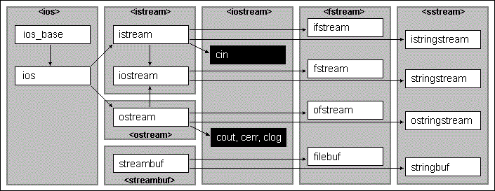

- [Операции](#операции)
- [Функции](#функции)
  - [Операторы](#операторы)
  - [Lambda](#lambda)
  - [Функторы](#функторы)
  - [Стандарные и пользовательские литералы](#стандарные-и-пользовательские-литералы)
- [Типы данных](#типы-данных)
  - [Преобразования типов](#преобразования-типов)
  - [Динамическая типизация](#динамическая-типизация)
    - [RTTI](#rtti)
- [Указатели и ссылки](#указатели-и-ссылки)
  - [Модель памяти и время жизни](#модель-памяти-и-время-жизни)
  - [R-value и L-value](#r-value-и-l-value)
  - [Сырые указатели](#сырые-указатели)
  - [Умные указатели](#умные-указатели)
- [Структуры и классы: ООП](#структуры-и-классы-ооп)
  - [Конструкторы и деструткоры](#конструкторы-и-деструткоры)
  - [Виртуальный "конструктор"](#виртуальный-конструктор)
  - [Статический полиморфизм](#статический-полиморфизм)
    - [Перегрузка методов](#перегрузка-методов)
  - [Динамический полиморфизм](#динамический-полиморфизм)
    - [Виртуальные методы](#виртуальные-методы)
    - [Таблица виртуальных методов](#таблица-виртуальных-методов)
    - [Вызов виртуальных методов из конструктора и деструктора](#вызов-виртуальных-методов-из-конструктора-и-деструктора)
    - [Вызов чисто виртуальной функции](#вызов-чисто-виртуальной-функции)
  - [Правило 0\5](#правило-05)
  - [Множественное наследование](#множественное-наследование)
- [Исключения](#исключения)
  - [Исключения в конструкторе](#исключения-в-конструкторе)
  - [Исключения в деструкторе](#исключения-в-деструкторе)
  - [Стандартные типы исключений](#стандартные-типы-исключений)
  - [Гарантии исключений](#гарантии-исключений)
- [Access violation](#access-violation)
- [Типизация](#типизация)
  - [Неявное\явное преобразование типов](#неявноеявное-преобразование-типов)
  - [const](#const)
    - [Переменные](#переменные)
    - [Функции](#функции-1)
  - [volatile](#volatile)
  - [Другие спецификаторы функций](#другие-спецификаторы-функций)
  - [Вывод типов](#вывод-типов)
    - [Шаблонных аргументов \ auto \ lamda](#шаблонных-аргументов--auto--lamda)
    - [decltype(auto)](#decltypeauto)
  - [type-casting](#type-casting)
    - [const_cast](#const_cast)
    - [reinterpret_cast](#reinterpret_cast)
    - [static_cast](#static_cast)
    - [dynamic_cast](#dynamic_cast)
    - [std::chrono::duration_cast](#stdchronoduration_cast)
- [Особенности языка](#особенности-языка)
  - [ADL (Argument Dependent Lookup)](#adl-argument-dependent-lookup)
  - [Static intialization fiasco](#static-intialization-fiasco)
- [Стандартная библиотека](#стандартная-библиотека)
  - [Потоки ввода вывода](#потоки-ввода-вывода)
  - [Отсчет времени](#отсчет-времени)
  - [Контейнеры](#контейнеры)
    - [Последовательные контейнеры](#последовательные-контейнеры)
    - [Упорядоченные ассоциативные контейнеры](#упорядоченные-ассоциативные-контейнеры)
    - [Неупорядоченные ассоциативные контейнеры](#неупорядоченные-ассоциативные-контейнеры)
    - [Адаптеры контейнеров](#адаптеры-контейнеров)
    - [Инвалидация](#инвалидация)
  - [Итераторы](#итераторы)
    - [InputIterator](#inputiterator)
    - [ForwardIterator](#forwarditerator)
    - [BidirectionalIterator](#bidirectionaliterator)
    - [RandomAccessIterator](#randomaccessiterator)
    - [OutputIterator](#outputiterator)
    - [std::iterator_trait](#stditerator_trait)
    - [Адаптеры итераторов](#адаптеры-итераторов)
  - [Алгоритмы](#алгоритмы)
  - [Многопоточность и concurency](#многопоточность-и-concurency)
    - [Потоки](#потоки)
    - [Модель памяти и std::atomic](#модель-памяти-и-stdatomic)
    - [Конкурентное выполнение](#конкурентное-выполнение)
    - [Распространенные ошибки с потоками](#распространенные-ошибки-с-потоками)
    - [Распространенные ошибки с асинхронностью](#распространенные-ошибки-с-асинхронностью)
- [Неопределенное и неуточненное поведение](#неопределенное-и-неуточненное-поведение)
- [Шаблоны](#шаблоны)
  - [Не типовые шаблонные параметры](#не-типовые-шаблонные-параметры)
  - [Типовые шаблонные параметры](#типовые-шаблонные-параметры)
  - [Ключевое слово typename](#ключевое-слово-typename)
  - [Вариативные шаблоны](#вариативные-шаблоны)
  - [Специализации шаблонов](#специализации-шаблонов)
    - [Частичная специализация](#частичная-специализация)
    - [Полная специализация](#полная-специализация)
  - [SFINAE](#sfinae)
  - [type-traits](#type-traits)
- [Идеомы](#идеомы)
  - [RAII](#raii)
  - [pImpl](#pimpl)
  - [Non-copyable/non-movable](#non-copyablenon-movable)
  - [Erase-remove](#erase-remove)
  - [Copy and swap](#copy-and-swap)
  - [Copy on write](#copy-on-write)
  - [CRTP (Curiously recurring template pattern)](#crtp-curiously-recurring-template-pattern)
  - [IILE](#iile)
- [Принципы разработки](#принципы-разработки)
  - [SOLID](#solid)
  - [KISS](#kiss)
  - [DRY](#dry)
  - [YANGI](#yangi)
  - [BDUF](#bduf)
  - [APO](#apo)
  - [Бритва Окама](#бритва-окама)


# Операции

Операции приведены в порядке их приоритетности, каждая группа это отдельный уровень приоритета. Операции одного уровня имеют равных приоритет, который можно изменить при помощи скобок.

```cpp
:: //1: Разрешения области видимости

. и -> //2: выбор члена класса
[] //2: индексация массива
() //2: вызов функции
++, -- //2: постфиксные инкримент\декримент
typeid //2: механизм RTTI
const_cast, dynamic_cast, reinterpret_cast, static_cast //2

sizeof //3
++, -- //3: префиксные инкримент\декримент
~ //3: или compl число необходимое чтобы дополнить все разряды до 1
! //3: или not логическое отрицание
+, - //3: унарные плюс и минус
& //3: операция взятия адреса
* //3: разименовывание указателя
new, delete //3
C-style cast () //3

.* и ->* //4: разименовывание указателя члена класса

*, /, % //5: умножение, деление и остаток от деления

+, - //6: сложение и вычитание

<<, >> //7: побитовый сдвиг влево и вправо (*2, /2)

<, >, <=, >= //8: операции сравнения логических выражений

==, != или not_eq //9: операции сравнения логических выражений

& или bitand //10: побитовое И

^ или xor //11: побитовое исключающее И (1 если 0 и 1)

| или bitor //12: побитовое ИЛИ

&& или and //13: логическое И

|| или or //14: логическое ИЛИ

?: //15: тернарный оператор
= //15: присвоение
*=, /=, %=, +=, -=, <<=, >>=, &= или and_eq, |= или or_eq ^= or xor_eq
throw //15

, оператор запятая //16: вычисляет два значения и возвращает второе
с = (a, b); //c == b 
с = a, b;   //с == a, вычисляется как (c = a), b
```
***

# Функции

## Операторы

Большинство операторов могут быть переопределены. Список не переопределяемых:

```cpp
. // выбор члена класса
.* // выбор указателя на член класса
:: // разрешение области
?: // тернарный оператор
# // препроцессор: преобразование в строку
## // препроцессор: конкатенация
```

Операторы могут быть определены как член класса, или глобальная функция. Во втором случае функция принимает первым аргументом константную ссылку на объект.
Рекомендации:

```cpp
Все унарные операторы //  Член класса
= () [] -> ->* - // Обязательно член класса
+= -= /= *= ^= &= |= %= >>= <<= - // Член класса
Остальные бинарные операторы - // Не член класса
```

Если оператор не является членом классом, он должен быть помечен как friend, для того чтобы работать с private\protected содержимым классов.

Примеры переопределений:

```cpp
class A 
{
    int a;

public:

    A(int a) : a(a) {}

    // Как глобальная функция
    friend const A operator+(const A& lhs, const A& rhs);

    // Как функция класса
    A operator-(A& other) {
        return A(a - other.a);
    }
};

const A operator+(const A& lhs, const A& rhs) {
    return A(lhs.a + rhs.b);
}
```

Перегрузка префиксных и постфиксных инкрементов и декриментов отличается тем, что постификсная форма принимает вторым аргументом int, который не используется


## Lambda

Общий вид:
```cpp
auto lambda = [capture-list](arguments) mutable
{
    ...
}; //Создание

//Если не указывать mutable - по дефолту аргументы не изменяемы

lambda(arguments); //Вызов
```

Списки захвата:
```cpp
[] // ничего не захватывается
[=] // локальные переменные по значению
[&] // локальные переменные по ссылке
[this] // this по ссылке
[*this] // объект по копии, нужен mutable для вызова не const f()
[a, &b] // захват отдельных перменных, по значению и ссылке
[&r = x] // захват переименованной ссылки
[x = x + 1] // инициализация переменной, может быть std::move()
```

Как возвращаемое значение, так и аргументы могут быть типа auto.

Если необходимо хранить переменную или контейнер lambd:

```cpp
std::function<return_type(arguments_types)> lamda;

std::vector<std::function<int(int)>> lambas_vector;
```

Cуществует возможность использовать обобщенные лямбды с переменным числом аргументов:

```cpp
auto variadic_lambda = [](auto... args) { function(args...); }
// Perfect forwarding:
auto variadic_lambda_ = [](auto&&... args) { std::forward<decltype(args)>(args)...; }
```

Так же они могут быть помечены как constexpr, если возможно вычисления будут выполненны на этапе компиляции.

## Функторы

Функтор это объект, у которого перегружен оператор ().
Они активно используются в STL, наравне с lambda, и например могут быть переданы в качестве аргумента в функцию сортировки.

Могут быть помечены как constexpr.

Так же существуют функторы из стандартной библиотеки:

```cpp
// Арифметические
std::plus<int>{};
std::minus<int>{};
std::multiplies<int>{};
std::divides<int>{};
std::modulus<int>{};
std::negate<int>{};

// Логические
std::less<int>{}(1, 0);
std::greater<int>{}(1, 0);
std::equal_to<type>{};
std::not_equal_to<type>{};
std::greater_equal<type>{};
std::less_equal<type>{};

std::logical_and<type>{};
std::logical_or<type>{};
std::logical_not<type>{};

// Побитовые
std::bit_and<type>{};
std::bit_or<type>{};
std::bit_xor<type>{};
std::bit_not<type>{};

// Хэширование
std::hash<Arithmetic>{};
std::hash<Enum>{};
std::hash<std::nullptr_t>{};
std::hash<T*>{};

// Searchers (для строк)
std::default_searcher<ForwardIt, BinaryPredicate>{};
std::boyer_moore_searcher<ForwardIt, BinaryPredicate>{};
std::boyer_moore_horspool_searcher<ForwardIt, BinaryPredicate>{};

// Отрицание функции (функция как аргумент)
std::not_fn<F>{};
```

## Стандарные и пользовательские литералы

Стандартные строковые литералы:

```cpp
"Text" //char 
L"Text" //wchar_t

u8"Text" //char - utf8
u"Text" //char16_t
U"Text"//char32_t

//Сырые строки обрамляются в () в "" и могут иметь произвольный delemiter
R"delimiter( raw string )delimeter" 
LR"delimiter( raw string )delimeter"

u8R"delimiter( raw string )delimeter"
uR"delimiter( raw string )delimeter"
UR"delimiter( raw string )delimeter"
```

Помимо стандартных литеральных типов, можно определять пользовательские.

Пример пользовательского литерала преобразования радиан в градусы.

```cpp
long double operator""_degrees(long double value)
{
	return value * M_PI / 180.0;
}

double degrees = 0.38__degrees
```

Список возможных аргументов, при определении пользовательского литерала:

```cpp
( const char * )
( unsigned long long int )	
( long double )	
( char )
( wchar_t )	
( char16_t )	
( char32_t )
( const char * , std::size_t )	
( const wchar_t * , std::size_t )	
( const char16_t * , std::size_t )	
( const char32_t * , std::size_t )
```


***

# Типы данных

C++ является статически типизированным языком, это значит что тип переменной не может меняться после инициализации.

## Преобразования типов

Безопасные преобразования, без потери данных:

```cpp
bool -> char -> short -> int -> double -> long double
bool -> char -> short -> int -> long -> long long
unsigned char -> unsigned short -> unsigned int -> unsigned long
float -> double -> long double
```

## Динамическая типизация

### RTTI

Существует ключевое слово typeid, которое может принимать как аргумент тип или выражение.

```cpp
typeid(int).name();
typeid(expression).nam();
```

Помимо получения имени типа есть ещё функции в типе std::type_info, возвращаемым оператором typeid().

Проверка является ли тип надлежащим.

```cpp
typeid(int).before(typeid(char)); // == false
typeid(char).before(typeid(int)); // == true
```

Возможно получить хэш значение из std::type_info

```cpp
size_t hash_id = typeid(int).hash_code();
```

***

# Указатели и ссылки

Указатель ссылается на область в памяти, они могут быть взяты от некоторой перменной, могут быть сравненны, к ним пременимы операции сложения и вычитания, и они могут быть разименованы, для получения значения переменной на которую они указывают.

Ссылки похожи на указатели, но они не содержут операций сравнения и операции сложения и вычитания.

## Модель памяти и время жизни

* Глобальны переменные
* Локальные переменные и агрументы функции, уничтожаемые при выходе из области видимости
* Динамически аллоцированные данные

Так же особые модели памяти используются в многопоточных приложениях, при взаимодействии с std::atomic, о них в разделе многопоточность.

## R-value и L-value

В C++ существует два разных типа ссылок, l-value представляют собой ссылку на некоторую переменную, т.е. являются некоторым аналогом указателя.

R-value представляют собой результаты выражений, т.е. временные объекты не привязанные к области памяти.

R-value ссылки используются для семантики перемещения.

Важно отметить, что в классе можно перегузить функции, и разные версии будут выбираться в зависимости от того является наш объект r или l value:

```cpp
struct A
{
  void f() & ; 
  void f() && ;
  void f() const & ;
  void f() const && ;
};
```

## Сырые указатели

Используются для предоставления доступа к объекту, через указатель на его базовый класс.

Так же при работе с сырыми указателями существует возможность конструирования объекта в уже выделенной памяти (placement new).

```cpp
unsigned char bufer[sizeof(int)] ;

int *pInt = new (bufer) int(42);
```

При использовании placement new не вызывается delete, но требуется вызывать деструктор, если он есть у объекта.

```cpp
unsigned char bufer[sizeof(NewClass)] ;
NewClass *pClass = new (bufer) NewClass(42);
pClass->~NewClass(); //Без этой строчки объект не будет разрушен
```

Так же при выделении массивов при помощи оператора new[] существует возможность задать значения по умолчанию:

```cpp
int* pArr = new int[N]{}; - создаёт массив с дефолтными значениями
```

## Умные указатели

* std::unique_ptr - основной тип умного указателя
* std::shared_ptr - указатель может использоваться в разных частях программы, деалокация происходит при уничтожении последнего объекта класса std::shared_ptr
* std::weak_ptr - используется для решения проблемы перекрестных ссылок, когда объекты ссылаются друг на друга, и не могут использовать shared_ptr, т.к. иначе память не будет высвобождена

std::weak_ptr создаётся из объекта std::shared_ptr, и может проверять является ли указатель висячим.

Для создания unique_ptr или shared_ptr предпочтительно использовать функции make_unique\make_shared. Они повышают устойчивость к исключениям, а так же могут избавлять от неопреденности порядка вычисления аргументов выражения.

Ситуация когда make функции не применимы - требудется задать пользовательский deleter.


Умные указатели могут так же использоваться для аллокации массивов:

```cpp
// Для того чтобы освобождать память правильно может понадобится свой deleter
std::shared_ptr<int> array_with_deleter(new int[10], std::default_delete<int[]>());

//Эквивалентно:
std::shared_ptr<int> sp(new int[10], [](int *p) { delete[] p; });

//Однако если не требуется использование общей памяти можно использовать std::unique_ptr
std::unique_ptr<int[]> unique_array(new int[10]);
```

Так же для объектов существует возможность возвращать shared_ptr. Для этого требуется используя CRTP унаследоваться от enable_shared_from_this. Тогда становится возможным вызывать функцию shared_from_this. Которая вернёт shared_ptr на this.


```cpp
struct A : public std::enable_shared_from_this<A> {
    A() { std::cout << "+\n"; }
    ~A() { std::cout << "-\n"; } 
    std::shared_ptr<A> getA() { return shared_from_this(); }
};
 
int main() {
    A *a = new A;
    std::shared_ptr<A> p1;
 
    {
        std::shared_ptr<Foo> p2(f);
        p1 = p2->getA();  // Разделяет владение объектом с p2
    }
 
    std::cout << "p2 is gone\n";   
}
```cpp

Однако такое поведение, при определенном поведении может приводить к негативным результатам:

https://habr.com/ru/post/471326/

### make_shared, make_unique

Изначально данные функции использовались с целью прекратить утечку памяти, однако такое поведение существовало до C++17. make_shared размещает управляющий блок и объект в соседней области, и он не будет освбожден пока есть хотя бы одна слабая ссылка. make_shared не поддерживает создание приватным конструктором, и не поддерживает кастомных делитеров. Так же перегруженные new\delete игнорируются make_shared.


## Object slicing

Операция присвоения\конструктора копирования, при которой теряется часть данных и виртуальные функции изначального объекта.

```cpp
class A 
{
  int a;
};

class B : public A
{
  int b;
};


B normal;

//Объект будет срезан:
A sliced = normal;

B another;
//Все будет в порядке:
A& fine = another;

//Объект будет содержать смесь normal и another:
another = normal;
```

***

# Структуры и классы: ООП

## Конструкторы и деструткоры

Конструкторы вызываются от базового класса, к дочерним.
Деструкторы вызываются в противоположном направлении, от дочерних классов к базовому.

Если конструктор базового класса требует аргументов, тогда он должен быть вызван в конструкторе дочернего класса:

```cpp
class A 
{
public:
    A(int a) {}
};

class B  : public A
{
public:
    B() : A(1) {}
};
```

Существует возможность запретить конструктор, пометив его ключевым словом = delete. Таком можно запретить копирование или перемещени объекта.

Таким образом можно пометить любые функции, как члены класса, так и обычные и даже истанцирование шаблона!


## Виртуальный "конструктор"

Рассмотрим проблемную ситуацию

```cpp
class A {

public:
    virtual A* clone() { return (new A(*this)); } 

};

class B : public A {

public:

    //co-variant return type: перегрузка функции возвращающей разные указатели, но в иерархии наследования
    virtual B* clone() { return (new B(*this)); }

};

void foo(A* to_copy)
{
    //Не смотра на то, что мы передаём объект B, сконструирован по копии будет А
    A* a = new A(*to_copy);

    //Решение
    A* a2 = to_copy->clone();
}

B b;
foo(&b);
```

## Статический полиморфизм

### Перегрузка методов

В языке C++ могут быть перегруженны функции. Перегруженные функции имеют одинаковое название, но разное количество аргументов, и\или разных тип аргументов.

Вызываемая функция определяется на этапе компиляции.

## Динамический полиморфизм

### Виртуальные методы

Виртуальные функции реализуют механизм позднего связавания, или дианамический полиморфизм. Он отличает от статического тем, что происходит на этапе выполнения.

Для этого требуется пометить функцию в базовом классе ключевым словом virtual. И определить такую же функцию в дочернем классе. При переопределении функции в дочернем классе крайне желательно использовать ключевое слово override, оно позволяет проще читать код, а так же может защитить от ошибки когда сигнатуры функций различались.

Суть полиморфизма реализуемого через виртуальные функции сводится к идее использования указателя\ссылки интерфейса (базового класса) для разных реализацией дочернего. 


### Таблица виртуальных методов

Указатель на таблицу виртуальных методов vptr присутствует в любом классе, которых содержит хотя бы 1 виртуальную функцию.

Если в базовом классе есть хотя бы 1 виртуальная функция, деструктор в ней должен быть помечен virtual. В противном случае при удалении указателя на базовый класс, по адресу которого находится дочерний класс - будет вызван только деструктор базового класса.

При наличии аргументов по умолчанию, будут выбираться те, что соответствуют типу указателя, по которому вызывается функция объекта. Т.е. это происходит на этапе компиляции, и для родительского указателя будет взят родительский аргумент по умолчанию, а для дочернего - дочерний элемент по умолчанию.


### Вызов виртуальных методов из конструктора и деструктора

Когда виртуальная функция вызывается из конструктора, т.к. конструкторы дочерних классов ещё не вызывались и потому реализованные в них функции не будут вызванны. Таким образом при вызове виртуальной функции из конструктора будет вызванна та его версия, которая заполненна в таблице виртуальных функций к моменту выполнения конструктора.

При вызове виртуальных функций из деструктора возникает схожая проблема. Т.е. если мы вызываем виртуальную функцию из деструктора базового класса, будет вызванна та его версия, которая находится в таблице виртуальных методов. Те деструкторы дочерних классов, которые уже отработали, очистят таблицу виртуальных функций от своих методов.

Однако если поведение описанное выше соответствует задуманному, т.е. ошибка отсутствует можно вызывать функции используя явное указание на класс из которого вызывается функция. Это никак не меняет поведение программы, но читать такой код проще, и компилятор\статический анализатор не выдадут предупреждения о возможной ошибке.

```cpp
B() {
  std::cout << "B()\n";
  A::foo();
  B::bar();
};
```

### Вызов чисто виртуальной функции

Чисто виртуальные функции используются в базовых классов, в которых отсутствует реализация этого виртуального метода. Подобная методология позволяет создавать абстрактные классы, объекты которых нельзя создать. Однако указатели на такие классы позволяют обращаться к дочерним классам и вызывать их виртуальные функции.

Если вызвать такую функцию из конструктора базового класса это приведёт к аварийному завершению программы.


## Правило 0\5

Правило 3 и 5 гласит, что если нам требуется реализация копирующего или перемещающего конструкторов, или соотвествующих операторов, или деструктора работающего с выделяемой памятью - рекомендуется реализовать все эти функции.

Правила автоматической генерации выше описанных операторов\конструкторов и деструктора:

* Конструктор по умолчанию генерируется если не было объявленные пользовательские конструкторы

* Деструктор по умолчанию будет виртуальным, только если деструктор базового класса был виртуальным

* Перемещяющие методы генерируются для классов, где нет явно объявленных ни перемещающих, ни копирующих, ни деструктора

* Конструктор копирования генерируется если он не был объявлен явно, и удаляется если был объявлен конструктор перемещения. Схоже с оператором.

* Шаблонные функции\конструкторы не влияют на выше описаные правила.

Правило 0 гласит, что не следует вручную создавать такие функции, а доверить им поведение по умолчанию = default. А для хранения указателей использовать их умные версии, избавляя себя от необходимости реализовывать деструктор.


## Множественное наследование

Пример множественного наследования:

```cpp
class X
{};
class Y
{};
class Z
{};
class A : public X, public Y, public Z
{};
```

При конструировании объекта вначале выполняются конструкторы базовых классов, в порядке их выполнения. Потом конструкторы членов результирующего класса. И уже само тело конструктора результирующего класса. Деструкторы так же вызываются в противоположной последовательности.

Правила доступа к членам класса такие же как при наследовании от одного класса. Однако возможны проблемы:

* Если в порожденном классе используется член с таким же именем, как в одном из базовых классов
* Если в нескольких базовых классах определены члены с одинаковыми именами

В этих случаях необходимо использовать оператор разрешения видимости для уточнения элемента, к которому осуществляется доступ, именем требуемого класса.

Однако базовый класс может быть задан только однажы во всей иерархии наследования. Для того чтобы включить базовый класс более одного раза используется виртуальное наследование \ ромбовидное наследование:

```cpp
class X
{};
class Y : virtual public X
{};
class Z : virtual public X
{};
class A : public Y, public Z
{};
```

Тогда конструктор X будет вызван единожды. Без ключевого слова virtual конструкторы X будут вызванны дважды, перед конструктором Y, и перед конструктором Z.

Конструкторы и деструкторы при использовании виртуальных базовых классов выполняются в следующем порядке:

* Конструкторы виртуальных базовых классов выполняются до конструкторов не виртуальных базовых классов, независимо от того, как эти классы заданы в списке порождения
* Если класс имеет несколько виртуальных базовых классов, то конструкторы этих классов вызываются в порядке объявления виртуальных базовых классов в списке порождения
* Деструкторы виртуальных базовых классов выполняются после деструкторов не виртуальных базовых классов.

Если у нескольких наследуемых классов есть одинаковые функции, то для доступа к ним нужно либо использовать явное расширение области видимости, либо же использовать ссылку\указатель на требуемый класс, для вызова соответствующей функции.


```cpp
class A 
{
  public:
  
  A(){ cout << "+A"; }
  ~A() { cout << "-A" << endl;; }
};

class B : public A
{
  public:
  
  B(){ cout << "+B"; }
  ~B() { cout << "-B"; }
};

class C : public B 
{
public:
  
    C() { cout << "+C"; }
    ~C() { cout << "-C"; }
};


class D : public C, public B
{
    D(){ cout << "+D"; }
    ~D() { cout << "-D"; }
};


class A2 
{
  public:
  
  A2(){ cout << "+A2"; }
  virtual ~A2() { cout << "-A2" << endl;; }
};

class B2 : virtual public A2
{
  public:
  
  B2(){ cout << "+B2"; }
  virtual ~B2() { cout << "-B2"; }
};

class C2 : virtual public B2 
{
public:

    C2() { cout << "+C2"; }
    virtual ~C2() { cout << "-C2"; }
};


class E : public C2, virtual public B2
{
    public:
        
    E() { cout << "+E"; }
    virtual ~E() { cout << "-E"; }
};


//Вывод: +A+B+C+A+B+D
// +A2+B2+C2+E
// _E_C2_B2_A2
// _D_B_A_C_B_A
```

***

# Исключения

Исключения прерывают поток выполнения комманд функции. Отличие throw от return, стек будет раскручиваться до тех пор пока не будет найден блок try, и все объекты по пути к этому блоку будут разрушаться.

Если исключение не было обработано - это приводит к аварийному завершению программы.

Так же исключение можн пробросить дальше по стеку, используя ключевое слово throw без параметра.

Блоки catch обрабатываются в порядке их определения, потому если вначале разместить блок с std::exception, а потом с std::logic_error, обработан будет только первый блок, т.к. это базовый класс для std::logic_error.

Так же блок обработки catch может иметь аргумент "...", в этот блок перейдёт управление, если не ни один другой блок не смог обработать исключение.

## Исключения в конструкторе

Если конструктор выбрасывает исключение, то объект не будет сконструкирован. Как следствие не будет вызван деструктор. Иногда это может приводить к утечкам памяти. 

Однако выбрасывать исключения в конструкторах всё же можно. Стандарт гарантирует, что при выбросе исключения из конструктора, все уже сконструкированые члены объекты будут успешно разрушены. Как следствие если мы используем идеому RAII то проблемы не будет.

## Исключения в деструкторе

Начиная с C++11 деструкторы помечены как noexcept, это означает что они не могут выбрасывать исключения наружу, это приводит к аварийному завершению программы.

Однако даже если исключения стремятся быть обработаны, проблемы могут могут возникнуть по другим причинам:

Программа не должна выбрасывать исключения, пока происходит обработка другого исключения, т.к. раскрытка стека до момента нахождения блока try. Это приведёт к аварийному завершению программы.

Причина такого поведения может быть в том, что один из деструкторов при раскрутке стека выбрасывает исключение сам, либо же не обрабатывает исключение функции, которую вызывает.

Другая проблема может возникнуть когда исключение покидает блок try, тогда происходит разрушение всех объектов, которые созданы в блоке try. Если один из объектов выкинет исключение в деструкторе, то программа завершится аварийно.

В стандартный библиотеке существует функция std::uncaught_exception, которая позволяет проверить почему уничтожается объект, из-за выброшенного исключения, или же по другой причине. Однако, желательно не использовать её, по мере возможностей.

## Стандартные типы исключений

Существует множество типов унаследованных от std::exception. В объектах исключений существует фунция what, возвращающая const char *.

```cpp
logic_error
    invalid_argument
    domain_error
    length_error
    out_of_range
    future_error

runtime_error
    range_error
    overflow_error
    underflow_error
    regex_error
    system_error
    ios_base::failure
    filesystem::filesystem_error(C++17)
    tx_exception(TM TS)
    nonexistent_local_time(C++20)
    ambiguous_local_time(C++20)
    format_error(C++20)

bad_typeid
bad_cast
    bad_any_cast(C++17)

bad_optional_access(C++17)
bad_weak_ptr
bad_function_call
bad_alloc
    bad_array_new_length

bad_exception
bad_variant_access(C++17)
```

Так же существует возможность определить функцию, которая будет вызываться вместо terminate, при условии отсутствия обработки выброшенного исключения.

## Гарантии исключений

Существует 4 уровня гарантий исключений для функции:

* noexcept - гарантия что код не выбрасывает исключение никогда
* Строгая гарантия - если функция выходит за пределы области видимости из-за исключения не случится утечки памяти, и состояние программы будет не изменено
* Базовая гарантия - утечки не будет, и объект в рабочем состоянии, но состояние может быть изменено
* Отсутствие гарантий - возможны утечки и объект может стать не рабочим

# Access violation

Аварийное состояние, которое возникает при обращении к памяти, к которой не должно быть доступа. 

Такие исключительные ситуации не могут быть обработанны при помощи стандартных средств языка C++. 

В компиляторах MS Visual C++ существуют отдельные подобные try-catch  блоки для этой цели.

Другой вариант, это обработка POSIX сигналов, например SEG_FAULT.

***

# Типизация

## Неявное\явное преобразование типов

```cpp
class A {};

class A2 {};

class B
{
    std::string str = "test";

public:

    B(const A& a) {}

    explicit B(const A2& a) {}

    std::string operator() const { return str; }
};

A a;
B b = a; //Неявное преобразование

A2 a2;
B b2 = a2; //Запрещено

std::string implicit = b; //Неявное преобразование
```
Опасной может быть ситуация, когда не explicit конструктор имеет 2 аргумента, со дефолтными значениями, и объект такого типа создается присвоением одной переменной соответствующего типа. Будет неявное преобразование типа, с поведением, которое не задуманно.

## const

### Переменные

```cpp
//Константный int
const int i = 1; 

//Альтернативная запись
int const j = 2; 

//Указатель на константный int
const int* pI = &i; 

//Константный указатель
int const* const cP = &i; 

//Снятие модификатора
const_cast<int&>(i) = 3; 

int k = 0;
// Ошибка компиляции, так можно добавить константность
static_cast<const int&>(k) = 1; 
```

### Функции

```cpp
class A
{
    std::string value = "test";
    int i = 0;
    
    mutable int j = 0;

    int* p_i; //Предположим что оно проиницилизированно

public:

    void f(const int i) {}

    //Ошибка компиляции, сигнатура считается одинаковой
    void f(int) {} 

    //Так функции могут быть перегружены
    void f_ref(int& r_i) {} 

    //Данная функция будет вызванна от r-value или const int как аргумента
    void f_ref(const int& c_r_i) {}

    //Возврат константной ссылки
    const string& get_const_ref() { return value; } 

    //const функция не даст изменить состояние объекта
    //Из неё могут вызываться только другие const функции
    int const_f() const { return i; } 
    
    //const функции можно перегружать, и они будут выбираться в зависимости от нашего объекта типа A
    int const_f() { return i };

    //Модификация j разрешена из-за ключевого слова mutable
    void set_const_f() const { j = 1; } 
    

    //Такой вызов разрешён, т.к. сам указатель не меняется
    void update_value() const { *p_i = 0; }

    //Другой метод обойти константность, помимо mutable
    void trick() const 
    {
        const_cast<A*>(this)->i = 1;
    }
}
```

Константность объектов и функций может быть очень полезна в многопоточных приложения. Константные объекты являются потоко-безопасными. Однако важно следить за тем, чтобы константные версии функций были тоже потоко-безопасны, и осуществлять соответствующую защиту.

## volatile

Ключевое слово для типа переменной, которое указывает на возможность использования переменной извне, что ведёт к запрету на оптимизацию.

Без ключевого слова volatile компилятор решит что переменная не меняется никогда, и все условия с ней будет оптимизировать на этапе компиляции.

Другой использования volatile: зануления конфеденциальной информации, т.к. компилятор может оптимизировать эту операцию, если область памяти с информацией после не используется после зануления.

## Другие спецификаторы функций

Так же существуют 2 спецификатора, являющихся частью системы типов.

Функции помечанные noexcept не должны выбрасывать исключения. Подбронее об этом в разделе исключения.

```cpp
struct A {
  void f() noexcept; 
}
```

Функции помеченные constexpr могут осуществлять вычисления на этапе компиляции.

```cpp
constexpr int f(int a, int b) {
  return a + b;
}
```


## Вывод типов


Правила для вывода шаблонных аргументов:

+ для указателей и ссылок
+ для обычных типов
+ r-value ссылки, которые в шаблонах работают не совсем как r-value, а как forwarding reference и в зависимости от того чем инициализируется становится либо r-value либо l-value ссылкой.

Ключевое слово auto наследует правила вывода всех шаблонных аргументов.

Ключевое слово decltype имеет собственные правила вывода типов.

Списки захвата lambda наследуют правила вывода типов для ссылок и указателей шаблонных аргументов.

Вывод возвращаемых типов lambda, который как auto наследует правила вывода шаблонных аргументов.

### Шаблонных аргументов \ auto \ lamda

Для (T param) отбрасываются ссылки, const, volatile.

Для (const\volatile T param) так же отбрасываются, но param будет иметь указанный спецификатор.

Для (T& param) отбрасываются ссылки, но сохраняются const\volatile. При этом param будет иметь тип ссылки. Если для param нужно добавить консткнтность, то требуется использовать (const T& param).

Если мы передаём массивы то: T = int[10], param = int(&)[10].
Если мы передаём функцию то: T = voic(), param = void(&)().

Для (T* param) действуют такие правила. Модификаторы сохраняются для T, но отбрасывается указатель для T, но param будет указателем.

Для (T&& param), т.е. forwarding refernce сохраняются спецификаторы для T, а param становится либо l-value, либо r-value ссылкой.

Для того чтобы вручную исследовать тип T и param можно использовать RTTI:

```cpp
std::cout << typeid(T).name() << " " << typeid(param).name() << std::endl;
```

Ключевое слово auto наследует поведение вывода шаблонных аргументов. Однако важно учитывать одну важную особенность:

```cpp
auto a = {1}; //В обоих случаях auto будет не int
auto b {2}; //а initializer_list<int>
```

Список захвата lamda наследует поведение вывода шаблонных аргументов. Для простых типов, и для ссылок и указателей.

Важно отметить, что если захваченное значение нужно модифицировать, требуется пометить lambda ключевым словом mutable. Но если захват при помощи ссылки - то её можно модифицировать, если только захватывается не константный объект.

### decltype(auto)

Сохраняет модификаторы.

Но для l-value значений типа T, отличных от имени, всегда даёт T&.

## type-casting

### const_cast

Используется для снятия квалификаторов const\volatile. Может применяться только к указателям, ссылкам или указателям на член класса.

### reinterpret_cast

Позволяет преобразовывать любой указатель в указатель любого другого типа. Также позволяет преобразовывать любой целочисленный тип в любой тип указателя и наоборот.

### static_cast

Static_cast создан для выполнения всех видов преобразований, разрешённых компилятором. Все преобразования работают, только если есть совместимость по const и volatile.

Необходим для преобразования enum class.

Так же может использоваться для явного указания, какую из перегруженных функций брать:

```cpp
std::transform(s.begin(), s.end(), s.begin(), static_cast<int(*)(int)>(std::toupper));
```

### dynamic_cast

Преобразует ссылку или указатель вниз по иерархии наследования, т.е. из типа предка в тип потомка, с проверкой возможно ли такое преобразование.

### std::chrono::duration_cast

Преобразование между разными длительностями времени (секунда\минута итд). static_cast не подходит, из-за возможной потери точности. 

***


# Особенности языка

## ADL (Argument Dependent Lookup)

Позволяет находить определения в связанных областях видимости.
Не применяется если обчыный поиск позволяет найти нужное имя.

## Static intialization fiasco

Проблема возникает при инциализации одной глобальной переменной другой. Этого надо строго избегаить.

***

# Стандартная библиотека
***

## Потоки ввода вывода
***

Иерархия потоков ввода вывода:



Существует 4 основных заголовочных файла, для использования стандартных реализаций потоков:

* iostream - содержит стандартный потоки ввода и вывода, cout, cin, cerr, clog
* fstream - содержит потоки ввода и вывода в файлы
* sstream - содержит строковые потоки ввода и вывода
* iomanip - содержит манипуляторы для потоков ввода и вывода

Каждый из первых 3х заголовочных файлов содержит по 3 класса, для чтения, записи и комбинированный. И ещё 3 для чтения unicode файлов, к их названию добавляется префикс 'w'.

iostream содержит: istream, ostream, iostream.

fstream содержит: ifstream, ofstream, fstream.

sstream содержит: istringstream, ostringstream, stringstream.

Стоит отметить, что эти классы представляют собой typedef от basic версий:

```cpp
typedef basic_ifstream<char>       ifstream;
typedef basic_ifstream<wchar_t>   wifstream;
typedef basic_ofstream<char>       ofstream;
typedef basic_ofstream<wchar_t>   wofstream;
typedef basic_fstream<char>         fstream;
typedef basic_fstream<wchar_t>     wfstream;
```

Для записи и чтения в поток существуют перегруженные операторы << и >> соответственно. Так же присутствуют другие функции для чтения и записи.

Чтение:

* get - читает один символ
* peek - читает следующий символ, не смещая позицию в потоке
* unget - возвращает последний считанный символ в поток
* putback - возвращает символ в поток, указанный аргументом
* getline - считывает последовательность символов, до указанного символа
* ignore - пропускат последовательность, до указанного символа
* read - читает блок символов, и записывает по адрессу первого аргументов, а число символов задаётся вторым аргументом типа std::streamsize
* readsome - читает блок символов, и записывает по адрессу первого аргументов, а число символов задаётся вторым аргументом
* gcount - возрващает число символов std::streamsize считанных последней не форматированной операцией

Для позиционирования в потоках чтения предусмотренны следующие функции:

* tellg - возвращает текущую позицию std::streamsize
* seekg - устанавливает текущую позицию, есть две перегрузки функции, с одним аргументом, и с двумя, где второй задаёт точку отсчёта, а первый может быть отрицательным

Точки отсчёта:

+ std::ios_base::beg - с начала поток
+ std::ios_base::end - с конца потока
+ std::ios_base::cur - с текущей позиции

Запись:

+ put - записывает единичный символ
+ write - записывает группу символов, первый аргумент указатель, второй число символов 

Для позиционирования в потоках чтения предусмотренны следующие функции:

* tellp - возвращает текущую позицию
* seekp - устанавливает текущую позицию, есть две перегрузки функции, с одним аргументом, и с двумя, где второй задаёт точку отсчёта, а первый может быть отрицательным

Данные могут записываться в поток не мгновенно, это сделанно для оптимизации, для того чтобы "пробросить" текущие накопленные данные существует функция flush.


Манипуляторы используются с перегруженным оператором <<, позволя менять внешний вид данных в поток вывода:

* boolalpha :	вывод bool как true\false 
* dec :	Использовать десятеричную систему счисления 
* endl :	Добавить переход на новую строку и выполнить flush 
* ends :	Добавить нулевой символ 
* fixed :	Использовать фексированную натацию вещественных чисел 
* flush :	Так же как функция flush 
* hex :	Использовать шеснадцатеричную систему счисления
* internal :	Заполняет данные по ширине position 
* left :	 Заполняет данные слева
* noboolalpha :	Отменяет ранее установленный манипулятор
* noshowbase :	Отменяет ранее установленный манипулятор 
* noshowpoint :	Отменяет ранее установленный манипулятор
* noshowpos :	Отменяет ранее установленный манипулятор
* noskipws :	Отменяет ранее установленный манипулятор
* nounitbuf :	Отменяет ранее установленный манипулятор 
* nouppercase :	Отменяет ранее установленный манипулятор
* oct :	Использовать восмеричную систему счисления 
* resetiosflags :	Отменяет все ранее установленные манипуляторы
* right :	Заполняет данные слева (стандартное поведение)
* scientific :	Использовать научную нотацию для вещественных чисел
* setbase :	Установить произвольную систему счислени 
* setfill :	Заполнять линию указанным символом на setw символов 
* setiosflags :	Установка флагов из std::ios::
* setprecision :	Установить количество цифр в вещественном числе 
* setw : Установить число символов перед выводов, по умолчанию пробел 
* showbase :	Отображать символы показывающие системы счисления
* showpoint :	Показывать точку, для вещественных чисел без дробной части
* showpos :	Показывать значки + и - 
* skipws :	Пропускать пробелы для потока вывода 
* unitbuf :	Делать flush после каждой записи
* uppercase :	Установка верхнего регистра букв 
* ws : Для потока вывода считывает пробелы, табуляци, переход на новую строку, останавливается на первом "обычном" символе


## Отсчет времени
***

```cpp
#include <chrono>

template <class Clock, class Duration = typename Clock::duration>
std::chrono::time_point; //Тип для хранения момента времени

std::chrono::system_clock; //Возможные типы отсчётов
std::chrono::high_resolution_clock;
std::chrono::steady_clock; //Наиболее приоритетный

auto start = std::chrono::steady_clock::now();
auto end = std::chrono::steady_clock::now();

std::chrono::duration<double> elapsed_seconds = end - start;
auto durMs = duration_cast<std::chrono::miliseconds>(end - start);

//Другие варианты для std::chrono::duration_cast:
std::chrono::nanosecods;
std::chrono::microseconds;
std::chrono::miliseconds;
std::chrono::seconds;
std::chrono::minutes;
std::chrono::hours;
```

Функции работы с датой появились только в C++20. До C++ можно было использовать C-style функции работы со временем из заголовочного файла ctime.


```cpp
#include <ctime>

time_t rawtime;
struct tm * timeinfo;

// текущая дата в секундах
time( &rawtime );  

// дата, представленная в нормальной форме
timeinfo = localtime ( &rawtime ); 

// Возвращает char* с читаемой датой\временем
asctime (timeinfo); 
```

## Контейнеры
***

### Последовательные контейнеры

**std::vector** хранит объекты типа T в динамически выделенной памяти.

+ at, operator[] -  O(1), at может бросить исключение
+ data -  O(1)
+ front, back -  O(1)
+ empty -  O(1)
+ size, max_size, capacity -  O(1)
+ resize, reserve, shrink_to_fit -  O(n)
+ clear, erase -  O(n)
+ insert, emplace, push_back -  O(1) или O(n)
+ emplace_back, pop_back -  O(1)
+ swap -  O(1)
+ get_allocator -  O(1)

**std::array** отличается от std:vector тем, что хранит элементы на стеке, а не в динамически выделенной памяти. В отличии от сырых массивов его можно передавать как по значению, так и по ссылки, и в первом случае он будет копироваться.

+ at, operator[] -  O(1)
+ data -  O(1)
+ front, back -  O(1)
+ empty -  O(1)
+ size, max_size -  O(1)
+ swap -  O(n)

**std::forward_list** представляет собой однонаправленный список. .

+ front -  O(1)
+ empty -  O(1)
+ max_size -  O(1)
+ resize -  O(n)
+ clear -  O(n)
+ erase_after -  O(1)-O(n)
+ insert_after -  O(1)-O(n)
+ push_front, emplace_after, emplace_front -  O(1)
+ pop_front -  O(1)
+ swap -  O(1)
+ merge -  O(n)
+ splice_after -  O(1)-O(n)
+ remove, remove_if -  O(n)
+ reverse -  O(n)
+ sort -  -  O(n log n)
+ unique -  O(n)
+ get_allocator -  O(1)

**std::list** двунаправленный список, занимает больше памяти.

+ front, back -  O(1)
+ empty -  O(1)
+ max_size -  O(1)
+ resize -  O(n)
+ clear -  O(n)
+ erase -  O(n)
+ insert -  O(1)-O(n)
+ push_front, push_back, emplace, emplace_front, emplace_back -  O(1)
+ pop_front, pop_back -  O(1)
+ swap -  O(1)
+ merge -  O(n)
+ splice_after -  O(1)-O(n)
+ remove, remove_if -  O(n)
+ reverse -  O(n)
+ sort -  -  O(n log n)
+ unique -  O(n)
+ get_allocator -  O(1)


**std::deque** - двусторонняя очередь (стек + очередь).

+ at, operator[] -  O(1)
+ front, back -  O(1)
+ empty -  O(1)
+ size, max_size -  O(1)
+ resize, shrink_to_fit -  O(n)
+ clear, erase -  O(n)
+ insert, emplace, push_front, push_back, O(1), O(n)
+ emplace_front, emplace_back, pop_front, pop_back -  O(n)
+ swap -  O(1)
+ get_allocator


### Упорядоченные ассоциативные контейнеры

**std::set / std::multiset** реализация это красно-черное дерево даёт сбалансированное бинарное дерево поиска, благодаря этом средняя скорость поиска имеет логарифмическую сложность.

std::multiset может хранить повторяющиеся значения, но они так же будут отсортированны.

+ empty -  O(1)
+ size, max_size -  O(1)
+ clear -  O(n)
+ erase -  O(1), O(log n), O(n)
+ insert, emplace -  O(log n)
+ emplace_hint -  O(1), O(log n)
+ swap -  O(1)
+ merge -  O(n log n)
+ extract -  O(1), O(log n)
+ count, find, contains, equal_range -  O(log n)
+ lower_bound, upper_bound -  O(log n)
+ key_comp, value_comp -  O(1)
+ get_allocator -  O(1)


**std::map / std::multimap** - словарь.

+ at, operator[] -  O(log n)
+ empty -  O(1)
+ size, max_size -  O(1)
+ clear -  O(n)
+ erase  -  O(1), O(log n), O(n)
+ insert, insert_or_assign, emplace, try_emplace - O(log n)
+ emplace_hint  -  O(1), O(log n)
+ swap -  O(1)
+ merge -  O(n log n)
+ extract  -  O(1), O(log n)
+ count, find, contains, equal_range -  O(log n)
+ lower_bound, upper_bound -  O(log n)
+ key_comp, value_comp -  O(1)
+ get_allocator -  O(1)


### Неупорядоченные ассоциативные контейнеры

Особенность неупорядоченных ассоциативных контейнеров заключается в том, что они используют хэш-функцию, для хранения ключей. Это позволяет добиться более быстрого доступа к элементам, в средем за константное время.

**std::unordered_set:**

+ empty -  O(1)
+ size, max_size -  O(1)
+ clear -  O(1)
+ erase -  O(1), O(log n), O(n)
+ insert, emplace -  O(1)
+ emplace_hint -  O(1), O(log n)
+ swap -  O(1)
+ merge -  O(n)
+ extract -  O(1), O(n)
+ count, find, contains, equal_range -  O(log n)
+ lower_bound, upper_bound -  O(log n)
+ key_eq, hash_function -  O(1)
+ get_allocator -  O(1)

**std::unordered_map:**

+ at, operator[] -  O(1), O(n)
+ empty -  O(1)
+ size, max_size -  O(1)
+ reserve -  O(n), O(n^2)
+ clear -  O(n)
+ erase  -  O(1), O(n)
+ insert, insert_or_assign, emplace, try_emplace - O(log n)
+ emplace_hint  -  O(1), O(log n)
+ swap -  O(1)
+ merge -  O(n)
+ extract  -  O(1), O(log n)
+ count, find, contains, equal_range -  O(log n)
+ lower_bound, upper_bound -  O(log n)
+ key_eq, hash_function -  O(1)
+ get_allocator -  O(1)

### Адаптеры контейнеров

Это разновидность контейнеров, которые могут использовать для своей реализации другой класс контейнера.

**std::stack:**

+ top - O(1)
+ empty - O(1)
+ size - O(1)
+ swap - как в контейнере ниже
+ push, emplace - как в контейнере ниже push_back, emplace_back
+ pop - как в контейнере pop_back

Ниже лежайщими контейнерами могут быть std::deque, std::vector и std::list.

**std::queue:**

+ front, back - O(1)
+ empty - O(1)
+ size - O(1)
+ swap - как в контейнере ниже
+ push, emplace - сложность как в контейнере ниже у функций push_back, emplace_back  
+ pop - сложность как в контейнере ниже у pop_front

Типы нижележащий контейнеров контейнеров: deque, list.

**std::priority_queue:** Очередь с приоритетом, реализуется через кучу.

+ top - O(1)
+ empty - O(1)
+ size - O(1)
+ swap - как в контейнере ниже
+ push, emplace - как в контейнере ниже push_back, emplace_back
+ pop - как в контейнере pop_back

Очередь с приоритетом. По умолчанию нижележайший контейнер это std::vector. Помимо него могут быть std::list, std::deque.

### Инвалидация

**std::vector**

Инвалидация может происходить при:

+ вставке нового элемента (если ставка не в конец или начало) - все инвалидируются
+ при удалении элемента (если удаление происходит не с конца) - инвалидируются элементы после вставленного
+ при выделения памяти resize или при реалокации - как и при вставке\удалении

**std::deque**

Инвалидация может происходить при:

+ вставке нового элемента (если ставка не в конец) - инвалидируются все после вставленного элемента
+ при удалении элемента (если удаление происходит не с конца\начала) - инвалидируются все элементы
+ при выделения памяти resize или при реалокации - как и при вставке\удалении

**std::list \ std::forward_list**

Инвалидируются только значения\ссылки по удаленным итереаторам.

**std::map \ multimap \ set \ multiset**

Инвалидация происходит только при удалении.

## Итераторы
***

Итераторы это обобщенные указатели, которые используются для унифицированного доступа к контейнерам и потокам ввода\вывода.

InputIterator:

+ std::istream

ForwardIterator:

+ std::forward_list
+ std::unordered_set
+ std::unordered_map
+ std::unordered_multiset
+ std::unordered_multimap

BidirectionalIterator:

+ std::list
+ std::set
+ std::multiset
+ std::map
+ std::multimap

RandomAccess \ ContinuesIterator (C++17):

+ std::array
+ std::vector
+ std::string
+ std::string_view
+ std::valarray

OutputIterator:

+ std::ostream

Последовательность первых 5 итераторов иерархична, и каждая следующая группа имеет больше возможностей, чем предшествующая.

### InputIterator

```cpp
std::istream& is;

std::istreambuf_iterator it {is};
std::istreambuf_iterator<char> end;

//size_t count = std::distance(it, end); //O(n)
//Если строчку выше раскоментить, то buf окажется пустой, т.к. it смещён!

std::string buf {it, end};
```

```cpp
std::vector<int> v { std::istreambuf_iterator<int> { is }, 
					 std::istreambuf_iterator<int> {}};
```

### ForwardIterator

У него есть перегруженная функция ++, но отсутствует --.

Оператор += не перегружен, но его эффекта можно достичь при помощи std::next \ std::advance.

Любой контейнер можно сконструировать используя итераторы, таким образом можно из std::forward_list или std::unordered_map создать вектор, с соответствующей нижележащей структурой.


### BidirectionalIterator

В дополнение имеет перегрузку --. Для смещения на несколько элементов можно использовать std::prev // std::advance.

Контейнеры имеют реверсированыне итераторы rbegin \ rend.


### RandomAccessIterator

В дополнение перегружены операторы +=, -=. Но prev\next\advance - работают так же.

### OutputIterator

```cpp
std::string buf { "text" };

std::ostream& os;

std::copy(buf.begin(), buf.end(), os); //Копирует строку в поток
```

### std::iterator_trait

Структуры для метапрограммирования, позволяющие узнать тип итератора.

### Адаптеры итераторов

**std::reverse_iterator**

```cpp
std::string str {"text"};

std::reverse_iterator rit{str.end()}; // C++17
auto rit = str.rbegin();

std::reverse_iterator rend{str.begin()}; // C++17
auto rend = str.rend();

std::string reversed {rit, rend}; // == "txet"
``` 

**std::back_insert_iterator**

Данный адаптер при резименовании приводит к вставке элемента в конец, в данном случае вызовется std::vector::push_back:

```cpp
std::vector<uint64_t> generate_vector(size_t n, std::functional<uint64_t()> g)
{
	std::vector<uint64_t> res;
	res.reserve(n);

	std::generate_n(std::back_insert_iterator{res}, n, g); //C++17
}
```

**std::move_iterator**

При разименовывании адаптера std::move_iterator нижележащий тип кастится к r-value&, т.е. будут извлекаться ресурсы.

```cpp
std::vector<std::string> v1 { "Hello", "my", "beautiful", "world" };
std::vector<std::string> v2;
v2.reserve(v1.size());

using iter_t = decltype(v1)::iterator;
std::copy(std::move_iterator {v.begin() }, 
		  std::move_iterator {v1.end()}, 
		  std::back_inserter(v2));

//v1 {"", "", "", ""}
//v2 { "Hello", "my", "beautiful", "world" }
```

Так же можно использовать std::make_move_iterator:

```cpp
std::vector<std::string> v1(vec.begin(), vec.end()); // copy

std::vector<std::string> v2(std::make_move_iterator(vec.begin()),
							std::make_move_iterator(vec.end())); // move
```

## Алгоритмы
***

Не модифицирующие последовательные алгоритмы:

+ std::all_of
+ std::any_of
+ std::none_of
+ std::count
+ std::count_if
+ std::find
+ std::find_if
+ std::find_if_not
+ std::find_first_of
+ std::find_end
+ std::mismatch
+ std::adjacent_find
+ std::search
+ std::search_n

Следующие 2 алгоритма могут модифицировать последовательность, если передаваемый функтор модифицирует элемент - он будет изменён:

+ std::for_each
+ std::for_each_n

Модифицирующие последовательные алгоритмы:

+ std::copy
+ std::copy_if
+ std::copy_n
+ std::copy_backward
+ std::move
+ std::move_backward
+ std::fill
+ std::fill_n 
+ std::generate
+ std::generate_n
+ std::transform
+ std::remove
+ std::remove_if
+ std::remove_copy
+ std::remove_copy_if
+ std::replace
+ std::replace_if
+ std::replace_copy
+ std::replace_copy_if
+ std::unique
+ std::unique_copy
+ std::swap_ranges
+ std::reverse
+ std::reverse_copy
+ std::rotate
+ std::rotate_copy
+ std::sample
+ std::shuffle
+ std::shift_left
+ std::shift_right

Разделяющие функции (Partitioning algorithms):

+ std::partition
+ std::stable_partition
+ std::is_partitioned
+ std::partition_point
+ std::partition_copy

Алгоритмы с кучей (Heap algorithms): 

+ std::make_heap
+ std::is_heap
+ std::is_heap_untill
+ std::push_heap
+ std::pop_heap
+ std::heap_sort

Сортирующие алгоритмы:

+ std::sort
+ std::stable_sort
+ std::is_sorted
+ std::is_sorted_untill
+ std::partial_sort
+ std::partial_sort_copy
+ std::nth_element
+ std::merge
+ std::inplace_merge

Бинарные алгоритмы поиска: 

+ std::lower_bound
+ std::upper_bound
+ std::equal_range
+ std::binary_search

Алгоритмы для множеств:

+ std::includes
+ std::sef_difference
+ std::set_intersection
+ std::set_symmetric_difference
+ std::set_union

Min\max алгоритмы:

+ std::min_element
+ std::max_element
+ std::minmax_element

Алгоритмы сравнения:

+ std::equal
+ std::lexicographical_compare

Алгоритмы перестановок:

+ std::next_permutation
+ std::prev_permutation
+ std::is_permutation

Числовые алгоритмы (Numeric algorithms):

+ std::iota
+ std::accumulate
+ std::reduce 
+ std::inner_product
+ std::partial_sum
+ std::inclusive_scan
+ std::exclusive_scan
+ std::transform_reduce
+ std::transform_inclusive_scan
+ std::transform_exclusive_scan

## Многопоточность и concurency
***

### Потоки 
***

Для работы с потоками используется заголовочный файл thread.

В зависимости от железа, количество одновременно запускаемых потоков может отличаться, для того чтобы узнать максимальное количество потоков можно воспользоваться функцией:

```cpp
#include <thread>
unsigned int count = std::thread::hardware_concurrency();
```

Поток может быть создан тремя способами:

* Используя указательна функцию
* Используя lamda
* Используя функтор

```cpp
void function(params) {}
std::thread function_thread(function, params);

auto lamda = [](params) {}; //Можно передать сразу в конструктор thread
std::thread lamda_thread(lamda, params);

struct functor {
  void operator()(params) {}
}
std::thread functor_thread(functor(), params);
```

Существует несколько специальных функций для работы с потоками:

```cpp
// Идентификатор потока
std::this_thread::get_id(); 

// Приостановить поток, передав управление другим на короткое время
std::this_thread::yield();

// Уснуть на некоторое время
std::this_thread::sleep_for(std::chrono::seconds(1));

std::chrono::system_clock::time_point time_point = std::chrono::system_clock::now() + std::chrono::seconds(10);

// Уснуть до некоторого момента
std::this_thread::sleep_until(time_point);
```

Есть несколько типов данных, которые могут разделять между собой несколько потоков:

* Глобальные и статические переменные проинициализированные во время комплияции
* Ссылки - для этого требуется воспользоваться оберткой std::ref или std::cref, т.к. по умолчанию аргументы передаются в поток по значению, посколько потоки не могут вернуть результат выполнения, ссылки помогают получить подобный результат

Важно не использовать static переменные внутри функции выполняемой несколькими потоками:

```cpp
void method()
{
  // Общая переменная для всех потоков
  static int v1 = 0; 

  // Отдельная переменная для каждого потока
  thread_local int v2 = 0;
}
```

Для того чтобы дождаться завершения потока используется функция join, она приводит к ожиданию завершения потока. Перед её использованием важно проверить возможно ли это функцией joinable.

Для того чтобы завершить поток из функции потока достаточно использовать return;

Возможно открепить поток функцией detach, такой поток теряет связь с объектом std::thread и уже не может управляться извне. Он завершит свою работу либо по завершении функции потока, либо по завершению главного потока. После detach функция joinable вернёт false.

Состояние гонки возникает когда происходит запись в данные, разделяемые несколькими потоками. Такое поведение моет привести к аварийному завершению программы или undefined behavior.

Есть несколько методов предотвратить состояние гонки, один из них это std::atomic<>. Он гарантирует что запись или чтение из такой переменной является атомарным, т.е. происходит как одно действие, и потому не может вызывать состояние гонки.

Другой подход это мьютекс и локи:

```cpp
std::mutex my;
 
void thread_function()
{
  std::lock_guard<std::mutex> guard(m);
}
```

Типы локов:

* std::lock_guard - захватыват один мьютекс
* std::scoped_lock - может захватывать несколько мьютексов
* std::unique_lock - инициализирует единственую блокировку, может быть возвращен из функции, без снятия лока, может быть высвобожден до уничтожения, а так же позволяет использовать удобные функции
* std::shared_lock - работает как unique, но с shared_mutex

```cpp
// Инициализация без осуществления лока
std::unique_lock<std::mutex> guard(mutex, std::defer_lock);

guard.lock(); // Осуществить лок
guard.try_lock(); // Не осуществит лок, если он не может быть завачен
guard.try_lock_for(); // Для timed_mutexes
guard.try_lock_until(); // Для timed_mutexes
```

```cpp
std::shared_lock<std::shared_mutex> guard(mutex);

// Проверяет владение локом
guard.owns_lock();
bool(guard);

// Освобождение лока до разрушения
guard.unlock();

//Так же содержит методы unique_lock описанные выше
```

Отличие shared_lock  от unique_lock: несколько потоков могут одновременно получить общую блокировку на один и тот же мьютекс std::shared_mutex. 

Ограничение заключается в том, что, если какой-либо имеющий shared блокировку поток попытается получить монопольную блокировку, он будет ждать до тех пор, пока все другие потоки не снимут свои блокировки. Аналогично, если какой-либо поток имеет монопольную блокировку, никакой другой поток не может получить shared или монопольную блокировку, пока не снимет свою блокировку первый поток.

***

Типы мьютексов:

* std::mutex
* std::shared_mutex - несколько потоков могут владеть одним мьютексом, либо же один поток может получить эксклюзивное владение
* std::timed_mutex - может быть заблокирован на время при помощи try_lock_for() и try_lock_until()
* std::shared_timed_mutex
* std::recursive_mutex - несколько раз может быть захвачен одним потоком, требуется разблокировать его такое же количество раз
* std::recursive_timed_mutex

Deadlock - взаимная блокировка потоков, когда мьютекс захватываются не в одинаковом порядке, для его разрешения нужно захватывать мьютексы в одинаковом порядке в разных потоках.

***

Conditional variables испольуют для синхронизации потоков до наступления некоторого события. Conditional variable преостанавливает поток, до того момента пока некоторое условие не станет равным true. Он работает следующим образом:

* Поток захватывает лок unique_mutex
* Проверяет выполнилось ли условие, если нет вызывает wait
* Тогда лок высвобождается и поток приостанавливается пока условие не выполнено
* Если условие выполненно, тогда cv должно быть уведомленно, прежде чем оно может проверить
* Когда условие выполненно лок снова захватывает лок и выполнение потока продолжается


Потоки должны иметь общий доступ к:

* Переменной определяющей некоторое событие
* Мьютексу
* Conditional variable

Для того чтобы уведомить потоки о том, что статус ожидания изменился требуется вызывать notify_one или notify_all. При этом перед этим должен быть захвачен тот же мьютекс, и само уведомление случится только тогда, когда этот мьютекс будет высвобожден. В случае notify_all потоки будут пробуждаться один за одним, т.к. защищены мьютексом.

Условие (lambda\функция) является опциональным параметром cv, который позволяет избежать случайного разблокирования при неудачном вызове notify.

```cpp
std::condition_variable condition_var;
std::mutex mutex;
bool condition(false);

void thread_1()
{
  std::unique_lock<std::mutex> guard(mutex);

  //Вместо while можно использовать функцию\lambda
  while (!condition) 
  {
    condition_var.wait(guard);
  }
}

void thread_2()
{
  std::unique_lock<std::mutex> guard(mutex);

  condition = true;

  condition_var.notify_one();
  //condition_var.notify_all();
}
```

Так же cv содержат функции wait_for и wait_until.

Существует специальная функция std::notify_all_at_thread_exit, которая ждёт завершения потока, в т.ч. разрушения thread_local переменных, и только после этого захватывает лок и вызывает notify_all. Если вместо неё вызывать notify_all, уведомление будет досталвенно до реального окончания потока. Особенно применимо для detached потоков.


### Модель памяти и std::atomic
***

Атомарная операция — это операция, которую невозможно наблюдать в промежуточном состоянии, она либо выполнена либо нет.

Атомарные переменные накладывают ограничения на последовательность выполнения операций, избегая оптимизации, которые могут привести к нежелательным эффектам при многопоточности.

Для записи значения в std::atomic используется функция store, для чтения load. Так же существуют специальные функции для арифметических операций: fetch_add, fetch_sub, fetch_and, fetch_or, fetch_xor. А так же перегружены соответствующие операторы.

Флаг std::memory_order_relaxed передающийся аргументом в функции выше обладает следующим поведением: он атомарен, но не может использоваться как примитив синхронизации. Можно использовать его как счётчик или условие остановки.

В примере ниже нет гарантии что потоки отработают правильно, т.к. не происходит синхронизация:

```cpp
std::string data;
std::atomic<bool> ready{ false };
 
void thread1() {
	data = "very important bytes";
	ready.store(true, std::memory_order_relaxed);
}
 
void thread2() {
	while (!ready.load(std::memory_order_relaxed));
  
  // Здесь кроется потенциальная проблема
	std::cout << "data is ready: " << data << "\n"; 
}
```

***

Флаг std::memory_order_seq_cst даёт самые строгие гарантии, и является флагом по умолчанию. Его свойства:

+ Порядок модификаций разных атомарных переменных в потоке thread1 сохранится в потоке thread2

+ Все потоки будут видеть один и тот же порядок модификации всех атомарных переменных. Сами модификации могут происходить в разных потоках

+ Все модификации памяти (не только модификации над атомиками) в потоке thread1, выполняющей store на атомарной переменной, будут видны после выполнения load этой же переменной в потоке thread2

Однако данный флаг приводит к дорогим операциям для процессорах, особенно на ARM.

***

Флаги std::memory_order_acquire и std::memory_order_release работают только в паре над одним атомарным объектом. Их свойства:

+ Модификация атомарной переменной с release будет видна видна в другом потоке, выполняющем чтение этой же атомарной переменной с acquire

+ Все модификации памяти в потоке thread1, выполняющей запись атомарной переменной с release, будут видны после выполнения чтения той же переменной с acquire в потоке thread2

+ Процессор и компилятор не могут перенести операции записи в память раньше release операции в потоке thread1, и нельзя перемещать выше операции чтения из памяти позже acquire операции в потоке thread2

Но нет полного порядка между операциями над разными атомиками, происходящих в разных потоках.

Так же модели acquire и release поможет понять гарантии синхронизации памяти, которые предоставляют классы стандартной библиотеки для работы с потоками.

+ std::thread::(constructor) и функция потока: вызов конструктора объекта std::thread (release) синхронизирован со стартом работы функции нового потока (acquire). Таким образом функция потока будет видеть все изменения памяти, которые произошли до вызова конструктора в исходном потоке.

+ std::thread::join и владеющий поток: после успешного вызова join поток, в котором был вызван join, "увидит" все изменения памяти, которые были выполнены завершившимся потоком.

+ std::mutex::lock и std::mutex::unlock: успешный lock синхронизирует память, которая была изменена до вызова предыдущего unlock.


### Конкурентное выполнение
***

Когда нам не требуется выполнять долгие задачи, с синхронизацией мьютексами, а вместо этого требуется запускать простые задачи лучше воспользоваться не потоками, а воспользоваться конкуретными механизмами.

+ std::future - класс для хранения значение, которое будет назначено позже, если к этому значения осуществляется попытка доступа, до его установки - произодёт блокировка, до момента пока значение не будет выставленно

+ std::shared_future - может быть скопирован, так что разные потоки могут ждать установки значения

+ std::promise - используется для установки значения, которое позже будет переданно в future, которые создаются из promise

Пример:

```cpp
void initiazer(std::promise<int> * promObj)
{
    std::cout<<"Inside Thread"<<std::endl;     promObj->set_value(35);
}
 
int main()
{
    std::promise<int> promiseObj;
    std::future<int> futureObj = promiseObj.get_future();
    std::thread th(initiazer, &promiseObj);
    std::cout<<futureObj.get()<<std::endl;
    th.join();
    return 0;
}
```

Асинхронности можно добиться при помощи функции std::async. Она принимает указатель на функцию\lamda\функтор, а так же список аргументов, и возвращает future.

Существует 3 разных варианта запуска функции async:

* std::launch::async : Гарантирует запуск в отедельном потоке
* std::launch::deferred: Функция будет вызванна только при вызове get, ленивое вычисление
* std::launch::async | std::launch::deferred: поведение по умолчанию, комбинация

### Распространенные ошибки с потоками

* Не использовать join для ожидания фоновых потоков.
* Попытка join после detach
* Непонимание что join блокирует вызывающий поток
* Считать что значения передаются в поток по ссылке
* Не защищать разделяемые данные при помощи критической секции
* Забыть освободить блокировку после критической секции
* Делать размер критической секции больше, чем это необходимо
* Взятие нескольких блокировок в разном порядке
* Пытаться дважды захватить блокировку std::mutex
* Использовать мьютексы, когда достаточно std::atomic типов
* Создавать и разрушать большое количество потоков напрямую, вместо использования пула свободных потоков
* Не обрабатывать исключения, возникающие в фоновых потоках
* Создавать намного больше «выполняющихся» потоков, чем доступно ядер
* Использование ключевого слова volatile для синхронизации
* Использование Lock Free архитектуры, кроме случаев когда это совершенно необходимо

### Распространенные ошибки с асинхронностью

* Использовать потоки для симуляции асинхронной работы, вместо применения std::async
* Не использовать std::launch::async если требуется асинхронность
* Вызывать метод get() у std::future объекта в блоке кода, время выполнение которого критично
* Непонимание того, что исключения, выброшенные внутри асинхронной операции, передадутся в вызывающий поток только при вызове std::future::get()
* Использование std::async, когда требуется чёткий контроль над исполнением потока


***

# Неопределенное и неуточненное поведение

**Неуточненное поведение** или **поведение определяемое реализацией** - поведение, которое может различаться на разных платформах и компиляторах, т.к. спецификация языка предлагает несколько доступных вариантов реализации конструкции.

В отличии от **неопределённого поведения**, программа с неуточненным поведением с точки зрения соответствия спецификации языка не считается ошибочной. Но писать такой код - плохая идея.

```cpp
int a = 0;
// Неуточненное поведение:
foo(a = 2, a); 
// Последовательность вычисления аргументов не гарантирована стандартом
```

```cpp
// -1 знаковое целое, вычисление b будет неуточненным поведением:
int b = (-1) >> 5;
```

**Примеры undefined behavior:**

+ Переполнение знакового числа
+ Выход за границы массива (как в +, так и в -)
+ Неинцилизированное скалярное значение
+ Неправильный тип скалярного значения (преобразование указателя)
+ Разименовывание nullptr
+ Доступ к высвобожденному указателю
+ Бесконечный цикл без побочных эффектов
+ Отсутствие return в функции с возвращаемым типом
+ Модификация строкового литерала
+ Целочисленное деление на 0
+ Перепутанные new\delete[] и delete[]\new
+ Переполнение числа с плавующей точкой
+ Вызов чисто-виртуальных функций из конструктора или деструктора
+ Удаление (delete) указателя базового класса
+ Висячие ссылки (например ссылка на объект\скаляр из тела функции)
+ Вызов функции через не соответствующий спецификации функции указатель
+ Модификация константного объекта
+ Смещения на отрицательное число бит или превосходящее размер переменной, например на 32 для 32 битной переменной
+ Выход return (в т.ч. пустой конец функции) из [[noreturn]] функции
+ Разрушение уже разрушенного объекта
+ Обращение по инвалидированным итераторам или ссылкам
+ Состояние гонки потоков (Data race)
+ Инкременты: i = ++i + i++; и n = ++i + i;


***

# Шаблоны

## Не типовые шаблонные параметры

Существует 4 вариации:

```cpp
template <size_t> // или <size_t N>
struct int_array { };

template <size_t = 42> // или <size_t N = 42>
struct array { };

// Начиная с C++11:
template <size_t ...> // или <size_t ...ints>
class sizeT_sequence { };

// Начиная с C++17:
template<auto V> // или <decltype(auto) V>
struct B {  };
```

Параметром могут выступать:

+ l-value reference
+ std::nullptr_t
+ integral type (bool, char, signed char, unsigned char, short, ...)
+ pointer
+ pointer to member
+ enumeration

## Типовые шаблонные параметры

Три наиболее часто используемых варианта:

```cpp
template <class> // или <typename T>
class FalseVector { ... };

template <class T, class Alloc = std::allocator<T>> 
class TrueVector { ... };

// Начиная с C++11:
template <class ...> // или <typename ...Types>
class tuple { .... };
```

Начиная с C++17 доступны три более экзотических вариантов, шаблон в шаблоне:

```cpp
template <class K, class T, template <class> class Container>
class MyMap
{
	Container<K> keys;
	Container<T> values;
};

template<class T> class my_array { ... };

template<class K, class T, template <class> class Container = my_array>
class MyMap { ... };


template <class K, class T, template <class, class> class ...Map>
class MyMap : Map<K, T>... { ... };
```

## Ключевое слово typename
***

Может быть использованно несколькими разными способами:

```cpp
template <typename T>
struct X : B<T> // B<T> is dependent T
{
//Если не написать typename T::A может интерпретироваться не верно
	typename T::A* pa; // T::A зависит T

	void f(B<T>* pb)
	{
		static int i = B<T>::i;
		pb->j++; // pb->j is dependent variable from T ??? B ???
	}
}
```

## Вариативные шаблоны

```cpp
// C++17:

template <class T1, class T2, class ...TN>
bool equalsAnyOf(const T1& t1, const T2& t2, const TN&... tN) noexcept
{
	// Лаконичное решение через свертку функций, в отличии от рекурсии C++17
	return ((t1 == t2) || ... || (t1 == tN));
}

std::cout << equalsAnyOf(0, 'a', 0.0, 42);
```

Существует четыре вида свёрток функций:

```cpp
(pack op ...) = (E_1 op (... op (E_N-1 op E_N)))
(... op pack) = (((E_1 op E_2) op ...) op E_N)
(pack op ... op init) = (E_1 op (... op (E_N-1 op (E_N op I))))
(init op ... op pack) = ((((I op E1) op E2) op ...) op E_N)
```

Операции:
```cpp
+,  -,  *,  /,  %,  ^,  &,  |,  =,  <,  >,  <<,  >>,  
+=,  -=,  *=,  /=,  %=,  ^=, &= |=, 
<<=, >>=, ==, !=, <=, >=, &&, ||, .*, ->*
и оператор ,
```

## Специализации шаблонов

### Частичная специализация

```cpp
// Шаблонный класс
template <class T, class Deleter>
class untique_ptr
{

public:
	T* operator->() const noexcept;
}

// Частичная специализация для шаблонного класса
// Реалиция unique_ptr для массивов
template <class T, class Deleter>
class unique_ptr<T[], Deleter> 
{

public:
	T& operator[](size_t idx) noexcept;
	const T& operator[](size_t idx) const noexcept;
}
```

Для функций частичная специализация не доступна.

### Полная специализация

Пример для классов:

```cpp
template <class T>
class vector // class template
{
	...
};

// full specialization for vector<bool>:
template<>
class vector<bool> 
{
	....
};
```

Пример для функций:

```cpp
template <class T>
void print(const T& obj) // function template
{
	std::cout << obj;
};

class SomeClass {...};

// full specialization for print:
template<>
void print<SomeClass>(const SomeClass& obj) 
{
	std::cout << obj;
};
```

## SFINAE

Subsituation Failure Is Not An Error - возможность манипулировать перегрузками какой-то функции, при необходимости скрывая некоторые из них при помощи создания искусственных ошибок. 

При определении перегрузок функции ошибочные инстанциации шаблонов не вызывают ошибку компиляции, а отбрасываются из списка кандидатов на наиболее подходящую перегрузку. 

В стандартной библиотеке есть метофункция std::enable_if, позволяющая удобно использовать SFINAE.

## type-traits

Позволяют узнать о множестве характеристик шаблонного аргумента.

Подробнее: https://en.cppreference.com/w/cpp/header/type_traits

***


# Идеомы

## RAII

Resource Acquisition Is Initialization: получение некоторого ресурса связанно с созданием объекта, а высвобождение с разрушением.

Т.к. при выходе из области видимости происходит разрушение локальныйх объектов, RAII безопасно использовать с исключениями.

Примеры в стандартной библиотеке: std::unique_ptr, std::ifstream, std::mutex, std::string, std::vector.

## pImpl

Private implementation: используется для того чтобы скрыть детали от других разработчиков, а так же помогают уменьшить нагрузку на компилятор при рекомпиляции скрытой реализации за счёт минимизация зависимостей компиляции и разделения интерфейса и реализации.

```cpp
// my_class.h
class my_class {
   //  ... all public and protected stuff goes here ...
private:
   class impl; 
   std::unique_ptr<impl> pimpl; // opaque type here
};

// my_class.cpp
class my_class::impl {  // defined privately here
  // ... all private data and functions: all of these
  //     can now change without recompiling callers ...
};

my_class::my_class(): pimpl( new impl )
{
  // ... set impl values ...
}
```

## Non-copyable/non-movable

Запрет на копирование\перемещение.

Достигается за счёт удаления конструктора и оператора, копирования и перемещения соответственно.

## Erase-remove

Метод для быстрого прореживания массива данных:

```cpp
std::string remove_from = "Some    spaces    were    here"
remove_from.erase(std::remove_if(remove_from.begin(), remove_from.end(),
                              [](unsigned char x) { return std::isspace(x); }),
```


Устойчивость к исключениям заключается в том, что в операторе присваивания нет точки, где генерация исключения могла бы привести к утечке памяти.

## Copy and swap

Идиома позволяющая реализовывать устойчивые к исключениям операции присвоения.

```cpp
class Copyable 
{
public:

	Copyable& operator=(Copyable value)
	{
		std::swap(value, *this);
		return *this;
	}
};
```

## Copy on write

При чтении данных используется общий объект, а при изменении - создаётся модифицированная копия.

Имеет общее с паттерном "легковес".


## CRTP (Curiously recurring template pattern)

```cpp
template <class T>
struct Base
{
};

struct Derived : Base<Derived>
{
};
```

Проблемная ситуация, для которой нужна такая странная композиция:

```cpp
template <class T = intmax_t>
class Rational
{
  ...
public:
	Rational() = default;

	friend bool operator<(const Rational<T>& l, const Rational<T>& r) noexcept
	{
		return ....;
	}
}
//Однако возникает сложность, если требуется оператор >
```

Пример:

```cpp
template <class T>
struct less_than_comparable
{
	friend bool operator>(const T& l, const T& r) noexcept
	{
		return r < l;
	}
	friend bool operator<=(const T& l, const T& r) noexcept
	{
		return !(r < l);
	}
	friend bool operator>=(const T& l, const T& r) noexcept
	{
		return !(l < r);
	}
	
};

template <class T = uint64_t>
class Rational : less_than_comparable<Rational<T>>
{ //Класс объявленый выше с операцией < 
};

//Обобщенная задача решена!
```

Эта идеома применима при статическом полиморфизме, но это не даёт большого прироста производительности.


## IILE

Immediately Invoked Lambda Expression: идеома используется для комплексной инициализации ресурсов.

Её суть заключается в создании lambd'ы, которая немедленно вызывается.

Код ниже создаёт константный вектор, который может быть заполнен произвольным образом.

```cpp
const std::vector<int> some_vector = [](){ return std::vector<int>(10);}();
```

Широкий список C++ идиом:

https://en.wikibooks.org/wiki/More_C%2B%2B_Idioms


# Принципы разработки

## SOLID

* Single responsibility principle (принцип единственной ответственности)
* Open-closed principle (принцип открытости/закрытости)
* Liskov substitution principle (принцип подстановки Лисков)
* Interface segregation principle (принцип разделения интерфейса)
* Dependency inversion principle (принцип инверсии зависимостей)

Принцип единой ответственности: для каждого класса должно быть определено единственное назначение. Все ресурсы, необходимые для его осуществления, должны быть инкапсулированы в этот класс и подчинены только этой задаче.

Принцип открытости\закрытости: программные сущности должны быть открыты для расширения, но закрыты для модификации.

Принцип подстановки Лисков: функции, которые используют базовый тип, должны иметь возможность использовать подтипы базового типа не зная об этом.

Принцип разделения интерфейса: много интерфейсов, специально предназначенных для клиентов, лучше, чем один интерфейс общего назначения.

Принцип инверсии зависимостей: Зависимость на Абстракциях. Нет зависимости на что-то конкретное.

## KISS

Keep It Simple, Stupid / Будь проще

Не придумывайте к задаче более сложного решения, чем ей требуется.

## DRY

Don’t Repeat Yourself / Не повторяйтесь

Уход от дублирования кода.

## YANGI

You Aren’t Gonna Need It / Вам это не понадобится

Если пишете код, то будьте уверены, что он вам понадобится. Не пишите код, если думаете, что он пригодится позже.

## BDUF

Big Design Up Front / Глобальное проектирование прежде всего

Проектируй код перед тем, как начинать его писать.

## APO

Avoid Premature Optimization / Избегайте преждевременной оптимизации

Эта практика побуждает разработчиков не оптимизировать код до того, как необходимость этой оптимизации будет доказана.

## Бритва Окама

Не создавайте ненужных сущностей без необходимости. Будьте прагматичны — подумайте, нужны ли они, поскольку они могут в конечном итоге усложнить вашу кодовую базу.


