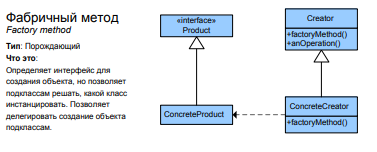
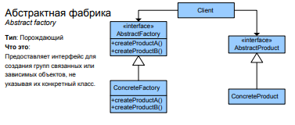

# Порождающие паттерны

+ Фабричный метод — это порождающий паттерн проектирования, который 
определяет общий интерфейс для создания объектов в суперклассе, позволяя 
подклассам изменять тип создаваемых объектов.

+ Абстрактная фабрика — это порождающий паттерн проектирования, который 
позволяет создавать семейства связанных объектов, не привязываясь к конкретным классам создаваемых объектов.

+ Строитель — это порождающий паттерн проектирования, который позволяет 
создавать сложные объекты пошагово. Строитель даёт возможность использовать один и тот же код строительства для получения разных представлений объектов.

+ Прототип — это порождающий паттерн проектирования, который позволяет 
копировать объекты, не вдаваясь в подробности их реализации.

+ Одиночка — это порождающий паттерн проектирования, который гарантирует, что у класса есть только один экземпляр, и предоставляет к нему лобальную точку доступа.

## Фабричный метод

* Применимость: Паттерн можно часто встретить в любом C++ коде, где требуется гибкость при создании продуктов.

* Признаки применения паттерна: Фабричный метод можно определить по создающим методам, которые возвращают объекты продуктов через абстрактные типы или интерфейсы. Это позволяет переопределять типы создаваемых продуктов в подклассах

Плюсы:

+ Избавляет класс от привязки к конкретным классам продуктов.

+ Выделяет код производства продуктов в одно место, упрощая поддержку кода.
 
+ Упрощает добавление новых продуктов в программу.

+ Реализует принцип открытости/закрытости.

Минусы:

 + Может привести к созданию больших параллельных иерархий классов, так как для каждого класса продукта надо создать свой подкласс создателя.


## Абстрактная фабрика

+ Применимость: Паттерн можно часто встретить в C++ коде, особенно там, где требуется создание семейств продуктов (например, внутри фреймворков).

+ Признаки применения паттерна: Паттерн можно определить по методам, возвращающим фабрику, которая, в свою очередь, используется для создания конкретных продуктов, возвращая их через абстрактные типы или интерфейсы.


Плюсы:

 + Гарантирует сочетаемость создаваемых продуктов.
 + Избавляет клиентский код от привязки к конкретным классам продуктов.
 + Выделяет код производства продуктов в одно место, упрощая поддержку кода.
 + Упрощает добавление новых продуктов в программу.
 + Реализует принцип открытости/закрытости.

Минусы:

 + Усложняет код программы из-за введения множества дополнительных классов.
 + Требует наличия всех типов продуктов в каждой вариации.


## Строитель

Применимость: Паттерн можно часто встретить в C++ коде, особенно там, где требуется пошаговое создание продуктов или конфигурация сложных объектов.

Признаки применения паттерна: Строителя можно узнать в классе, который имеет один создающий метод и несколько методов настройки создаваемого продукта. Обычно, методы настройки вызывают для удобства цепочкой (например, someBuilder->setValueA(1)->setValueB(2)->create()).

Плюсы:

+ Позволяет создавать продукты пошагово.
+ Позволяет использовать один и тот же код для создания различных продуктов.
+ Изолирует сложный код сборки продукта от его основной бизнес-логики.
  
Минусы:

+ Усложняет код программы из-за введения дополнительных классов.
+ Клиент будет привязан к конкретным классам строителей, так как в интерфейсе директора может не быть метода получения результата.

## Прототип

Признаки применения паттерна: Прототип легко определяется в коде по наличию методов clone, copy и прочих.

Плюсы:
+ Позволяет клонировать объекты, не привязываясь к их конкретным классам.
+ Меньше повторяющегося кода инициализации объектов.
+ Ускоряет создание объектов.
+ Альтернатива созданию подклассов для конструирования сложных объектов.

Минусы:
+ Сложно клонировать составные объекты, имеющие ссылки на другие объекты.

## Одиночка

Применимость: Многие программисты считают Одиночку антипаттерном, поэтому его всё реже и реже можно встретить в C++ коде.

Признаки применения паттерна: Одиночку можно определить по статическому создающему методу, который возвращает один и тот же объект.

Плюсы:

+ Гарантирует наличие единственного экземпляра класса.
+ Предоставляет к нему глобальную точку доступа.
+ Реализует отложенную инициализацию объекта-одиночки.
+ Нарушает принцип единственной ответственности класса.

Минусы:

+ Маскирует плохой дизайн.
+ Проблемы мультипоточности.
+ Требует постоянного создания Mock-объектов при юнит-тестировании.


# Примеры реализации

## Фабричный метод



Пример:

```cpp

class Product {
 public:
  virtual ~Product() {}
  virtual std::string Operation() const = 0;
};


class ConcreteProduct1 : public Product {
 public:
  std::string Operation() const override {
    return "{Result of the ConcreteProduct1}";
  }
};

class ConcreteProduct2 : public Product {
 public:
  std::string Operation() const override {
    return "{Result of the ConcreteProduct2}";
  }
};


class Creator {

 public:

  virtual ~Creator(){};
  virtual Product* FactoryMethod() const = 0;

  std::string SomeOperation() const 
  {
    Product* product = this->FactoryMethod();
    std::string result = product->Operation();
    delete product;
    return result;
  }
};


class ConcreteCreator1 : public Creator {

 public:
  Product* FactoryMethod() const override {
    return new ConcreteProduct1();
  }
};

class ConcreteCreator2 : public Creator {
 public:
  Product* FactoryMethod() const override {
    return new ConcreteProduct2();
  }
};


void ClientCode(const Creator& creator) 
{
  std::cout << creator.SomeOperation() << std::endl;
}


int main() 
{
  Creator* creator = new ConcreteCreator1();
  ClientCode(*creator);

  Creator* creator2 = new ConcreteCreator2();
  ClientCode(*creator2);

  delete creator;
  delete creator2;

  return 0;
}
```

## Абстрактная фабрика



```cpp
class AbstractProductA {
 public:
  virtual ~AbstractProductA(){};
  virtual std::string UsefulFunctionA() const = 0;
};


class ConcreteProductA1 : public AbstractProductA {
 public:
  std::string UsefulFunctionA() const override {
    return "The result of the product A1.";
  }
};

class ConcreteProductA2 : public AbstractProductA {
  std::string UsefulFunctionA() const override {
    return "The result of the product A2.";
  }
};


class AbstractProductB {

 public:
  virtual ~AbstractProductB(){};
  virtual std::string UsefulFunctionB() const = 0;

  virtual std::string AnotherUsefulFunctionB(const AbstractProductA &collaborator) const = 0;
};


class ConcreteProductB1 : public AbstractProductB {
 public:
  std::string UsefulFunctionB() const override {
    return "The result of the product B1.";
  }

  std::string AnotherUsefulFunctionB(const AbstractProductA &collaborator) const override {
    const std::string result = collaborator.UsefulFunctionA();
    return "The result of the B1 collaborating with ( " + result + " )";
  }
};


class ConcreteProductB2 : public AbstractProductB {
 public:
  std::string UsefulFunctionB() const override {
    return "The result of the product B2.";
  }

  std::string AnotherUsefulFunctionB(const AbstractProductA &collaborator) const override {
    const std::string result = collaborator.UsefulFunctionA();
    return "The result of the B2 collaborating with ( " + result + " )";
  }
};


class AbstractFactory {
 public:
  virtual AbstractProductA *CreateProductA() const = 0;
  virtual AbstractProductB *CreateProductB() const = 0;
};


class ConcreteFactory1 : public AbstractFactory {
 public:
  AbstractProductA *CreateProductA() const override {
    return new ConcreteProductA1();
  }
  AbstractProductB *CreateProductB() const override {
    return new ConcreteProductB1();
  }
};


class ConcreteFactory2 : public AbstractFactory {
 public:
  AbstractProductA *CreateProductA() const override {
    return new ConcreteProductA2();
  }
  AbstractProductB *CreateProductB() const override {
    return new ConcreteProductB2();
  }
};


void ClientCode(const AbstractFactory &factory) {
  const AbstractProductA *product_a = factory.CreateProductA();
  const AbstractProductB *product_b = factory.CreateProductB();
  std::cout << product_b->UsefulFunctionB() << "\n";
  std::cout << product_b->AnotherUsefulFunctionB(*product_a) << "\n";
  delete product_a;
  delete product_b;
}

int main() 
{
  ConcreteFactory1 *f1 = new ConcreteFactory1();
  ClientCode(*f1);
  delete f1;

  ConcreteFactory2 *f2 = new ConcreteFactory2();
  ClientCode(*f2);
  delete f2;

  return 0;
}
```